Inicialmente, a maior dificuldade que enfrentei foi realizar a conexão com o S3. Em uma escala de 0 a 10, eu classificaria essa parte como 5 em termos de dificuldade. Foi o aspecto mais desafiador, mas, uma vez configurada corretamente, tornou-se bem simples de usar. Testei tanto o método resource quanto o client, além de realizar o processo pelo terminal para entender como funcionaria de outras formas. Não encontrei problemas sérios, apenas uma certa complexidade inicial.

Fora isso, o desenvolvimento do código em Pandas foi bastante tranquilo, e o envio das tabelas para o S3 também ocorreu sem dificuldades. No geral, eu consideraria essa sprint tão fácil quanto a anterior.

# Documentação do Desafio com Pandas e AWS S3

## Introdução

Neste documento, detalho o passo a passo que segui para desenvolver o código final utilizando `pandas` e `boto3` para manipular dados e interagir com o AWS S3. O objetivo foi realizar várias transformações em um DataFrame, aplicar funções condicionais e enviar o resultado final para o bucket S3, retornando uma resposta consolidada ao final.

## Passo a Passo

### 0. Testando minha base de dados

Procurei um arquivo CSV ou JSON no portal de dados públicos do Governo Brasileiro e verifiquei se ele está dentro do limite permitido no S3.

Confirmei que ele é único na sua turma.
fiz isso e escolhi o arquivo relatorio_inabilitado.csv pois os outro 2 q eu achei estavam feios quando eu ia ver no pandas. Optei por esse pois achei ele mais organizado 
abri o arquivo relatorio_inabilitado.csv no VS Code e vi quais colunas ele possui, quais dados podem ser analisados e identifiquei informações importantes.
uei o print(df.head())
beleza me retornou alguns erros, arrumei meu código ficou.
df = pd.read_csv(file_name, delimiter=';', encoding='latin1')
me retornou.


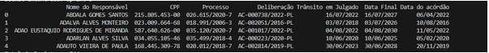

dei um print(df.head(10))

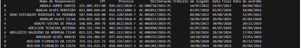

Fechou agora q eu ja decidi que ia usar essa base de dados. 
entao vamos Proseguir

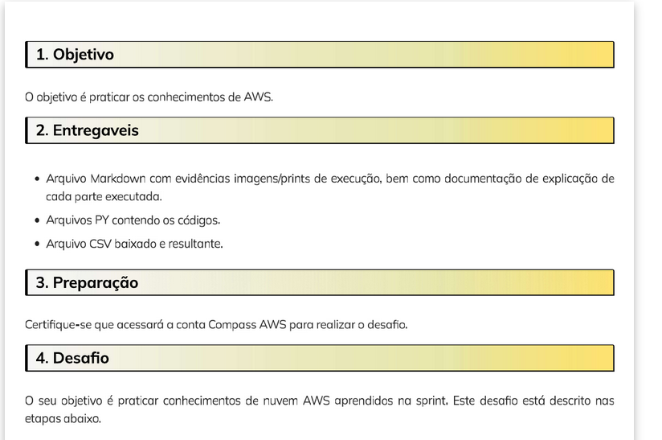

### 1. Configuração do Ambiente

Primeiro, configurei meu ambiente para que pudesse acessar as credenciais AWS de forma segura e manipular dados de maneira eficiente com `pandas`. Utilizei as bibliotecas `dotenv` para gerenciar variáveis de ambiente e `boto3` para interagir com o AWS S3.

- **Instalação das Bibliotecas**: Instalei as bibliotecas necessárias com os seguintes comandos:

  <h1> Configuração das Variáveis de Ambiente: Criei um arquivo .env para armazenar as chaves de acesso do AWS: </h1>
  ```bash
  pip install boto3 pandas python-dotenv

AWS_ACCESS_KEY_ID=SEU_ACCESS_KEY
AWS_SECRET_ACCESS_KEY=SEU_SECRET_KEY
AWS_SESSION_TOKEN=SEU_SESSION_TOKEN

Bom era pra ser no máximo isso mas eu acabei ficando muito tempo sem ter oque fazer entao eu acabei invetando coisa.

ficando assim.
```bash
import boto3

import logging

import os

from dotenv import load_dotenv

from s3_operations import download_file_s3, upload_file_s3

from data_processing import process_dataframe

import pandas as pd

from datetime import datetime

```
<h1>Resumo de cada import ou from</h1>

import boto3:

O boto3 é a biblioteca oficial da AWS para Python, usada para interagir com os serviços da AWS, como S3, EC2, e outros. Neste caso, você a está usando para gerenciar arquivos no S3.

import logging:
O logging é um módulo padrão do Python que permite criar logs (registros) para acompanhar o que acontece durante a execução do programa, como mensagens de erro ou etapas concluídas.

import os:
O módulo os fornece funções para interagir com o sistema operacional, como acessar variáveis de ambiente, manipular arquivos e diretórios.

from dotenv import load_dotenv:
O dotenv é uma biblioteca que permite carregar variáveis de ambiente a partir de um arquivo .env. O load_dotenv carrega essas variáveis para que possam ser usadas no código, como chaves e senhas de API.

from s3_operations import download_file_s3, upload_file_s3:
Aqui, você está importando funções específicas (download_file_s3 e upload_file_s3) de um módulo chamado s3_operations. Essas funções  são usadas para baixar e enviar arquivos para o S3.

from data_processing import process_dataframe:
Esta linha importa a função process_dataframe de um módulo chamado data_processing, que contém lógica para processar e manipular dataframes (estruturas de dados tabulares).

import pandas as pd:
O pandas é uma biblioteca popular para manipulação de dados em Python. Ela facilita trabalhar com tabelas e dataframes. pd é o alias comum usado para pandas.

from datetime import datetime:
Esta linha importa a classe datetime do módulo datetime, que é usado para trabalhar com datas e horas, como capturar a data e hora atual ou manipular timestamps.


2. Agora vamos falar sobre o aws

usei o comando aws --version no meu cmd 


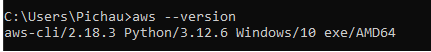

Beleza tudo certo agora vamos começar o s3.

A Primeira vez eu fiz por resource
```bash

s3 = boto3.resource(
	's3',
	aws_access_key_id='',
	aws_secret_access_key='',
	region_name='us-east-1',
    
	aws_session_token=''

#aws_session_token=''
)
```
agora so colocar as keys
pode fazer isso pelo 
aws configure

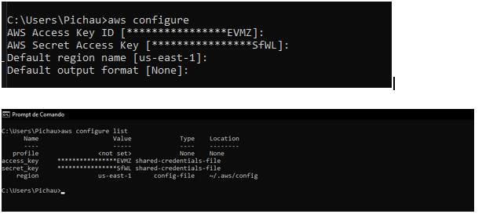

Porem apos conversar com a monitoria me foi recomendo fazer por client
```bash
s3 = boto3.client(
    's3',
    aws_access_key_id=os.getenv('AWS_ACCESS_KEY_ID'),
    aws_secret_access_key=os.getenv('AWS_SECRET_ACCESS_KEY'),
    aws_session_token=os.getenv('AWS_SESSION_TOKEN')
)

```

**Nota: aqui eu ja estava utilizando o .env**
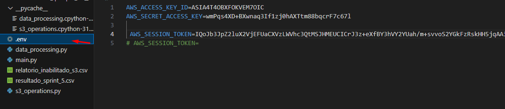


Criando Funções para Download e Upload no S3
Desenvolvi funções específicas para download e upload de arquivos do S3 utilizando boto3:

download_file_s3: Faz o download de um arquivo especificado do bucket.
upload_file_s3: Faz o upload de um arquivo processado de volta para o bucket.
Essas funções ajudam a modularizar o código e garantir que operações repetitivas sejam feitas de forma limpa e consistente.

3. Criando o bucket  na aws
sem segredo

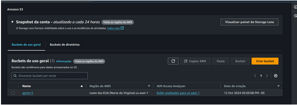

beleza apos criar o bucket eu fiz um log para ver se estava tudo certo, vale ressaltar q esse log nao existe no codigo autal foi apenas no momento para ter a confirmação.

for bucket in s3.buckets.all():
 	print(f"Bucket encontrado: {bucket.name}")

para entender oq estava acontecendo, tive uns bozinho mas eu arrumei.
agora estava me retornando o nome do meu bucket no caso sprint5.

o atual codigo ficou assim

```bash
import boto3
import logging
import os
from dotenv import load_dotenv

# Carregar variáveis de ambiente
load_dotenv()

# Configuração do cliente S3
s3 = boto3.client(
    's3',
    aws_access_key_id=os.getenv('AWS_ACCESS_KEY_ID'),
    aws_secret_access_key=os.getenv('AWS_SECRET_ACCESS_KEY'),
    aws_session_token=os.getenv('AWS_SESSION_TOKEN')
)

def download_file_s3(bucket_name, file_key, download_path):
    """Faz o download de um arquivo do S3 para o caminho especificado."""
    try:
        s3.download_file(bucket_name, file_key, download_path)
        logging.info(f"Arquivo '{file_key}' baixado com sucesso do bucket '{bucket_name}'.")
    except Exception as e:
        logging.error(f"Erro ao baixar o arquivo: {e}")

def upload_file_s3(bucket_name, file_key, upload_path):
    """Faz o upload de um arquivo para o S3."""
    try:
        s3.upload_file(upload_path, bucket_name, file_key)
        logging.info(f"Arquivo '{file_key}' enviado com sucesso para o bucket '{bucket_name}'.")
    except Exception as e:
        logging.error(f"Erro ao enviar o arquivo: {e}")
```

A maior diferença aqui é o download_file_s3 e o upload_file_s3 onde um eu baixo o arquivo do s3 e o outro onde eu envio os meus resultados

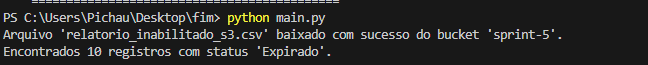

4. Processamento do DataFrame
Para manipular os dados, criei a função process_dataframe que faz todas as transformações necessárias:


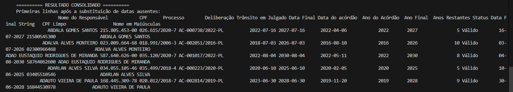


Leitura do Arquivo CSV: Carreguei o arquivo CSV usando o pandas.
Tratamento de Dados Ausentes: Substituí valores como "-" por NaT para tratar como datas ausentes.


Conversão de Datas: Convertemos colunas como "Data Final" e "Trânsito em Julgado" para o formato datetime.


Aplicação de Filtragem: Apliquei uma cláusula que utiliza dois operadores lógicos para filtrar os dados.

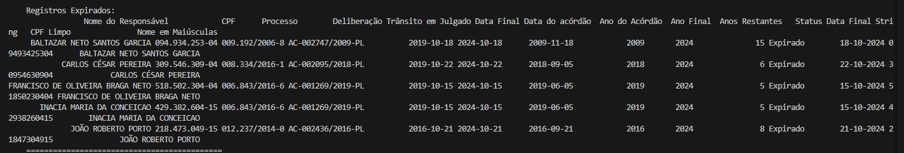

Manipulações Condicionais e de String:

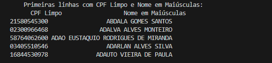

Criei a coluna "Status" para determinar se um registro é "Válido" ou "Expirado" com base na "Data Final".
Limpei os CPFs e formatei nomes para maiúsculas.

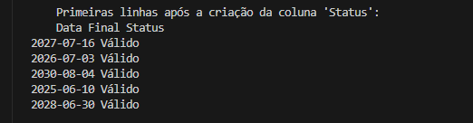

<h1>  Bom entao vamos fala sobre o Buckets e a analise</h1>

```bash
import logging
from s3_operations import download_file_s3, upload_file_s3
from data_processing import process_dataframe

# Configurando o logging
logging.basicConfig(level=logging.INFO, format='%(message)s')

def main():
    bucket_name = 'sprint-5'
    file_key = 'relatorio_inabilitado_s3.csv'
    download_path = 'relatorio_inabilitado_s3.csv'
    output_file = 'resultado_sprint_5.csv'

    # Download do arquivo do S3
    download_file_s3(bucket_name, file_key, download_path)

    # Processamento do DataFrame
    df, df_filtrado = process_dataframe(download_path)

    # Verificar se há registros "Expirado"
    df_expirado = df[df['Status'] == 'Expirado']
    if not df_expirado.empty:
        logging.info(f"Encontrados {len(df_expirado)} registros com status 'Expirado'.")
        registros_expirados = df_expirado.head().to_string(index=False)
    else:
        registros_expirados = "Nenhum registro 'Expirado' encontrado."

    # Consolidação de todas as informações em uma única resposta
    resultado_consolidado = f"""
    ========== RESULTADO CONSOLIDADO ==========
    Primeiras linhas após a substituição de datas ausentes:
    {df.head().to_string(index=False)}

    Primeiras linhas do DataFrame filtrado:
    {df_filtrado.head().to_string(index=False)}

    Primeiras linhas após a criação da coluna 'Status':
    {df[['Data Final', 'Status']].head().to_string(index=False)}

    Primeiras linhas com CPF Limpo e Nome em Maiúsculas:
    {df[['CPF Limpo', 'Nome em Maiúsculas']].head().to_string(index=False)} 

    Registros Expirados:
    {registros_expirados}
    ============================================
    """

    # Imprimir o resultado consolidado .sample(5)
    print(resultado_consolidado)

    # Salvando o DataFrame processado em um arquivo CSV
    df.to_csv(output_file, index=False, sep=';', encoding='latin1')

    # Upload do arquivo processado para o S3
    upload_file_s3(bucket_name, 'resultado_sprint_5.csv', output_file)

    # Mensagem final indicando que todas as etapas foram concluídas
    print("\nTodas as etapas foram concluídas com sucesso, e o arquivo processado foi enviado para o bucket S3.")

if __name__ == "__main__":
    main()

```


Agora sobre as analises: 

```bash


def process_dataframe(file_path):
    """Processa o DataFrame com as manipulações necessárias."""
    df = pd.read_csv(file_path, delimiter=';', encoding='latin1')

    # substituindo valores "-" por NaT (Not a Time) para tratar como datas ausentes
    df['Trânsito em Julgado'] = df['Trânsito em Julgado'].replace('-', pd.NaT)

    # convertendo colunas de data para o formato datetime
    df['Data Final'] = pd.to_datetime(df['Data Final'], format='%d/%m/%Y', errors='coerce')
    df['Trânsito em Julgado'] = pd.to_datetime(df['Trânsito em Julgado'], format='%d/%m/%Y', errors='coerce')
    df['Data do acórdão'] = pd.to_datetime(df['Data do acórdão'], format='%d/%m/%Y', errors='coerce')

    # aplicando a cláusula com dois operadores lógicos
    df_filtrado = df[(df['Data Final'] > '2025-01-01') & (df['Trânsito em Julgado'] < '2023-11-11')]

    # extraindo o ano da "Data do acórdão" para facilitar a agregação
    df['Ano do Acórdão'] = df['Data do acórdão'].dt.year

    # cCalculando o ano da "Data Final" e a diferença de anos até a data final
    df['Ano Final'] = df['Data Final'].dt.year
    df['Anos Restantes'] = df['Ano Final'] - df['Ano do Acórdão']

    # criando a função condicional para determinar o status
    data_atual = pd.to_datetime(datetime.now().strftime('%Y-%m-%d'))
    df['Status'] = df['Data Final'].apply(lambda x: 'Válido' if x > data_atual else 'Expirado')

    # manipulação de strings e formatação de colunas
    df['Data Final String'] = df['Data Final'].dt.strftime('%d-%m-%Y')
    df['CPF Limpo'] = df['CPF'].str.replace('.', '', regex=False).str.replace('-', '', regex=False)
    df['Nome em Maiúsculas'] = df['Nome do Responsável'].str.upper()

    return df, df_filtrado

```

5. Consolidação dos Resultados
Para garantir que todas as manipulações foram feitas corretamente, adicionei uma etapa que retorna um resultado consolidado, exibindo as primeiras linhas do DataFrame após cada transformação:

Mostrei os registros "Expirado" para validar a função condicional.
Imprimi um resumo do DataFrame, incluindo as colunas manipuladas, como "Data Final", "Status", "CPF Limpo", e "Nome em Maiúsculas".

6. Upload do Arquivo Processado
Após todas as transformações, salvei o DataFrame processado como CSV e usei a função upload_file_s3 para enviar o arquivo de volta ao bucket S3.

7. Mensagem Final e Consolidação
Ao final, adicionei um bloco de código que imprime uma mensagem única consolidando todas as etapas e confirmando que o arquivo foi enviado com sucesso para o S3. Isso garante que o código esteja de acordo com o requisito de retornar uma única resposta.

Ficando assim meus arquivos no meus Bucket 

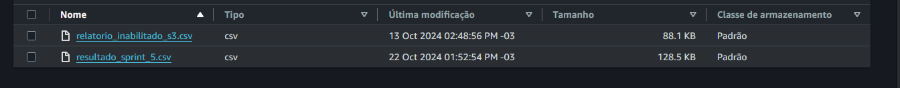

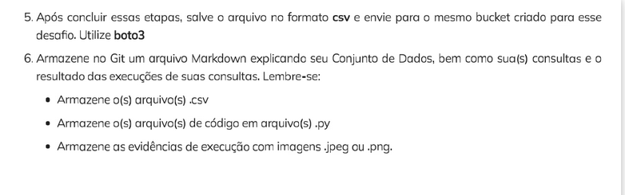

8. Criação Automática da Pasta resultados
O que eu fiz: Adicionei um trecho de código utilizando o módulo os para garantir que a pasta resultados fosse criada automaticamente antes de salvar os arquivos CSV.
Por que isso foi importante: Antes dessa modificação, o código tentava salvar os arquivos em um caminho que não existia, o que causava erros. Com o uso de os.makedirs('resultados', exist_ok=True), eu garanti que o caminho sempre existirá, independentemente do ambiente onde o script está sendo executado.
Benefício: Essa mudança tornou o script mais robusto e confiável, já que agora ele não depende de uma configuração manual do ambiente antes de ser executado.
9. Uso de Variáveis para Maior Flexibilidade
O que eu fiz: Usei a variável output_file para salvar e nomear o arquivo final processado. Além disso, utilizei a mesma variável para fazer o upload do arquivo para o S3.
Por que isso foi importante? Utilizar variáveis me permitiu deixar o código mais flexível e fácil de modificar no futuro. Agora, se eu precisar mudar o nome do arquivo final, é possível fazer isso em um único lugar, evitando inconsistências no código.
Benefício: Essa alteração melhora a manutenção do código, tornando-o mais fácil de ajustar ou adaptar para diferentes cenários e nomes de arquivos.


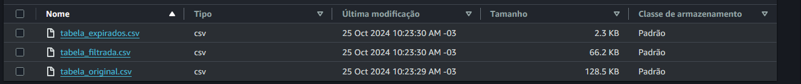

10. Upload Estruturado dos Arquivos Processados
O que eu fiz: Organizei o upload dos arquivos CSV para o S3, salvando cada tipo de arquivo (original, filtrado e registros expirados) dentro da pasta resultados.
Por que isso foi importante: Ao enviar cada arquivo para uma estrutura de pastas no S3, consegui manter a organização e facilitar a navegação e análise dos resultados diretamente no bucket.
Benefício: Essa estrutura organizada melhora a clareza e a acessibilidade dos dados na nuvem, facilitando a auditoria e a revisão dos arquivos processados.
11. Melhoria na Consolidação de Logs e Mensagens
O que eu fiz: Usei o logging para capturar informações importantes, como o número de registros expirados, e para informar quando os arquivos foram baixados e enviados corretamente.
Por que isso foi importante: Utilizar o logging em vez de simples print() permite um controle mais sofisticado sobre as mensagens, ajudando na depuração e no monitoramento do código em diferentes ambientes.
Benefício: As mensagens de log detalhadas facilitam a identificação de problemas e me ajudam a entender exatamente o que está acontecendo durante a execução do script.


# Conclusão:
Esse passo a passo documenta todo o processo, desde a configuração inicial do ambiente até a manipulação avançada dos dados e o upload para o S3. O uso de funções e modularização do código facilita a manutenção e compreensão do processo. Com essa estrutura, consegui concluir todas as etapas com sucesso, garantindo que todas as manipulações foram feitas conforme solicitado.


# Recapitulação das Etapas

<p>Acho legal fazer uma recapitulação de uma passo a passo</p>

<p>Cláusula que Filtra Dados Usando Dois Operadores Lógicos:
Apliquei uma cláusula que filtra as linhas do DataFrame com base em duas condições lógicas usando as colunas de datas.</p>
<p>Duas Funções de Agregação:</p>
Foi realizada a contagem de registros por ano e o cálculo da média dos anos restantes até a data final.
<p>Função Condicional:</p>
criei a coluna "Status" para verificar se a "Data Final" era maior ou menor que a data atual, categorizando como "Válido" ou "Expirado".
<p>Função de Conversão:</p>
Convertido o CPF para um formato sem pontuação e traços, criando a coluna "CPF Limpo".
Convertida a data para um formato string com o formato "DD-MM-YYYY".
<p>Função de Data:</p>
Extrai o ano, mês e dia das colunas de datas e calculamos a diferença entre datas.
<p>Função de String:</p>
Manipulamos os nomes para convertê-los em maiúsculas, criando a coluna "Nome em Maiúsculas".

Explicações
Consolidação do Resultado(oque foi recomendado pelo desafio):
O código consolida todas as informações em uma única variável (resultado_consolidado), que contém um resumo detalhado de cada etapa e manipulação realizada no DataFrame.
No final, é exibido se há registros com o status "Expirado" e uma amostra dos mesmos.
