A Sprint 6 foi muito bom! Os exercícios foram excelentes e me ajudaram a consolidar o conhecimento. A sequência dos desafios foi bem gradual, facilitando o aprendizado. Os cursos da AWS estão sendo incríveis e a metodologia de ensino está me agradando bastante. Apesar da Sprint ter passado rápido, senti que o ritmo foi adequado. Estou ansioso para a próxima Sprint e os novos desafios!

eu fiz um curso a parte chamado Complete Data Wrangling & Data Visualisation With Python para ter uma ideia melhor sobre Data Visualisation para pensar em tipos de analise 

Atualmente, já concluí os  cursos de AWS e estou gostando bastante da trilha. Estou ansioso pela próxima sprint e pelos novos aprendizados que ela trará 😊.

# Certificados


[1 Noções básicas de Analytics na AWS – Parte 1](../Sprint_6/certificados/img/Noções%20básicas%20de%20Analytics%20na%20AWS%20–%20Parte%201.pdf)

    
[2 Fundamentos de analytics na AWS – Parte 2](../Sprint_6/certificados/img/Fundamentos%20de%20analytics%20na%20AWS%20–%20Parte%202.pdf)

    
[3 Analytics](../Sprint_6/certificados/img/Serverless%20Analytics.pdf)
 
[4 Introduction to Amazon Athena.pdf](../Sprint_6/certificados/img/Introduction%20to%20Amazon%20Athena.pdf)

[5 AWS Glue Getting ](../Sprint_6/certificados/img/Amazon%20EMR%20Getting%20Started.pdf)

[6 Amazon EMR Getting Started ](../Sprint_6/certificados/img/Getting%20Started%20with%20Amazon%20Redshift.pdf)

[7 Getting Started with Amazon Redshift ](../Sprint_6/certificados/img/AWS%20Glue%20Getting%20Started.pdf)

[8 AWS Amazon QuickSight - Getting Start ](../Sprint_6/certificados/img/Amazon%20QuickSight%20-%20Getting%20Start.pdf)


[9 Best Practices for Data Warehousing with Amazon Redshift ](../Sprint_6/certificados/img/Amazon%20QuickSight%20-%20Getting%20Start.pdf)


# Exercícios
No Ex1 eu vou copiar  oque eu escrevi na sprint passada.
1. [Resposta Ex1](../Sprint_5/exercicios/index.html)

Documentação do Exercício de Hospedagem de Site Estático no AWS S3
Bom exercício, eu gostei de fazer, de certo modo. Aqui eu vou documentar um pouco melhor sobre. Achei o enunciado muito grande para coisas algo tão simples.

Passo 1: Criar um Bucket no S3
O primeiro passo foi acessar o console do AWS S3 e criar um bucket para hospedar o site. Defini o nome e a região do bucket, escolhendo us-east-1 para facilitar a configuração e deixar no padrão.


Passo 2: Habilitar a Hospedagem Estática
Depois de criar o bucket, eu habilitei a hospedagem de site estático. Defini o index.html como o documento de índice e o 404.html como o documento de erro. Foi simples, mas achei que poderia ser mais direto no enunciado.


Passo 3: Upload dos Arquivos
Fiz o upload dos arquivos necessários:


index.html: Página inicial do site com um link para download do CSV.
404.html: Página de erro personalizada.
nomes.csv: O arquivo de dados que será baixado pelo usuário.

Passo 4: Configurar Permissões e Política de Bucket
Para garantir que o site funcionasse, precisei ajustar as permissões:


Editei a Política do Bucket para permitir acesso público de leitura a todos os objetos.
Verifiquei as permissões individuais de cada arquivo, garantindo que todos tivessem a leitura pública habilitada.

Passo 5: Testar o Endpoint do Site
Com tudo configurado, testei o endpoint do site. O index.html carregou corretamente, e o link para download do CSV estava funcionando após ajustar as permissões.


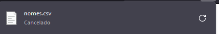


2. [Resposta do Lab AWS Athena](../Sprint_6/exercicios/Athena.sql)


<h1>Etapa 1: Configurar Athena </h1>

Acessar o console S3:

Verifique se o arquivo nomes.csv está no bucket ex-labawss3.


Depois de garantir que o arquivo estava no bucket, criei uma pasta chamada queries dentro dele. Essa pasta seria usada pelo Athena para armazenar os resultados das consultas.

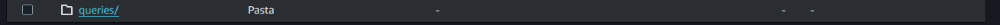
Em seguida, acessei o AWS Athena e cliquei em Explore the Query Editor. Para configurar o local de resultados, fiz o seguinte:

Acessei View Settings e cliquei em Manage.

Inserí o caminho s3://ex-labawss3/queries/ na caixa de texto Query result location.

Cliquei em Save para salvar as configurações.

Etapa 2: Criar um Banco de Dados

No editor de consultas do Athena, crie um banco de dados com a seguinte instrução:
```sql
CREATE DATABASE meubanco;
```

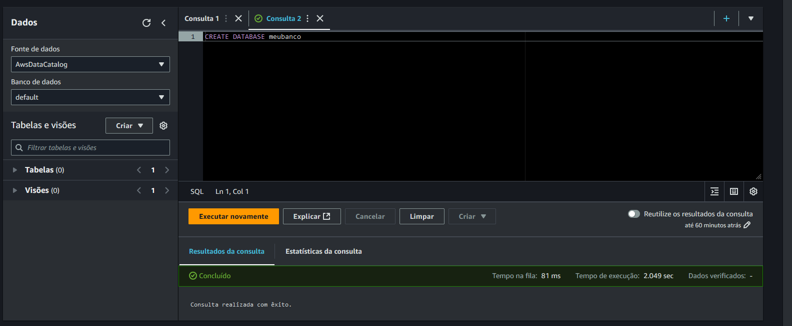


Execute a consulta clicando em Run ou pressionando Ctrl+ENTER.

Selecione meubanco como o banco de dados atual na lista à esquerda.

Etapa 3: Criar uma Tabela

Agora que o banco de dados foi criado, é hora de criar uma tabela com base no arquivo nomes.csv.

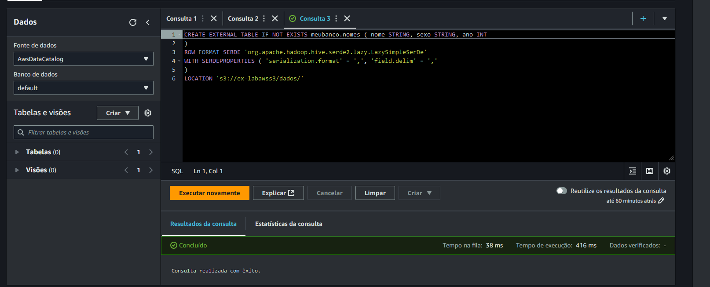

Execute a instrução de criação de tabela adaptada para o meu bucket:
```sql
CREATE EXTERNAL TABLE IF NOT EXISTS meubanco.nomes (
    nome STRING,
    sexo STRING,
    total INT,
    ano INT
)
ROW FORMAT SERDE 'org.apache.hadoop.hive.serde2.lazy.LazySimpleSerDe'
WITH SERDEPROPERTIES (
    'serialization.format' = ',',
    'field.delim' = ','
)
LOCATION 's3://ex-labawss3/dados/'
TBLPROPERTIES ("skip.header.line.count"="1");


```
Execute a consulta e verifique a mensagem Completed (Concluído).

Observações Importantes

Os tipos de dados foram definidos de forma apropriada.

Utilizei o analisador LazySimpleSerDe CSV, que permite valores nulos e não suporta valores entre aspas.

O delimitador de campos é , e a primeira linha do arquivo contém os nomes dos campos, que serão ignorados.


Teste de Consulta

Para validar os dados, execute a seguinte consulta de teste:

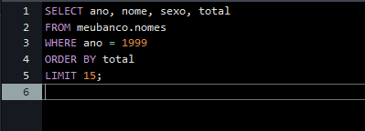

```sql
SELECT nome 
FROM meubanco.nomes 
WHERE ano = 1999 
ORDER BY nome 
LIMIT 15
```
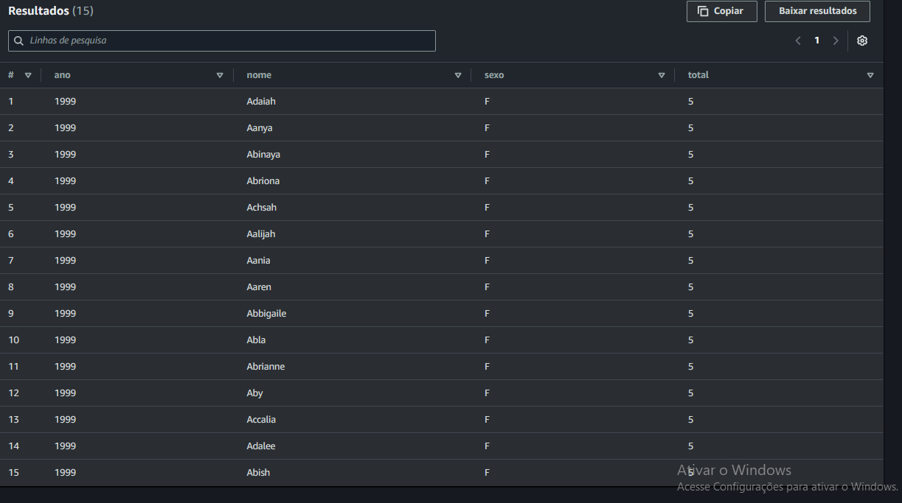

usando o modelo de vc 
```sql
    select nome from nomedobanco.nomedatabela where ano = 1999 order by total limit 15;
```

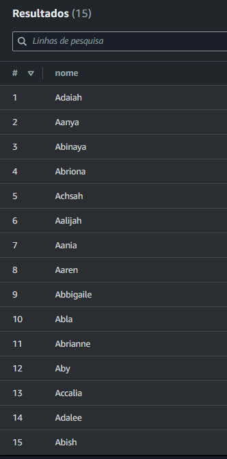

Desafio: Consulta Avançada

Crie uma consulta que liste os 3 nomes mais usados em cada década desde 1950 até hoje:
```sql
SELECT nome, COUNT(*) AS total, FLOOR(ano / 10) * 10 AS decada
FROM meubanco.nomes
WHERE ano >= 1950
GROUP BY nome, FLOOR(ano / 10) * 10
ORDER BY decada, total DESC
LIMIT 3
```

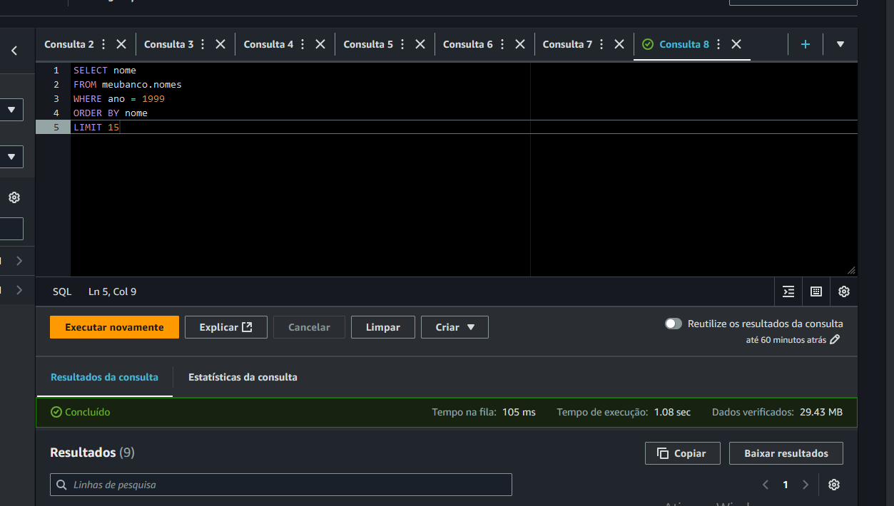

Resultado:


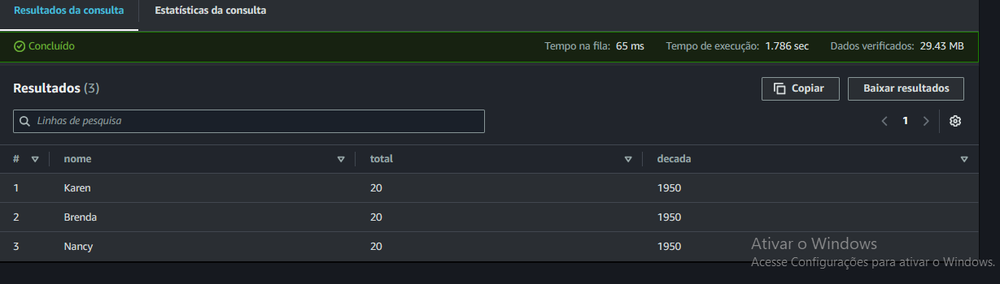


Conclusão:

Com estas etapas, consegui configurar o ambiente no Athena, criar uma tabela baseada no arquivo nomes.csv e executar consultas que ajudam a explorar e entender melhor os dados. Este foi um excelente desafio para reforçar conhecimentos em AWS S3 e Athena e relembrar SQL.


3. [Resposta do Lab AWS Lambda](../Sprint_6/exercicios/layer_pandas/Dockerfile)


<h1>Etapa 1: Criar a função do Lambda</h1>

No console do AWS Lambda, selecionei Criar uma função. Se já tiver funções criadas, acesse a página Lambda > Funções.

Escolha Author from scratch (criar do zero).
Em Function name (nome da função), defina o nome da função. Em Runtime, selecione Python 3.9.
Para criar a função, clique em Create (Criar).

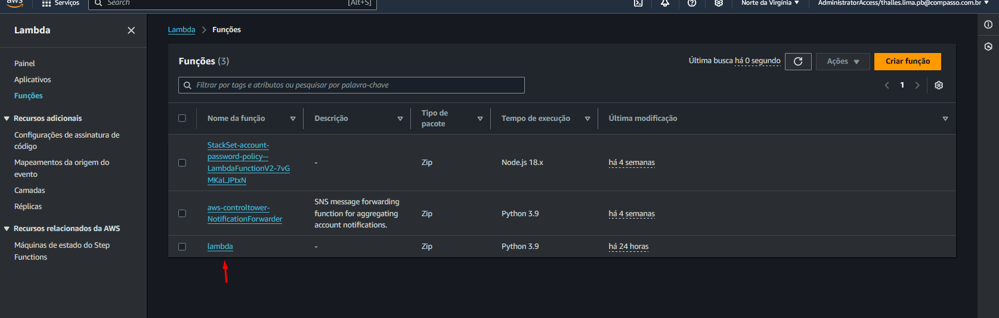
Etapa 2: Construir o código

Após criar a função, serei redirecionado para o editor de funções do console. O arquivo padrão lambda_function.py é gerado:

Mudo o arquivo padrão para o seguinte codigo 

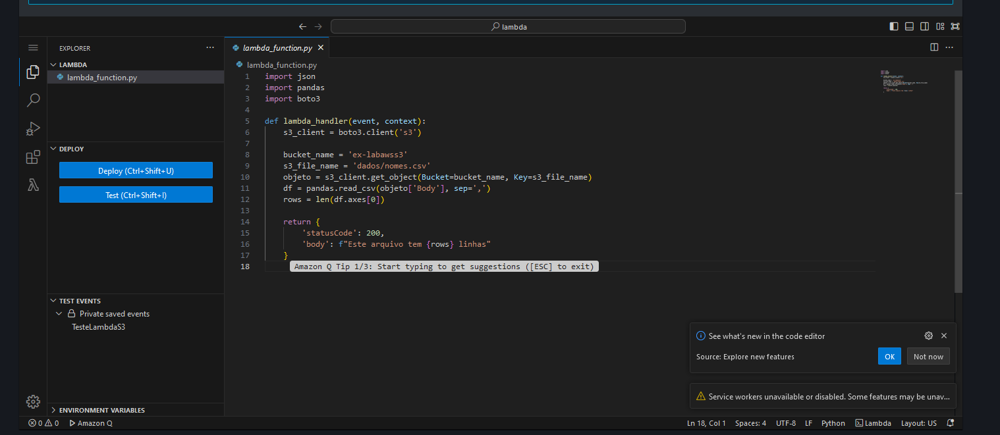

Para testar, clico em Test e defino um nome de teste.

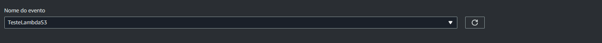


Ao executar, aparece o erro.

Esse erro ocorre porque o AWS Lambda não possui a biblioteca Pandas. Precisamos adicionar uma Layer.

Etapa 3: Criar uma Layer

 crio um arquivo chamado Dockerfile com o seguinte conteúdo:

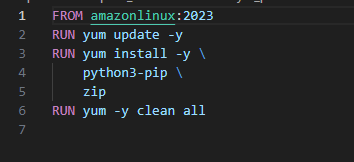


Executo o comando abaixo para construir a imagem:

`docker build -t amazonlinuxpython39 .`


`docker run -it amazonlinuxpython39 bash`

Dentro do shell do Docker, crio as pastas necessárias para a Layer:

`mkdir layer_dir`

`cd layer_dir/`

`mkdir python`

`cd python/`

Instalo as bibliotecas dentro da pasta python:

`pip3 install pandas -t .`

Compacto o conteúdo em minha-camada-pandas.zip:

`cd ..`

`zip -r minha-camada-pandas.zip .`


Em outra janela de terminal, copio o arquivo compactado do container para a máquina local:

Faço upload do minha-camada-pandas.zip para um bucket no S3.

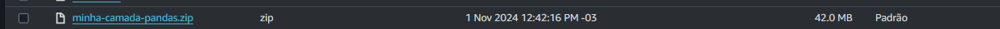

No console do Lambda, vou em Camadas, clico em Criar uma camada, dou o nome PandasLayer e seleciono Fazer upload de um arquivo do Amazon S3. Colei a URL do objeto S3.


Defino x86_64 em Arquiteturas compatíveis e Python 3.9 em Tempos de execução compatíveis. Por fim, clico em Criar.


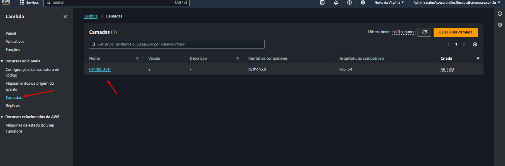


Etapa 4: Utilizando a Layer

No menu do Lambda, seleciono Funções e localizo a função Lambda criada na Etapa 1.

Vou até a seção de Camadas e clico em Adicionar uma camada.

Escolho Custom Layers (Camadas personalizadas), seleciono a camada criada e a versão.

Clico em Adicionar.

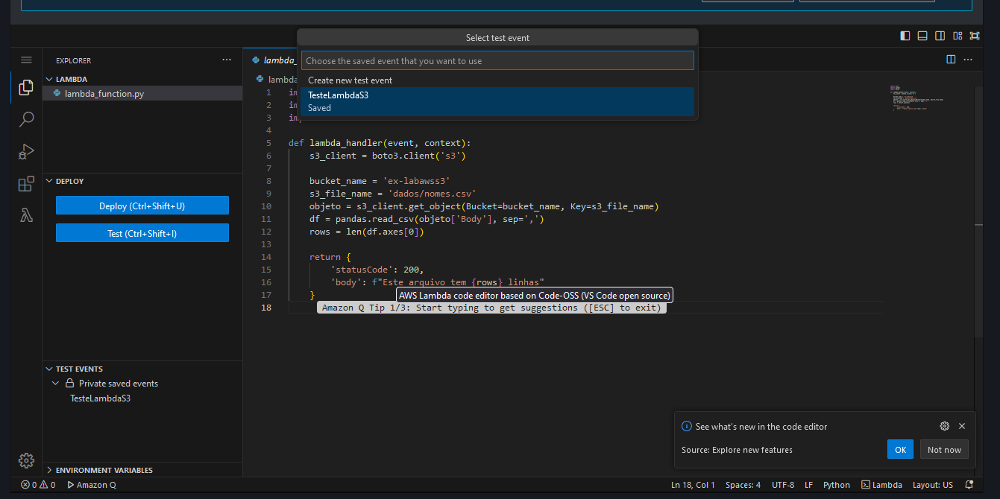

Executo o teste e vejo o resultado esperado no Response:


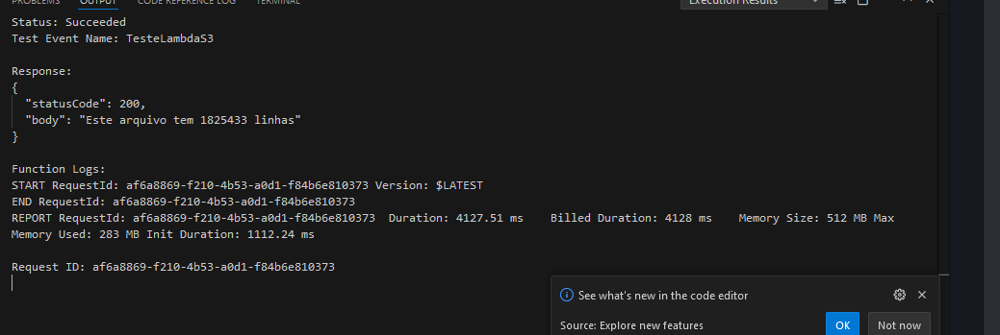

eu  ajustei  o tempo limite e o tamanho da memória da Lambda para suportar operações com grandes volumes de dados.
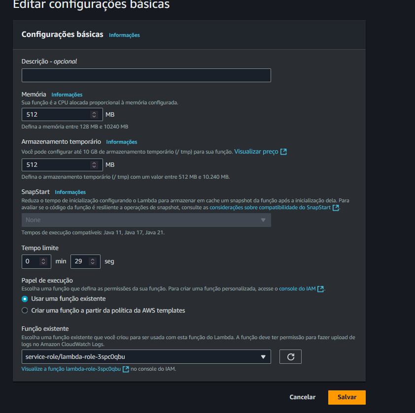


Resultado [Resposta do Lab AWS Athena zip](../Sprint_6/exercicios/layer_pandas/minha-camada-pandas.zip)

Conclusão: Eu gostei muito desses exercícios. Eles são realmente fáceis de seguir, com todas as instruções bem detalhadas sobre o que fazer (talvez pudessem ser um pouco mais desafiadores para nos incentivar ainda mais). De modo geral, gostei bastante de trabalhar com Athena e Lambda; achei que foi simples de entender e aprender. Não tive dificuldades, e, até o momento, considero esses os melhores exercícios, junto com os da Sprint 2.

# Desafios

[Desafio 6](../Sprint_6/Desafio/README.MD)


# Evidências

Minha lógica ja esta documentada nos aquivos, vou usar imagens colocando que funcionou dentro da plataforma. A ideia é mostrar de forma clara e direta os resultados


# Feedback

Durante a Sprint 6, tive uma experiência bastante positiva, especialmente em relação à implementação do código, que achei relativamente fácil e direta. Não enfrentei grandes dificuldades técnicas nessa parte. Contudo, o maior desafio foi realmente desenvolver uma análise que fosse sólida e envolvente. Confesso que ainda me sinto um pouco incerto sobre qual caminho seguir para criar uma análise que traga insights realmente interessantes e aprofundados.

De modo geral, aprendi muito e aproveitei bem a oportunidade para expandir meus conhecimentos, especialmente na prática. Inclusive, fiz um  curso adicional por fora para complementar meu aprendizado. No entanto, senti que a sprint foi um pouco superficial em termos de conteúdo. Consegui finalizar todas as atividades com bastante antecedência, e isso acabou me levando a procrastinar um pouco, pois não havia tanto a explorar além do que foi proposto. Apesar disso, me esforcei para buscar maneiras de enriquecer o que foi entregue.

Minha avaliação para essa sprint é 6/10 igual a ultima. Foi uma experiência produtiva e enriquecedora em certos aspectos, mas eu gostaria que houvesse mais profundidade em algumas áreas. Ter um conteúdo mais desafiador e um escopo mais amplo permitiria que eu me envolvesse ainda mais e realmente me aprofundasse na análise de dados.


# Erros cometidos.


eu acabei subindo o csv pro git sem qeurer e deu tudo errado kkkkkkkkkkkk

e para ajudar ainda dei .gitignore errado mas deu tudo certo vou dar alguns detalhes do que fiz

git rm -r --cached Sprint_6/Desafio/Spritn_6/csv/ para apagar minha versao e ainda sim n estava mais subindo pro meu git

usei um git log --onelin

entao eu voltei na versao anterior que eu tinha no meu git mudei pull requests E o meu main no git e depois eu atualizei no meu o main do meu do meu pc fazendo 
finalmente funcionar. 

git branch -D main 

git checkout main

acabei colocando um .gitignore nos meus arquivos 