# Certificados

 [ Certificados](../Sprint_07/certificados/img/txt.txt)

# Exercícios

1. [Contador](../Sprint_07/exercicios/Contador/contador_de_palavras.py)

2. [TMDB](../Sprint_07/exercicios/TMDB/tmdb/tmdb.py)

3. [GLUE](../Sprint_2/exercicios/exportacao_Biblioteca/biblioteca2/query.sql)


# Desafios

[Desafio 7](../Sprint_07/Desafio/README.MD)

[Desafio](Desafio/Sprint_07)


# Evidências

<h1>Contador </h1>


A proposta inicial do desafio incluía o uso da imagem jupyter/all-spark-notebook no Docker para criar um ambiente com Spark e Jupyter Lab pré-instalados. No entanto, como o tamanho da imagem Docker era grande (5.8GB), e eu queria agilizar o processo, optei por usar o Google Colab para configurar e executar o Spark.


3. Passos Realizados

3.1 Configuração do Ambiente no Google Colab

Instalação do PySpark:

Iniciei instalando o PySpark no ambiente do Colab com os seguintes comandos:


`!apt-get install openjdk-8-jdk-headless -qq > /dev/null`
`!wget -q https://archive.apache.org/dist/spark/spark-3.1.2/spark-3.1.2-bin-hadoop2.7.tgz`
`!tar xf spark-3.1.2-bin-hadoop2.7.tgz`
`!pip install -q findspark`

Configuração das Variáveis de Ambiente:

Configurei o Java e o Spark para que fossem reconhecidos no Colab:

import os
`os.environ["JAVA_HOME"] = "/usr/lib/jvm/java-8-openjdk-amd64"`
`os.environ["SPARK_HOME"] = "/content/spark-3.1.2-bin-hadoop2.7"`

Inicialização do Spark:

Inicializei o Spark com o findspark e criei uma sessão:

`import findspark`
`findspark.init()`
`from pyspark.sql import SparkSession`
`spark = SparkSession.builder.master("local[*]").appName("Colab Spark").getOrCreate()`


Fiz um teste 

`spark.range(5).show()`

Processamento do Arquivo README.md
Carregando o Arquivo:
Montei meu Google Drive no Colab para acessar o arquivo README.md:

from google.colab import drive
drive.mount('/content/drive')
rdd = spark.sparkContext.textFile("/content/drive/MyDrive/Colab Notebooks/README.md")

(**Nota:Peguei qualquer README do meu git**)

Contagem de Palavras:
Realizei o processamento para contar as palavras no arquivo. As etapas principais foram:

Dividir o texto em palavras.
Remover palavras vazias.
Contar as ocorrências de cada palavra.

`import re`
`word_counts = (rdd.flatMap(lambda line: re.split(r'\W+', line))  `
                  ` .filter(lambda word: len(word) > 3)  `
                  ` .map(lambda word: (word.lower(), 1))  `
                  ` .reduceByKey(lambda a, b: a + b))  `

Exibição dos Resultados:
Transformei os resultados em um DataFrame e exibi as palavras mais frequentes:

`word_counts_df = word_counts.toDF(["Palavra", "Contagem"]).orderBy("Contagem", ascending=False)`
`word_counts_df.show(truncate=False)`

 Resultados Obtidos:
O Spark foi configurado com sucesso no Google Colab.
O arquivo README.md foi processado, e consegui identificar as palavras mais frequentes no texto.
A análise revelou a contagem precisa de cada palavra, com a possibilidade de expandir para remover pontuações e ordená-las.

(**Nota: Considerei palavra algo com mais de 3 letras**)
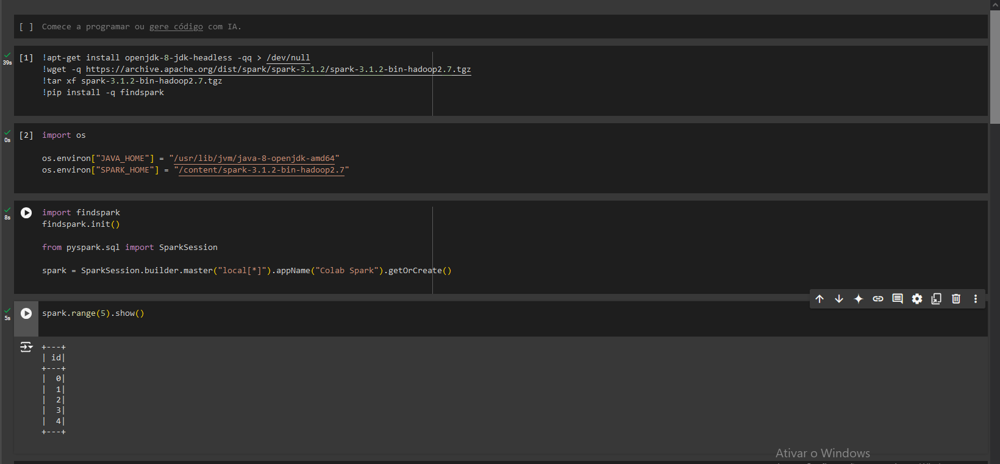

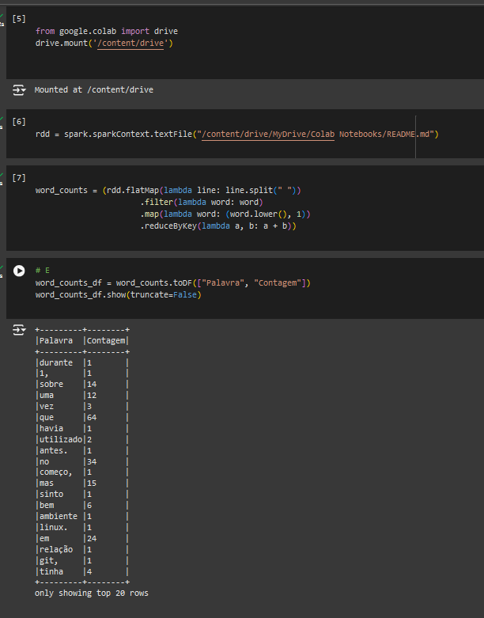

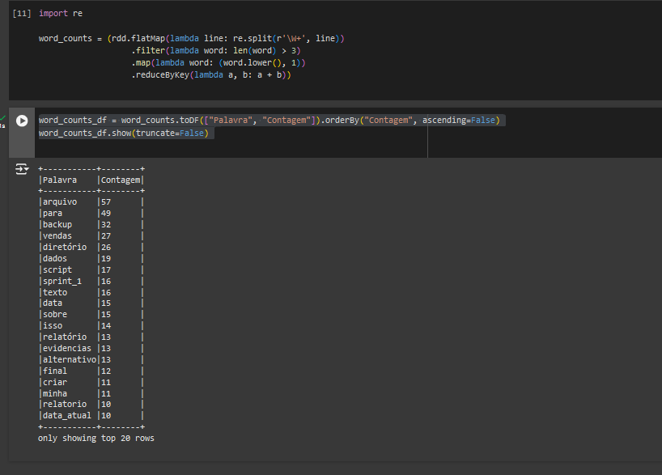

<h1> TMDB</h1>

Passo 1: Criando uma Conta no TMDB

Não vou comentar o obivo 

mas fiz a conta e Com a chave de API em mãos, pude prosseguir com os próximos passos.

    Configurando o Ambiente

Agora que eu tinha a chave de API, a primeira coisa que fiz foi configurar o ambiente de desenvolvimento.

Criei um arquivo .env no qual armazenei a chave de API para manter minhas credenciais seguras e evitar que fossem expostas 

diretamente no código.

Instalei as bibliotecas necessárias para o projeto:

requests: para fazer requisições HTTP à API.

pandas: para manipulação e exibição dos dados.

python-dotenv: para carregar variáveis de ambiente a partir do arquivo .env.


`pip install requests pandas python-dotenv`

Em seguida, escrevi o código Python para fazer uma requisição à API do TMDB e processar os dados dos filmes.


Carregamento da Chave da API: Usei o dotenv para carregar a chave da API a partir do arquivo .env:

`from dotenv import load_dotenv`
`import os`

`# Carregar variáveis de ambiente`
`load_dotenv()`

`api_key = os.getenv("API_KEY")`

Requisição à API: Utilizei o requests.get() para fazer a requisição à API e verifiquei o código de status da resposta para garantir que a requisição foi bem-sucedida:

Processamento dos Dados: Após obter a resposta da API, extraí as informações relevantes de cada filme, como título, data de lançamento, visão geral, votos e média de votos. Guardei esses dados em um DataFrame do Pandas para exibi-los de forma estruturada:

Exibição dos Dados: Por fim, utilizei o Pandas para organizar os dados em um DataFrame e exibi-los com a função display():


Resultado
Ao executar o código, consegui obter os filmes mais bem avaliados, com suas respectivas informações de título, data de lançamento, visão geral, votos e média de votos, todos organizados de maneira clara e fácil de visualizar.

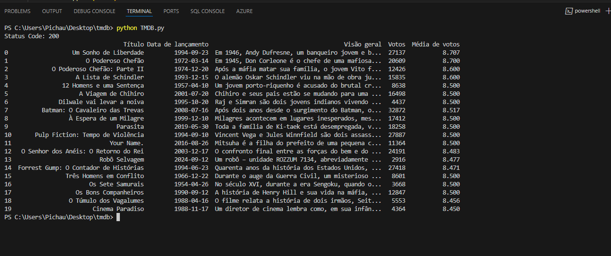

Verificando o Código de Status e Tratamento de Erros

Adicionei verificações adicionais no código para garantir que o processo não falhasse caso houvesse problemas na requisição à API. Se o código de status retornado não for 200 (sucesso), o programa exibe uma mensagem de erro detalhada.

Neste exercício, consegui integrar a API do TMDB ao meu código Python com sucesso. O uso do arquivo .env para armazenar a chave de API foi uma boa prática para manter as credenciais seguras. O código foi capaz de extrair dados dos filmes mais bem avaliados e exibi-los de forma estruturada com a ajuda do Pandas.

Codigo completo

[TMDB](../Sprint_07/exercicios/TMDB/tmdb/tmdb.py)


<h1>GLUE </h1>


Preparando os dados de origem
Primeiro, vou garantir que o arquivo nomes.csv, que contém dados sobre nomes de registro de nascimento dos cartórios americanos, esteja armazenado em um bucket no S3. O caminho do arquivo no S3 será s3://{BUCKET}/lab-glue/input/nomes.csv. O {BUCKET} deve ser substituído pelo nome do meu bucket na conta AWS.


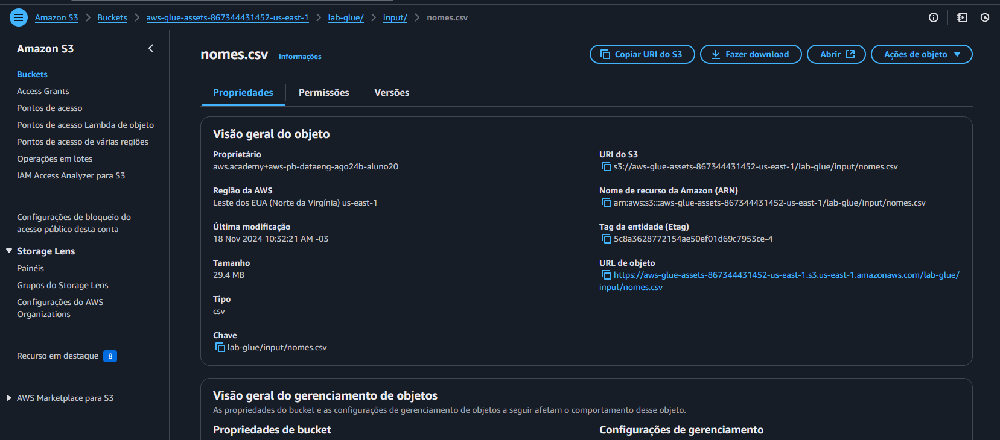

2. Criando a IAM Role para os jobs do AWS Glue

Agora, vou criar uma IAM Role para que o AWS Glue possa executar jobs com as permissões necessárias:

Acesso ao console do IAM (Identity and Access Management) e crio uma nova Role chamada AWSGlueServiceRole-Lab4.

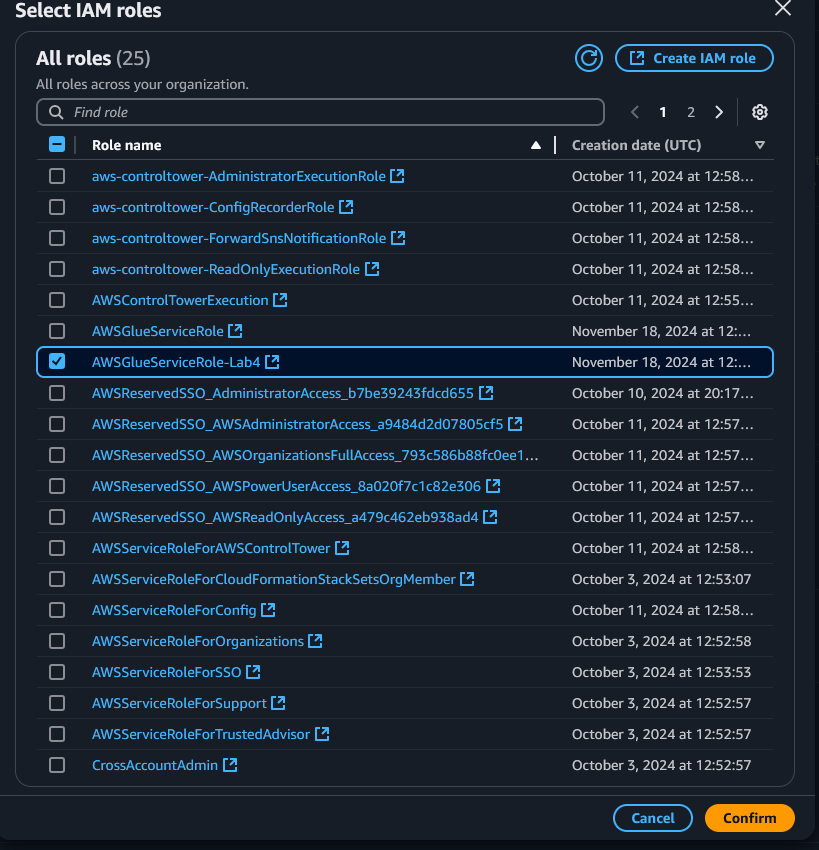

Na criação, seleciono as policies necessárias:

AmazonS3FullAccess

AWSLakeFormationDataAdmin

AWSGlueConsoleFullAccess

CloudWatchFullAccess

Após isso, finalizo a criação da Role.

3. Configurando a conta para usar o AWS Glue

Acessarei o console do AWS Glue e, na opção "Set up roles and users", selecionarei a Role AWSGlueServiceRole-Lab4 para garantir que o Glue tenha acesso necessário.
Também concedo permissões totais de leitura e escrita para o S3.
Finalizo o processo clicando em "Next" e depois "Apply changes".

4. Configuração do AWS Lake Formation
Vou configurar o AWS Lake Formation para criar um banco de dados no qual o crawler do Glue irá adicionar uma tabela automaticamente:


No console do Lake Formation, clico em "Add myself" e "Get started".
Crio um banco de dados chamado glue-lab no catálogo do Glue.


Finalizo a criação do banco.


5. Criando um Job no AWS Glue
Agora, vou criar um Job ETL no Glue:

Acessarei o console do Glue, e em "ETL jobs", escolho a opção "Visual ETL" e depois "Script editor".

Selecionei o tipo de engine "Spark" e criei o script.

Na parte "Job details", configurarei as propriedades do job, incluindo:
Name: job_aws_glue_lab_4
IAM Role: AWSGlueServiceRole-Lab4
Engine: Spark
Glue version: Glue 3.0
Language: Python 3
Worker type: G 1x
Requested number of workers: 2
Job timeout: 5 minutos
Finalmente, crio o job.

6. Desenvolvendo o código ETL no Job
Com o job criado, vou escrever o código para processar o arquivo nomes.csv:

Vou ler o arquivo do S3, filtrar os dados para o ano de 1934 e armazená-los em formato Parquet em outro local no S3.

Vou utilizar parâmetros como S3_INPUT_PATH e S3_TARGET_PATH para tornar o código flexível.

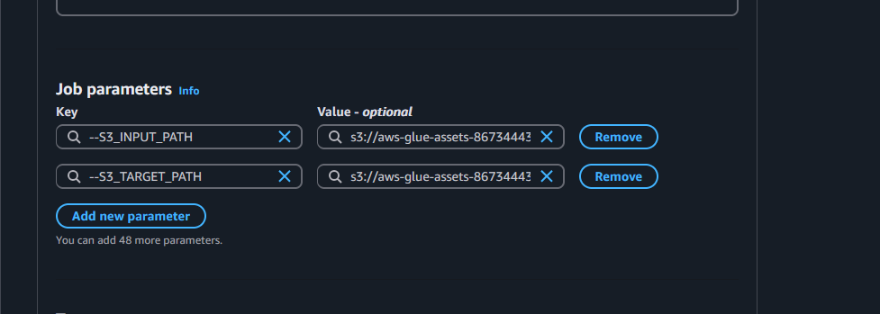

O código a ser implementado usará objetos dynamic_frames e dataframes do Glue para manipular os dados.


7. Imprimindo e manipulando os dados
Vou seguir as instruções para manipular e imprimir dados:

Vou imprimir o esquema do dataframe gerado.
Alterar a caixa dos valores da coluna nome para MAIÚSCULO.
Imprimir a contagem de linhas no dataframe.
Agrupar os dados por ano e sexo e ordenar para mostrar o ano mais recente.
Encontrar o nome feminino e masculino mais registrados, e os anos correspondentes.

```sql
df = spark.read.csv(input_path, header=True, inferSchema=True)

# 2. Imprimir o schema do DataFrame
print("Schema do DataFrame:")
df.printSchema()

# 3. Alterar os valores da coluna nome para MAIÚSCULO
df_upper = df.withColumn("nome", upper(col("nome")))

# 4. Imprimir a contagem de linhas presentes no DataFrame
print(f"Total de linhas no DataFrame: {df_upper.count()}")

# 5. Contar nomes agrupados por ano e sexo
df_grouped = df_upper.groupBy("ano", "sexo").agg(count("nome").alias("total_nomes"))
print("Contagem de nomes agrupados por ano e sexo:")
df_grouped.show()

# 6. Ordenar os dados pelo ano mais recente
df_sorted = df_upper.orderBy(col("ano").desc())
print("Dados ordenados pelo ano mais recente:")
df_sorted.show()

# 7. Nome feminino com mais registros e o ano
df_fem = df_upper.filter(col("sexo") == "F")
most_common_fem = df_fem.groupBy("ano", "nome").agg(count("*").alias("total")) \
    .orderBy(desc("total")).first()
print(f"Nome feminino mais registrado: {most_common_fem['nome']} em {most_common_fem['ano']}")

# 8. Nome masculino com mais registros e o ano
df_masc = df_upper.filter(col("sexo") == "M")
most_common_masc = df_masc.groupBy("ano", "nome").agg(count("*").alias("total")) \
    .orderBy(desc("total")).first()
print(f"Nome masculino mais registrado: {most_common_masc['nome']} em {most_common_masc['ano']}")

# 9. Total de registros masculinos e femininos para cada ano (primeiras 10 linhas)
df_year_totals = df_upper.groupBy("ano", "sexo").agg(count("*").alias("total")) \
    .orderBy("ano").limit(10)
print("Total de registros masculinos e femininos para os primeiros 10 anos:")
df_year_totals.show()

# 10. Escrever o DataFrame com nomes em maiúsculo no S3
df_upper.write.mode("overwrite").partitionBy("sexo", "ano").json(output_path)

 Finalizar o job
job.commit()
```
confirmação do resultado 

[Codigo](exercicios/GLUE/glue.py)


8. Gravando os resultados no S3
O próximo passo é gravar os resultados no S3:

O dataframe com os nomes em maiúsculo será salvo no subdiretório frequencia_registro_nomes_eua no caminho s3://lab-glue/.
Vou salvar os dados em formato JSON e particionados pelas colunas sexo e ano.

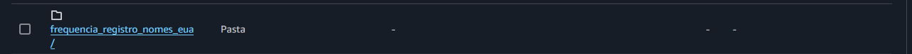


9. Criando o Crawler

Vou criar um Crawler para monitorar o diretório no S3 e automaticamente criar uma tabela no catálogo do Glue:

No console do Glue, vou acessar "Crawlers" e clicar em "Create".
Definirei o nome do Crawler como FrequenciaRegistroNomesCrawler e especificarei o caminho do S3 onde os dados estão.
Configurarei o Crawler para usar a Role AWSGlueServiceRole-Lab4 e definir o banco de dados de destino como glue-lab.
Finalmente, vou executar o Crawler e verificar se a tabela foi criada com sucesso no catálogo do Glue.

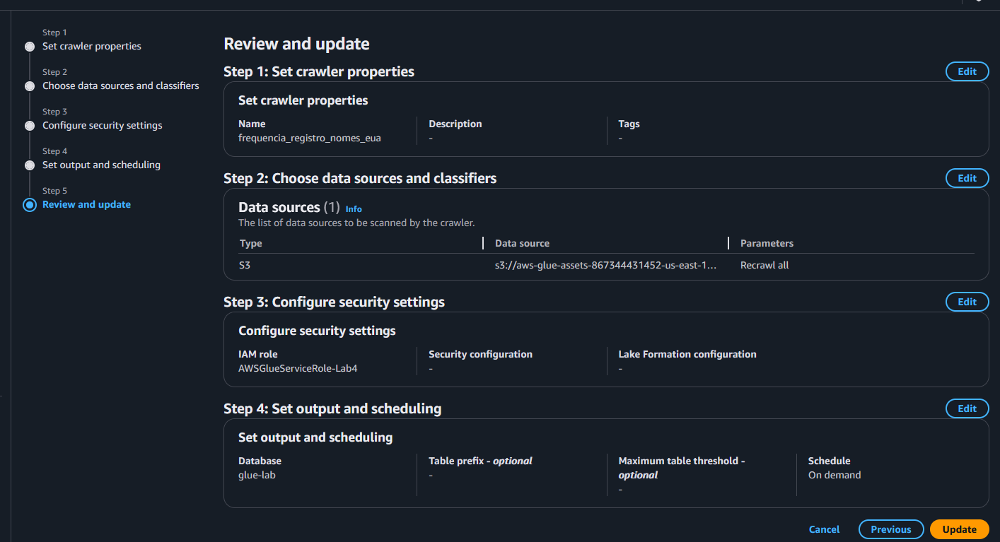

10. Verificando os resultados
Após a execução do Crawler, vou verificar a criação da tabela frequencia_registro_nomes_eua:

No Glue, vou acessar a seção de "Tables" para confirmar que a tabela foi criada.

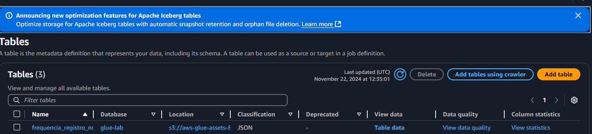

vou realizar  consulta no Athena

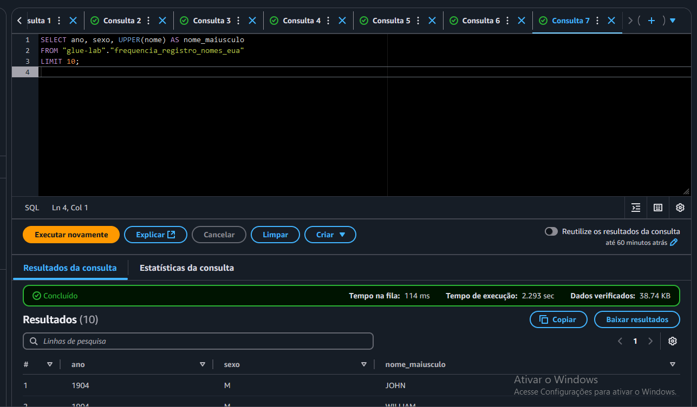

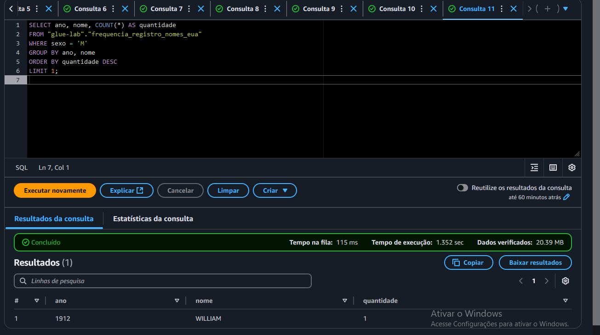

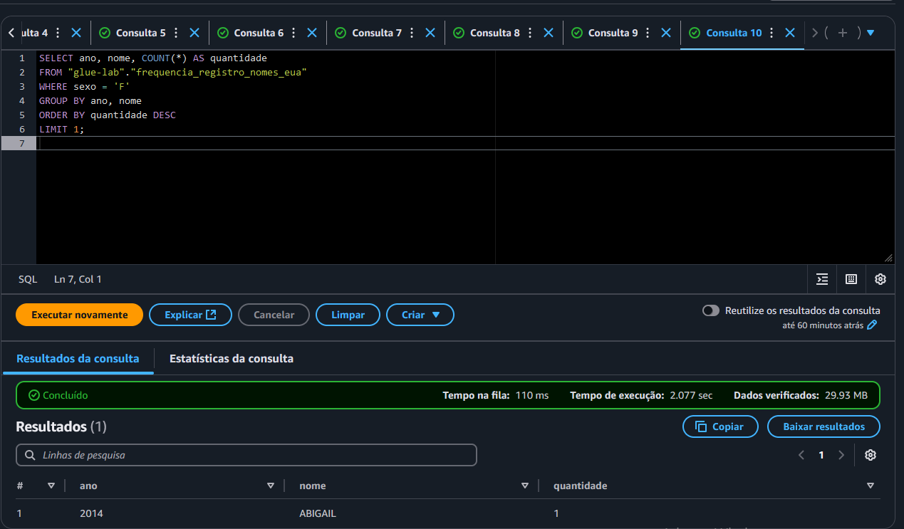

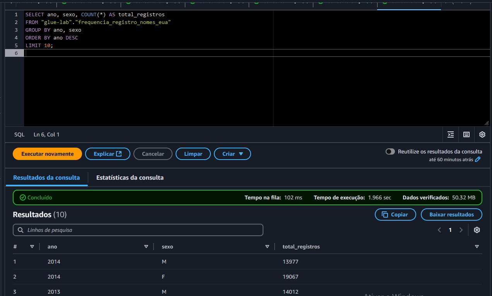

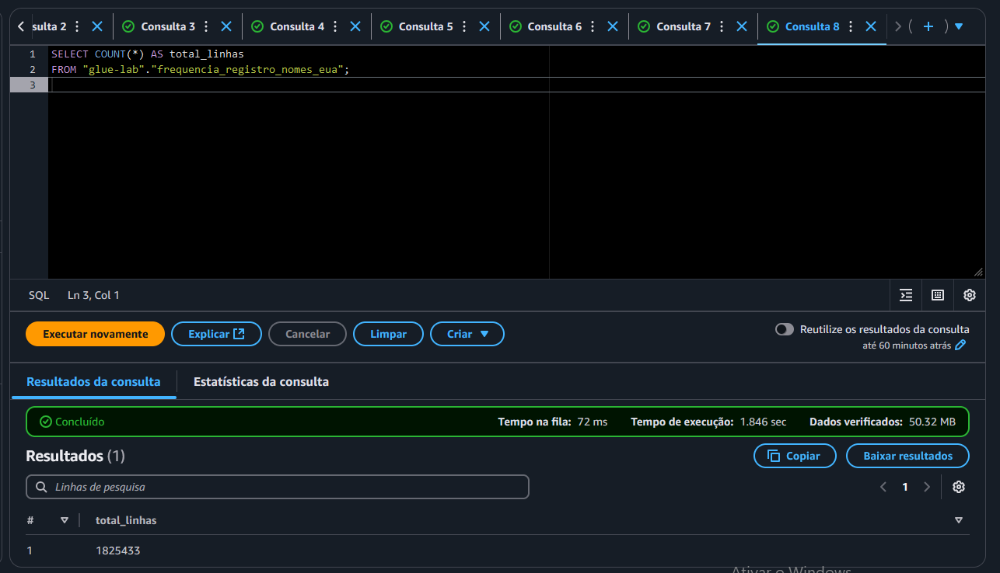

vou realizar algumas mais consulta no Athena para verificar os dados.

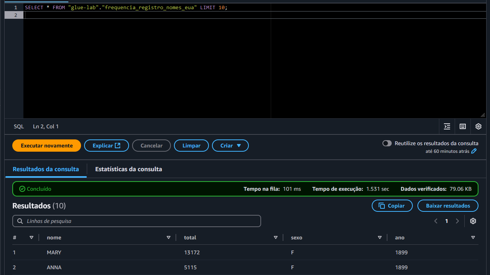

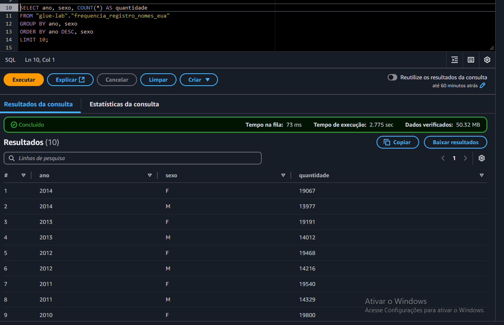

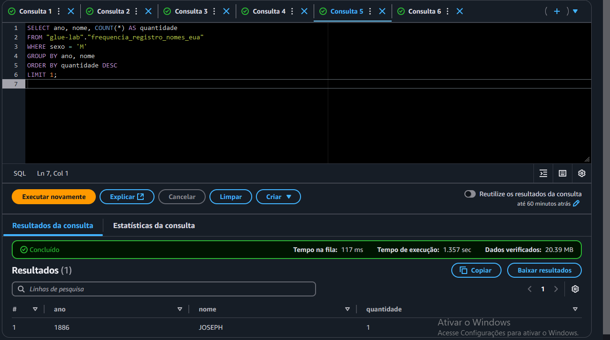

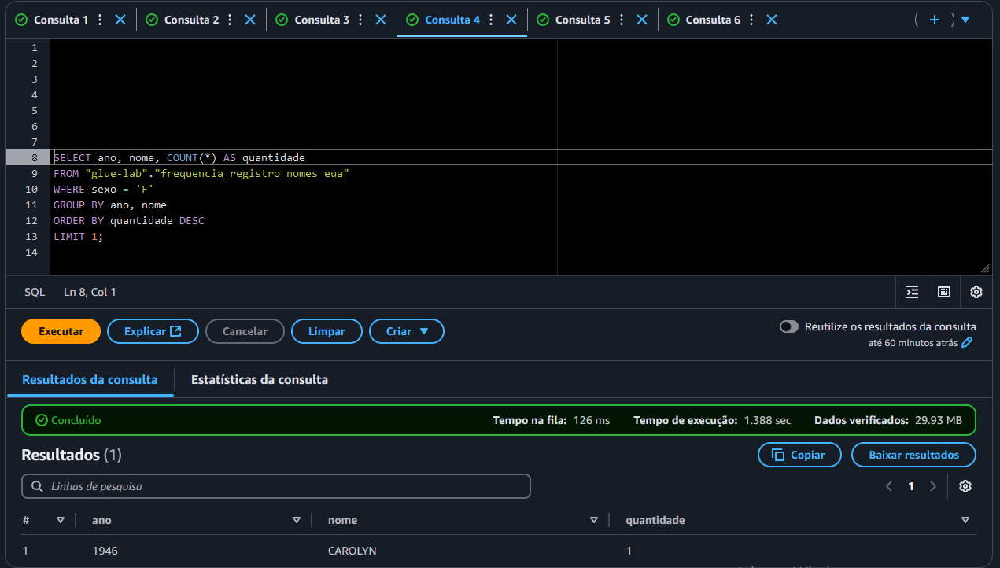

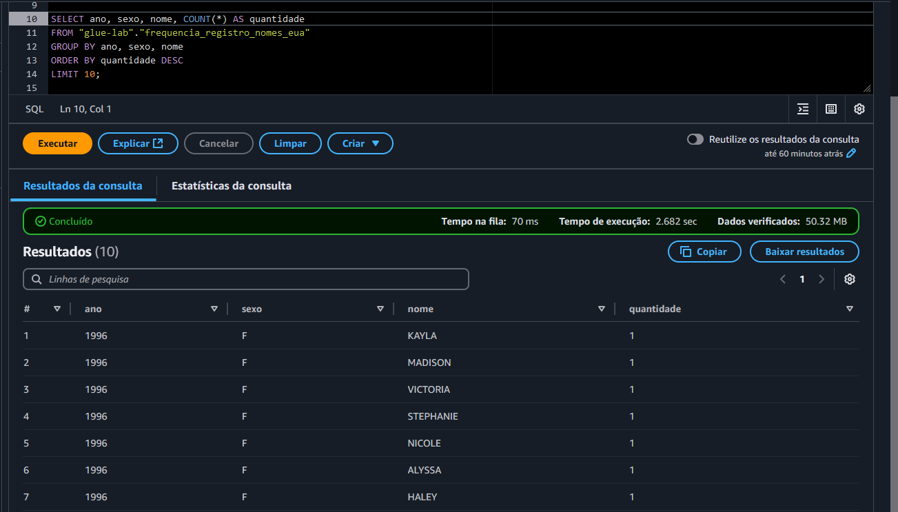

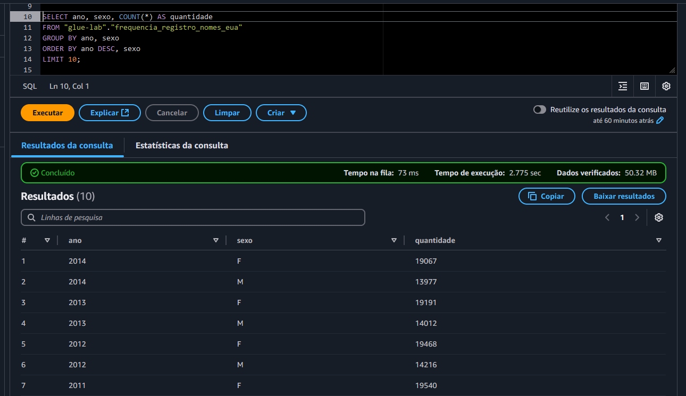


# Feedback

Eu gostei muito, de verdade, dos exercícios! Acho a dinâmica extremamente interessante e percebo que aprendo muito mais dessa forma do que assistindo a vídeos. É, sem dúvidas, uma maneira muito eficiente de ensinar.

O único ponto negativo que gostaria de destacar é o PDF desatualizado, que acabou atrapalhando mais do que ajudando em alguns momentos.

Sobre o desafio, não tive problemas para concluí-lo. Confesso que me sinto um pouco inseguro pois notei que as pessoas fizeram de um jeito diferente do meu usando docker e criando mais uma camada no s3 no mesmo "nivel" da raw , mas acredito que meio jeito esteja certo tambem.