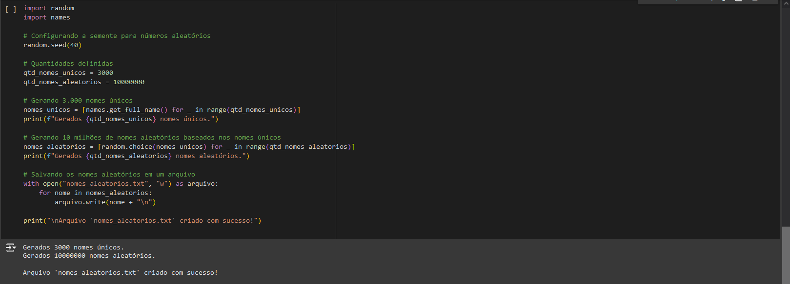

Durante a Sprint 8, aprendi muito e aproveitei bastante a experiência. Gostei bastante da sprint como um todo, achei os exercícios bem elaborados e o desafio bastante interessante. Embora tenha enfrentado algumas dificuldades, a jornada foi muito enriquecedora e satisfatória.

# Certificados

 [ Certificados](../Sprint_08/certificados/img/texto.txt)

# Exercícios

1. [Resposta massa_dados](../Sprint_08/exercicios/massa_dados.py)

2. [Resposta apache_spark](../Sprint_08/exercicios/apache_spark.py)

3. [Resposta TMDB](../Sprint_08/exercicios/TMDB/tmdb/tmdb.py)

# Desafios

[Desafio 8](../Sprint_08/Desafio/README.MD)

# Evidências

Minha lógica ja esta documentada nos aquivos, vou usar imagens colocando que funcionou dentro da plataforma. A ideia é mostrar de forma clara e direta os resultado!

<h1> Massa_dados </h1>

Etapa 1: Lista de números aleatórios

Comecei gerando uma lista com 250 números inteiros aleatórios entre 1 e 1000.

Para isso, usei a função random.randint() dentro de uma list comprehension.

Reverti a ordem dos números na lista.

Utilizei o método reverse() para inverter a ordem dos elementos.

Imprimi o resultado.

A lista gerada, agora invertida, foi exibida no console.

Etapa 2: Lista de animais

Criei uma lista contendo os nomes de 20 animais.

Listei os nomes diretamente dentro de uma lista.

Ordenei os nomes em ordem crescente.

Utilizei o método sort() da lista para organizar os nomes alfabeticamente.

Imprimi cada animal em uma linha.

Iterei sobre a lista com um loop for e exibi cada animal individualmente.

Salvei a lista em um arquivo chamado animais.csv.

Usei o comando open() no modo de escrita ("w") para salvar cada nome em uma linha do arquivo.

Etapa 3: Geração de nomes de pessoas

Configurei a semente para números aleatórios.

Usei random.seed(40) para garantir que os resultados fossem reprodutíveis.

Defini as quantidades necessárias.

Determinei que seriam gerados 3.000 nomes únicos e 10 milhões de nomes aleatórios.

Gerei os 3.000 nomes únicos.

Usei a função names.get_full_name() em um loop para gerar os nomes.

Exibi no console a confirmação da geração.

Gerei os 10 milhões de nomes aleatórios.

Escolhi aleatoriamente, com random.choice(), os nomes únicos para criar essa lista maior.

Exibi no console a confirmação da geração.

Salvei os nomes aleatórios em um arquivo chamado nomes_aleatorios.txt.

Usei um loop para escrever cada nome em uma linha do arquivo.
Exibi no console a confirmação de que o arquivo foi salvo com sucesso.

Txt com os nomes 

<h1> Apache_Spark </h1>

Configuração Inicial
Comecei instalando a biblioteca pyspark usando o comando 
!pip install pyspark no Google Colab.

Montei meu Google Drive no Colab com o comando:

Usei o caminho do arquivo nomes_aleatorios.txt no Google Drive e li o conteúdo.

Renomeando Coluna

Renomeei a coluna padrão _c0 para Nome com

Exibi o esquema atualizado do DataFrame com df_nomes.printSchema().
Mostrei novamente as 10 primeiras linhas com o nome atualizado usando df_nomes.show(10).

Adicionei uma nova coluna chamada Escolaridade com valores aleatórios entre:
Fundamental
Médio
Superior
Usei a função rand() para gerar aleatoriedade

Criei uma lista com os países da América do Sul e adicionei a coluna País com valores aleatórios da lista.
Atribuí os valores utilizando a função rand() e when()

Adicionei a coluna AnoNascimento com valores aleatórios entre 1945 e 2010:

Filtrei os registros de pessoas nascidas a partir do ano 2000:

Criei uma tabela temporária chamada pessoas

Filtrei pessoas nascidas neste século usando SQL:

Filtrei as pessoas nascidas entre 1980 e 1994 (Geração Millennials):

Executei a contagem via SQL:

Executei uma consulta SQL para categorizar as gerações:

<h1> TMDB</h1>

Passo 1: Criando uma Conta no TMDB

Não vou comentar o obivo 

mas fiz a conta e Com a chave de API em mãos, pude prosseguir com os próximos passos.

    Configurando o Ambiente

Agora que eu tinha a chave de API, a primeira coisa que fiz foi configurar o ambiente de desenvolvimento.

Criei um arquivo .env no qual armazenei a chave de API para manter minhas credenciais seguras e evitar que fossem expostas 

diretamente no código.

Instalei as bibliotecas necessárias para o projeto:

requests: para fazer requisições HTTP à API.

pandas: para manipulação e exibição dos dados.

python-dotenv: para carregar variáveis de ambiente a partir do arquivo .env.

`pip install requests pandas python-dotenv`

Em seguida, escrevi o código Python para fazer uma requisição à API do TMDB e processar os dados dos filmes.

Carregamento da Chave da API: Usei o dotenv para carregar a chave da API a partir do arquivo .env:

`from dotenv import load_dotenv`
`import os`

`# Carregar variáveis de ambiente`
`load_dotenv()`

`api_key = os.getenv("API_KEY")`

Requisição à API: Utilizei o requests.get() para fazer a requisição à API e verifiquei o código de status da resposta para garantir que a requisição foi bem-sucedida:

Processamento dos Dados: Após obter a resposta da API, extraí as informações relevantes de cada filme, como título, data de lançamento, visão geral, votos e média de votos. Guardei esses dados em um DataFrame do Pandas para exibi-los de forma estruturada:

Exibição dos Dados: Por fim, utilizei o Pandas para organizar os dados em um DataFrame e exibi-los com a função display():

Resultado
Ao executar o código, consegui obter os filmes mais bem avaliados, com suas respectivas informações de título, data de lançamento, visão geral, votos e média de votos, todos organizados de maneira clara e fácil de visualizar.

Verificando o Código de Status e Tratamento de Erros

Adicionei verificações adicionais no código para garantir que o processo não falhasse caso houvesse problemas na requisição à API. Se o código de status retornado não for 200 (sucesso), o programa exibe uma mensagem de erro detalhada.

Neste exercício, consegui integrar a API do TMDB ao meu código Python com sucesso. O uso do arquivo .env para armazenar a chave de API foi uma boa prática para manter as credenciais seguras. O código foi capaz de extrair dados dos filmes mais bem avaliados e exibi-los de forma estruturada com a ajuda do Pandas.

Codigo completo

[TMDB](../Sprint_7/exercicios/TMDB/tmdb/tmdb.py)

# Feedback

Para mim, a Sprint 8 foi a mais dificil até agora, e eu a avaliaria com uma nota 7,5. Trabalhar com o AWS Glue foi um pouco complicado em alguns aspectos, mas estou começando a pegar o jeito. Particularmente, não gostei muito da forma como o script job é utilizado, pois, na minha opinião, seria possível alcançar os mesmos resultados utilizando o **visual job**, o que considero mais prático com base no videos que eu vi. Apesar de interessante, essa abordagem não me agradou tanto.

Por outro lado, o desafio em si foi bastante simples. O que realmente se destacou para mim foram os exercícios, novamente. A sequência de exercícios tem sido muito boa, e sinto que aprendo mais com eles do que com as videoaulas. Gostei bastante dessa dinâmica de aprendizado!

# Feedback Monitoria

incluir o partitionBy.

csv:

`clean_data = DynamicFrame.fromDF(df_cleaned, glueContext, "clean_data")`

`df_cleaned.write.mode("overwrite").partitionBy("column_name").parquet(output_path)`

Json:

`dyf_cleaned = DynamicFrame.fromDF(df_cleaned, glueContext, "dyf_cleaned")`

`partition_columns = ["year", "month", "day"]`

`df_cleaned = df_cleaned.withColumn("year", lit(year_value)) \`
                      ` .withColumn("month", lit(month_value)) \`
                      ` .withColumn("day", lit(day_value))`

`df_cleaned.write.mode("overwrite").partitionBy(*partition_columns).parquet(output_path)`

Recomendação do uso do selec.

CSV:

`df_cleaned = raw_data.select([`
   ` trim(lower(when(col(c) == "\\N", None).otherwise(col(c)))).alias(c)`
   ` if dict(raw_data.dtypes)[c] == "string" `
   ` else when(col(c) == "\\N", None).otherwise(col(c)).alias(c)`
 `   for c in raw_data.columns`
`])`

JSON:

`df_cleaned = df.select(["id", "title"]) \`
   ` .dropDuplicates(["id", "title"]) \`
   ` .na.drop()`

