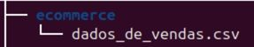
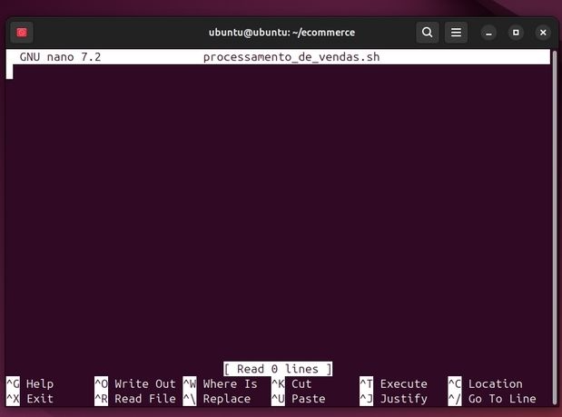
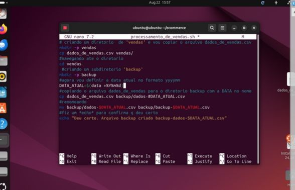
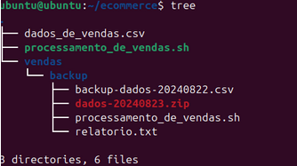
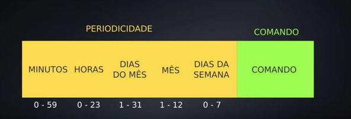
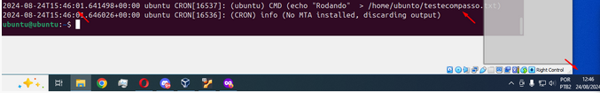

# Instruções
# Primeiro passo:

- Criando ecommerce

mkdir ecommerce
`mkdir /ecommerce`

`mv /home/ubuntu/Desktop/dados_de_vendas.csv ecommerce/l`
ou
`mv ~/Desktop/dados_de_vendas.csv ~/ecommerce/`

verificando se foi movido

ecommerce/
└── dados_de_vendas.csv

<h4> Segundo Passo:</h4>

Criar o Script processamento_de_vendas.sh

Navegue até o diretório ecommerce:
`cd /ecommerce`
Criando o arquivo processamento_de_vendas.sh:

`touch processamento_de_vendas.sh`
Dando permissão de execução ao script:

`chmod +x processamento_de_vendas.sh`

Escrevendo o Script
Abra o arquivo no editor de texto do Linux, como o nano:

nano processamento_de_vendas.sh

Ficando assim o codigo
`# Cria o diretório 'vendas' e copia o arquivo dados_de_vendas.csv para ele `
`mkdir -p vendas`
`cp dados_de_vendas.csv vendas/`
`# Navega até o diretório 'vendas'`
`cd vendas`
`# Crie o subdiretório 'backup'`
`mkdir -p backup`
`# Define a data atual no formato yyyymmdd`
`DATA_ATUAL=$(date +%Y%m%d)`
`# Copia o arquivo dados_de_vendas.csv para o diretório backup com a data no nome`
`cp dados_de_vendas.csv backup/dados-$DATA_ATUAL.csv`
`# Renomeia o arquivo no diretório backup para o novo nome "backup"`
`mv backup/dados-$DATA_ATUAL.csv backup/backup-dados-$DATA_ATUAL.csv`
`# Exibe uma mensagem de conclusão`
`echo "Deu certo. Arquivo backup criado: backup-dados-$DATA_ATUAL.csv"`

Salvei e sai do editor (Ctrl + O para salvar e Ctrl + X para sair no nano).

Testando o script no terminal:
`./processamento_de_vendas.sh`

Confirmando  que os arquivos foram criados e renomeados corretamente:

para navegar até o diretório cd vendas/backup
`cd vendas/backup`

<h4> Terceiro Passo:</h4>

Criando o Arquivo relatorio.txt
`touch relatorio.txt`

agora eu preciso Obter a Data do Sistema em Formato YYYY/MM/DD HH:MI
Utilizei o comando “data” para formatar a data
Abro o nano

ficando assim. 
`“echo "Data do sistema: $(date '+%Y/%m/%d %H:%M')" >> relatorio.txt”`

**(Nota: roubei esses códigos da internet é adaptei ele # date +%Y%m%d -s "2019-05-11"  $ date +'Hoje é %A, %d de %B de %Y, o %j dia do ano, as %H:%M')**

tenho que Obter as Datas de Primeiro e Último Registro de Venda
Eu notei que as datas de vendas estão na coluna 5 do arquivo CSV. Vamos pegar a primeira e última datas do arquivo:

Ficando assim.
 `FIRST_DATE=$(head -n 2 backup-dados-$DATA_ATUAL.csv | tail -n 1 | cut -d',' -f5): Captura a data do primeiro registro do arquivo de backup.)`
`LAST_DATE=$(tail -n 1 backup-dados-$DATA_ATUAL.csv | cut -d',' -f5): Captura a data do último registro do mesmo arquivo`

`echo "Data do primeiro registro de venda: $FIRST_DATE" >> relatorio.txt`
`echo "Data do último registro de venda: $LAST_DATE" >> relatorio.txt`
Agora eu preciso contar a Quantidade Total de Itens Diferentes Vendidos
`TOTAL_ITENS=$(cut -d',' -f2 backup-dados-$DATA_ATUAL.csv | tail -n +2 | sort | uniq | wc -l)`

#Contando a quantidade total de itens diferentes vendidos
TOTAL_ITENS=$(cut -d',' -f2 backup-dados-$DATA_ATUAL.csv | tail -n +2 | sort | uniq | wc -l)
`echo "Quantidade total de itens diferentes vendidos: $TOTAL_ITENS" >> relatorio.txt`
#Inclui as primeiras 10 linhas do arquivo no relatorio.txt
`echo -e "\nPrimeiras 10 linhas do arquivo:" >> relatorio.txt`
`head -n 10 backup-dados-$DATA_ATUAL.csv >> relatorio.txt`

#Compacta o arquivo CSV
`zip dados-$DATA_ATUAL.zip backup-dados-$DATA_ATUAL.csv`

#Apaga os arquivos desnecessários
rm backup-dados-$DATA_ATUAL.csv
rm ../dados_de_vendas.csv
**(nota a primeira vez eu fiquei com medo de fazer e perder tudo)**

ficando assim no resultado final

vendo os resultados:
cat vendas/backup/relatorio.txt

vou mostra uma comparação de um para o outro
Antes 	

depois

Agendar a Execução Automática do Script

Para agendar o script para rodar de segunda a quinta-feira às 15:27, abri o cron

Utilizei o `crontab -e`

Aparece a seguinte mensagem.
“no crontab for ubuntu - using an empty one
Select an editor.  To change later, run 'select-editor'.
  1. /bin/nano          	<---- 
  2. /usr/bin/vim.tiny
  3. /bin/ed 
Choose 1-3 [1]:“  
digitei 1 e dei enter.

Ajustei o agendamento temporário: usei o cron para que ele execute o script 
Tive que usar o `“ /ecommerce$ tree” `eu não sabia qual caminho eu tinha que fazer
    	 /ecommerce$ tree.
├── dados_de_vendas.csv
├── processamento_de_vendas.sh
└── vendas
	└── backup
    	├── backup-dados-20240822.csv
    	├── dados-20240823.zip
    	├── processamento_de_vendas.sh
    	└── relatorio.txt
entendendo como funciona

**Nota utulizei esse site para me ajudar (https://crontab.guru)**

**opção 1:**
`27 15 * * 1-4 /home/ubuntu/ecommerce/processamento_de_vendas.sh`
Nessa opção eu notei que rodaria de 1 a 4 dias, ou seja se eu rodasse o programa a partir da segunda estaria tudo certo.

**opção 2:** 
opção 2:
27 15 24-29 8 * /home/ubuntu/ecommerce/processamento_de_vendas.sh
eu optei por essa opção porque eu queria fazer o teste antes então deixei rodando do dia 23 ao dia 29 para ter mais informação

testando se foi 
`cat /var/log/syslog | grep cron`

**(Nota roubei o codigo do site https://medium.com/@habbema/logs-no-linux-ef988b933661#:~:text=Este%20comando%20busca%20mensagens%20relacionadas,sobre%20tarefas%20agendadas%20no%20sistema.)**

Verifique a Configuração do Cronjob:
Executei o comando para listar os cronjobs e confirmar que o seu está listado:
`crontab -l`
fazendo teste 

fiz um script que rode a cada 1min para testar
verificar se foi criado 
`sudo grep CRON /var/log/syslog`
ou
`cat /var/log/syslog | grep cron`

Beleza deu certo agora vamos de fato agendar 

27 15 24-29 8 * /home/ubuntu/ecommerce/processamento_de_vendas.sh
# Quarto passo:

fui até o diretório onde está o script processamento_de_vendas.sh:
`cd /home/ubuntu/ecommerce/`
Criando o script consolidador_de_processamento_de_vendas.sh

nano consolidador_de_processamento_de_vendas.sh

