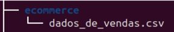

# Instruções

# Etapa 1

- Criando ecommerce

mkdir ecommerce
`mkdir /ecommerce`

`mv /home/ubuntu/Desktop/dados_de_vendas.csv ecommerce/l`
ou
`mv ~/Desktop/dados_de_vendas.csv ~/ecommerce/`

verificando se foi movido

ecommerce/
└── dados_de_vendas.csv

<h4> Segundo Passo:</h4>

Criar o Script processamento_de_vendas.sh

Navegue até o diretório ecommerce:
`cd /ecommerce`
Criando o arquivo processamento_de_vendas.sh:

`touch processamento_de_vendas.sh`
Dando permissão de execução ao script:

`chmod +x processamento_de_vendas.sh`

Escrevendo o Script
Abra o arquivo no editor de texto do Linux, como o nano:

nano processamento_de_vendas.sh

Ficando assim o codigo
`# Cria o diretório 'vendas' e copia o arquivo dados_de_vendas.csv para ele `
`mkdir -p vendas`
`cp dados_de_vendas.csv vendas/`
`# Navega até o diretório 'vendas'`
`cd vendas`
`# Crie o subdiretório 'backup'`
`mkdir -p backup`
`# Define a data atual no formato yyyymmdd`
`DATA_ATUAL=$(date +%Y%m%d)`
`# Copia o arquivo dados_de_vendas.csv para o diretório backup com a data no nome`
`cp dados_de_vendas.csv backup/dados-$DATA_ATUAL.csv`
`# Renomeia o arquivo no diretório backup para o novo nome "backup"`
`mv backup/dados-$DATA_ATUAL.csv backup/backup-dados-$DATA_ATUAL.csv`
`# Exibe uma mensagem de conclusão`
`echo "Deu certo. Arquivo backup criado: backup-dados-$DATA_ATUAL.csv"`

Salvei e sai do editor (Ctrl + O para salvar e Ctrl + X para sair no nano).

Testando o script no terminal:
`./processamento_de_vendas.sh`

Confirmando  que os arquivos foram criados e renomeados corretamente:

para navegar até o diretório cd vendas/backup
`cd vendas/backup`

<h4> Terceiro Passo:</h4>

Criando o Arquivo relatorio.txt
`touch relatorio.txt`

agora eu preciso Obter a Data do Sistema em Formato YYYY/MM/DD HH:MI
Utilizei o comando “data” para formatar a data
Abro o nano

ficando assim. 
`“echo "Data do sistema: $(date '+%Y/%m/%d %H:%M')" >> relatorio.txt”`

**(Nota: roubei esses códigos da internet é adaptei ele # date +%Y%m%d -s "2019-05-11"  $ date +'Hoje é %A, %d de %B de %Y, o %j dia do ano, as %H:%M')**

tenho que Obter as Datas de Primeiro e Último Registro de Venda
Eu notei que as datas de vendas estão na coluna 5 do arquivo CSV. Vamos pegar a primeira e última datas do arquivo:
Ficando assim.
 `FIRST_DATE=$(head -n 2 backup-dados-$(date +%Y%m%d).csv | tail -n 1 | cut -d',' -f5)`
`LAST_DATE=$(tail -n 1 backup-dados-$(date +%Y%m%d).csv | cut -d',' -f5)`
# Explicação da lógica:
FIRST_DATE: Ele pega a data presente na quinta coluna da segunda linha do arquivo.
head -n 2 pega as duas primeiras linhas do arquivo.
tail -n 1 seleciona a segunda linha.
cut -d',' -f5 extrai o valor da quinta coluna, presumivelmente uma data.
LAST_DATE: Ele pega a data presente na quinta coluna da última linha do arquivo.

tail -n 1 seleciona a última linha do arquivo.
cut -d',' -f5 extrai o valor da quinta coluna, que também é presumivelmente uma data.
 
`echo "Data do primeiro registro de venda: $FIRST_DATE" >> relatorio.txt`
`echo "Data do último registro de venda: $LAST_DATE" >> relatorio.txt`
Agora eu preciso contar a Quantidade Total de Itens Diferentes Vendidos
`TOTAL_ITENS=$(cut -d',' -f2 backup-dados-$(date +%Y%m%d).csv | tail -n +2 | sort | uniq | wc -l)`
# Explicação da lógica:
cut: Extrai campos de cada linha de um arquivo de texto.

-d',': Eu define a vírgula (,) como o delimitador entre os campos.

-f2: Especificando q o comando deve pegar o segundo campo de cada linha do arquivo CSV.

backup-dados-$(date +%Y%m%d).csv: Refere-se ao arquivo CSV cujo nome inclui a data atual no formato YYYYMMDD.

O resultado deste comando é a extração da segunda coluna do arquivo CSV.
Comando tail -n +2

tail -n +2: Removendo a primeira linha do arquivo, que era um cabeçalho. Ou seja, ele  começa a mostrar as linhas a partir da segunda.

Comando sort
sort: Ordena a saída anterior (ou seja, a segunda coluna do arquivo CSV).

Comando uniq
uniq: Remove duplicatas consecutivas da saída. Isso é útil para garantir que cada valor da coluna 2 seja contado apenas uma vez.

Comando wc -l
wc -l: Conta o número de linhas na saída. Isso representa o número de itens únicos na segunda coluna do arquivo CSV.

`echo "Quantidade total de itens diferentes vendidos: $TOTAL_ITENS" >> relatorio.txt`
Preciso Incluir as Primeiras 10 Linhas do Arquivo no relatorio.txt:
`echo -e "\nPrimeiras 10 linhas do arquivo:" >> relatorio.txt`
`head -n 10 backup-dados-$(date +%Y%m%d).csv >> relatorio.txt`
agora tenho q deixar em zip 
`zip dados-$DATA_ATUAL.zip backup-dados-$DATA_ATUAL.csv`
ficando assim no resultado final

# Remove o arquivo CSV original do diretório backup
rm backup-dados-$DATA_ATUAL.csv

