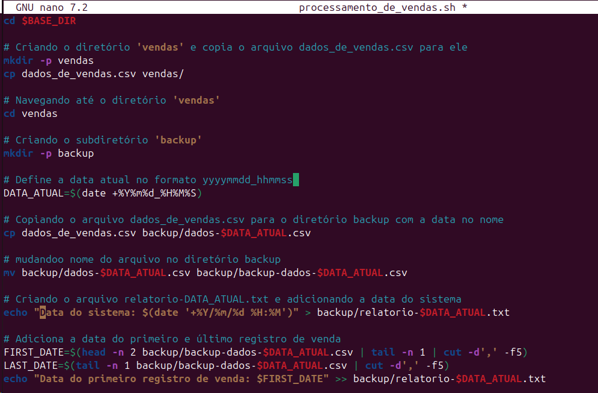
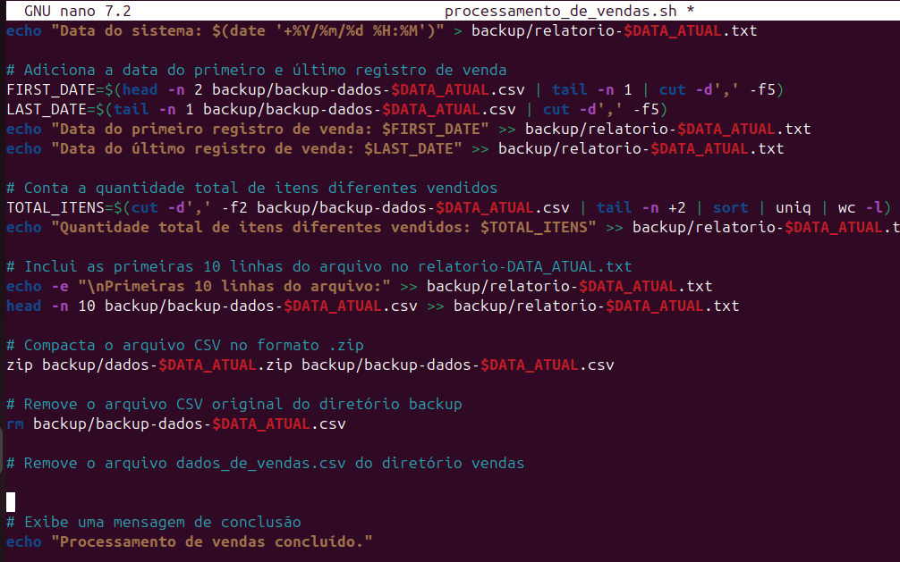
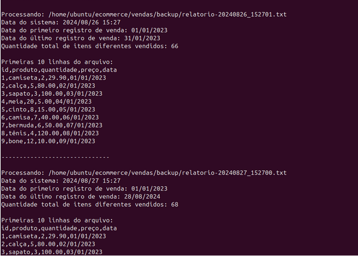

# Instruções

<h4> Primeiro passo:</h4>

Baixei o arquivo dados_de_vendas.csv

Agora preciso criar o `ecommerce`

- Criando ecommerce

mkdir ecommerce
`mkdir /ecommerce`

Movendo o arquivo para o ecommerce

`mv /home/ubuntu/Desktop/dados_de_vendas.csv ecommerce/`
ou
`mv /home/ubuntu//Downloads/dados_de_vendas.csv /ecommerce/`

verificando se foi movido

ecommerce/
└── dados_de_vendas.csv

<h4> Segundo Passo:</h4>

Criar o Script processamento_de_vendas.sh

Naveguei até o diretório ecommerce:
`cd /ecommerce`
Criando o arquivo processamento_de_vendas.sh:

`touch processamento_de_vendas.sh`

Dando permissão de execução ao script:

`chmod +x processamento_de_vendas.sh`

Escrevendo o Script

Abri o arquivo no editor de texto do Linux, como o nano:

nano processamento_de_vendas.sh

Ficando assim o codigo

**(Nota fiz mudancas no atual codigo. porem so tenho essa imagem mostrando o resultado. codigo atulizado na proximas imagens)**

Salvei e sai do editor (Ctrl + O para salvar e Ctrl + X para sair no nano).

Testando o script no terminal:
`./processamento_de_vendas.sh`

Confirmando  que os arquivos foram criados e renomeados corretamente:

para navegar até o diretório cd vendas/backup
`cd vendas/backup`

<h4> Terceiro Passo:</h4>

Criando o Arquivo relatorio.txt
`touch relatorio.txt`

agora eu preciso Obter a Data do Sistema em Formato YYYY/MM/DD HH:MI
Utilizei o comando “data” para formatar a data
Abro o nano

ficando assim. 
`“echo "Data do sistema: $(date '+%Y/%m/%d %H:%M')" >> relatorio.txt”`

**(Nota: roubei esses códigos da internet é adaptei ele # date +%Y%m%d -s "2019-05-11"  $ date +'Hoje é %A, %d de %B de %Y, o %j dia do ano, as %H:%M')**

tenho que Obter as Datas do Primeiro e Último Registro de Venda
Eu notei que as datas de vendas estão na coluna 5 do arquivo CSV. Vamos pegar a primeira e última datas do arquivo:

ficando assim no resultado final

vendo os resultados:

cat vendas/backup/relatorio.txt

vou mostra uma comparação de um para o outro

Antes 	

depois

Agendar a Execução Automática do Script

Para agendar o script para rodar de segunda a quinta-feira às 15:27, abri o cron

Utilizei o `crontab -e`

Aparece a seguinte mensagem.
“no crontab for ubuntu - using an empty one
Select an editor.  To change later, run 'select-editor'.
  1. /bin/nano          	<---- 
  2. /usr/bin/vim.tiny
  3. /bin/ed 
Choose 1-3 [1]:“  
digitei 1 e dei enter.

Ajustei o agendamento temporário: usei o cron para que ele execute o script 
Tive que usar o `“ /ecommerce$ tree” `eu não sabia qual caminho eu tinha que fazer

/ecommerce$ tree.
├── dados_de_vendas.csv
├── processamento_de_vendas.sh
└── vendas
	└── backup
    	├── backup-dados-20240822.csv
    	├── dados-20240823.zip
    	├── processamento_de_vendas.sh
    	└── relatorio.txt

entendendo como funciona

**Nota utulizei esse site para me ajudar (https://crontab.guru)**

**opção 1:**
`27 15 * * 1-4 /home/ubuntu/ecommerce/processamento_de_vendas.sh`
Nessa opção eu notei que rodaria de 1 a 4 dias, ou seja se eu rodasse o programa a partir da segunda estaria tudo certo.

**opção 2:** 
opção 2:
27 15 24-29 8 * /home/ubuntu/ecommerce/processamento_de_vendas.sh
eu optei por essa opção porque eu queria fazer testes antes então deixei rodando do dia 23 ao dia 29 para ter mais informação

testando se foi 
`cat /var/log/syslog | grep cron`

**(Nota roubei o codigo do site https://medium.com/@habbema/logs-no-linux-ef988b933661#:~:text=Este%20comando%20busca%20mensagens%20relacionadas,sobre%20tarefas%20agendadas%20no%20sistema.)**

Verifique a Configuração do Cronjob:

Executei o comando para listar os cronjobs e confirmar que o seu está listado:
`crontab -l`
fazendo teste 

fiz um script que rode a cada 1min para testar
verificar se foi criado 
`sudo grep CRON /var/log/syslog`
ou
`cat /var/log/syslog | grep cron`

Beleza deu certo agora vamos de fato agendar 

27 15 24-29 8 * /home/ubuntu/ecommerce/processamento_de_vendas.sh
**(depois optei por um caminho absoluto)**

<h4>Quarto passo:</h4>

fui até o diretório onde está o script processamento_de_vendas.sh:

`cd /home/ubuntu/ecommerce/`

Criando o script consolidador_de_processamento_de_vendas.sh

nano consolidador_de_processamento_de_vendas.sh

<!--  
#Caminho do diretório de backup

`BACKUP_DIR="/home/ubuntu/ecommerce/vendas/backup"`

#Arquivo final consolidado
`OUTPUT_FILE="/home/ubuntu/ecommerce/relatorio_final.txt"`

#Cria o arquivo final consolidado (vazio)
`> $OUTPUT_FILE`

#Adiciona um cabeçalho ao arquivo final para facilitar a vizualização
`echo "Relatório Consolidado de Vendas" > $OUTPUT_FILE`
`echo "------------------------------" >> $OUTPUT_FILE`

#Itera sobre todos os arquivos de relatório dentro do diretório de backup
`for RELATORIO in $BACKUP_DIR/relatorio-*.txt; do`
`echo "Processando: $RELATORIO" >> $OUTPUT_FILE`
`cat $RELATORIO >> $OUTPUT_FILE`
`echo -e "\n------------------------------\n" >> $OUTPUT_FILE`
`done`

#Exibe uma mensagem de conclusão
`echo "Consolidação concluída. Relatório final gerado em $OUTPUT_FILE"`
-->

dando permissao

`chmod +x consolidador_de_processamento_de_vendas.sh`

Fazendo testes:

Modificando o arquivo dados_de_vendas.csv manualmente:

Abri o arquivo e modifiquei uma linha 
nano dados_de_vendas.csv
execute o script
`./processamento_de_vendas.sh`
Verificando o resultado
`cat relatorio-20240825_15/2738.txt`

fiz alteração no valor da calca e deu certo 

agora vamos rodar o script que consolida todos os relatórios em um único arquivo final.

./consolidador_de_processamento_de_vendas.sh

`cat relatorio_final.txt`

fiz alteração no valor da calca 

Deu certo, decidi fazer varios teste para confirma os resultados 

apos diversos teste 

**(Nota: eu deletei tudo que nao era relevante para ficar mais facil a vizualicao de voces.)**
<!-- fala sobre os testes, que eu mudei data preço add produto entre outros --> 

# Relatorio

 <h5>Fazendo o relatório dia 26.</h5>

 

<h5>resultado dia 26/08/2024</h5>

<h5>resultado dia 27/08/2024 </h5>

 <h5>o relatorio dia 27.</h5>
 
 

 <h5>o resultado dia 27/08/2024.</h5>

**Acabei realizando um teste e, por conta disso, a data no relatório final foi alterada para (2024/08/27). No entanto, a última venda registrada ocorreu em (2024/08/28), o que resultou em um erro no cálculo, indicando 68 em vez de 67.**

  <h5>o relatorio dia 28/08/2024.</h5>

 <h5>o resultado dia 28/08/2024.</h5>

<h5>o relatorio dia 29/08/2024.</h5>

 <h5>o resultado dia 29/08/2024.</h5>

# FIM
Agora vamos rodar o script que consolida todos os relatórios em um único arquivo final.

`./consolidador_de_processamento_de_vendas.sh`

`cat relatorio_final.txt`

