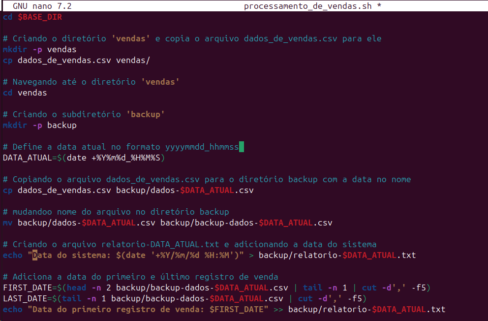
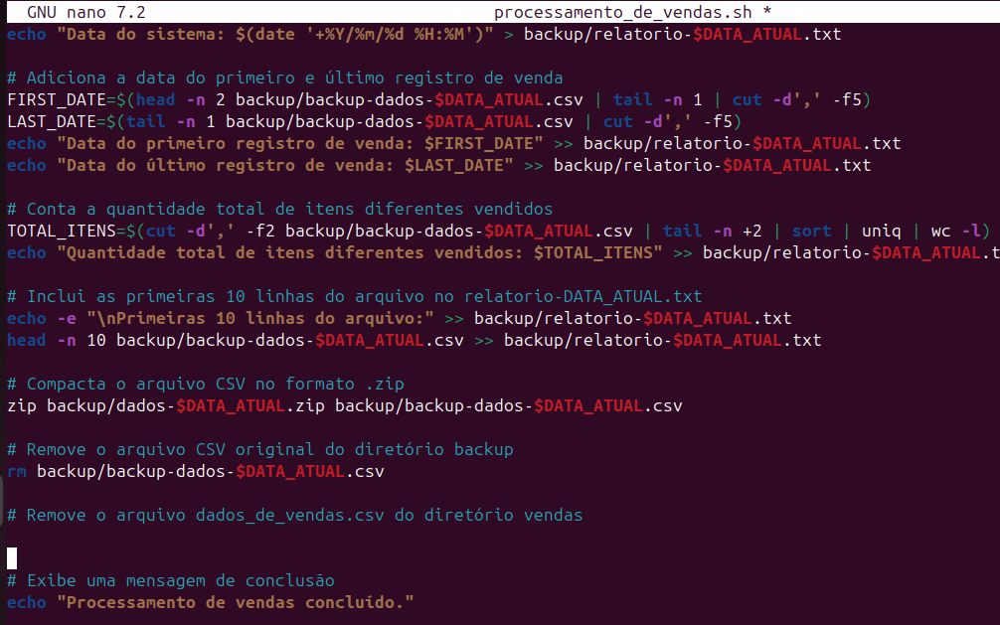
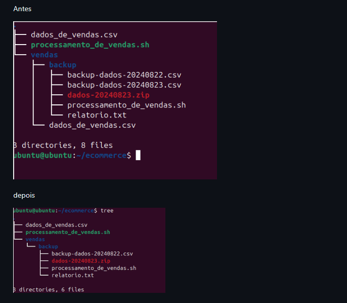
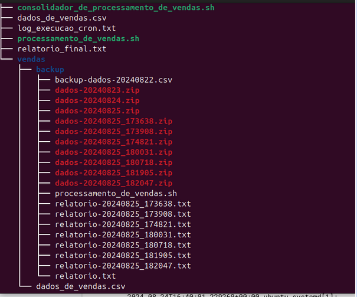
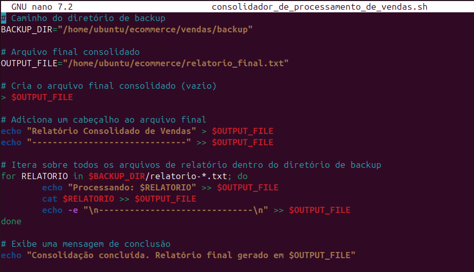
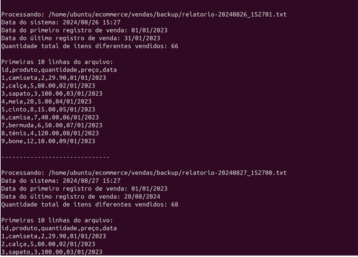

Durante a Sprint 1, aprendi muita coisa, principalmente sobre Linux, uma vez que nunca havia utilizado antes. No começo, tive algumas dificuldades, mas com o tempo fui pegando o jeito e agora me sinto bem mais confortável no ambiente Linux. Em relação ao Git, não tive tantas dificuldades, pois já tinha um pouco de experiência, o que facilitou o meu aprendizado.

Sobre o Readme sem problemas bem simples, utiizei uma extensão chamada **Markdown Preview Enhanced** para fazer a vizuização melhor

Atualmente, já concluí os dois cursos e estou gostando bastante da trilha. Estou ansioso pela próxima sprint e pelos novos aprendizados que ela trará 😊.
# Certificados

 [ Certificados](/Sprint_1/certificados/vazio.md)

# Exercícios

1. [Resposta Ex1](/Sprint_1/exercicios/vazio.md)

# Desafios

[Desafio 1](/Sprint_1/Desafio/README.md)

# Evidências

Vou documentar aqui a lógica por trás das minhas ideas, usando imagens. A ideia é mostrar de forma clara e direta o que eu fiz e por que tomei certas decisões, facilitando o entendimento do processo.

Primeiro, eu tive que baixar o arquivo dados_de_vendas.csv, criar um diretório chamado ecommerce no Linux, e colocar o arquivo dentro desse diretório.

**Desafio:** O objetivo é processar e gerar um relatório de vendas.

Notei que eu tinha que criar arquivo executável: Criar um script chamado processamento_de_vendas.sh que realiza as seguintes tarefas:

Criar um diretório chamado vendas e copiar o arquivo dados_de_vendas.csv para dentro desse diretório.

Criar um subdiretório chamado backup dentro do diretório vendas, e fazer uma cópia do arquivo dados_de_vendas.csv com a data de execução no nome.

Renomear o arquivo no formato backup-dados-<yyyyMMdd>.csv e movê-lo para o subdiretório backup.

Percebi que o objetivo é criar um script que automatize essas tarefas e prepare os dados para o relatório final.

Ficando assim 

# LOGICA

entao vamos explicar o meu codigo.

Criando o diretório vendas e copiando o arquivo:

eu criei `cd $BASE_DIR` pois achei q pdoeria ser util
o comando nele é `BASE_DIR="/home/ubuntu/ecommerce"` sempre que eu tivesse que voltar pro "ecommerce" eu usaria ele.

O código usa `mkdir -p` vendas para garantir que o diretório vendas seja criado( caso ainda não exista).

Em seguida, o comando `cp dados_de_vendas.csv vendas/` copia o arquivo dados_de_vendas.csv para dentro do diretório vendas.

Navegando para o diretório vendas:

O comando `cd vendas` é usado para entrar no diretório vendas.

Criando o subdiretório backup:

Dentro do diretório vendas, o comando `mkdir -p backup` cria um subdiretório chamado backup. Esse subdiretório armazenará as cópias dos arquivos de vendas.
Definindo a data atual no formato yyyyMMdd_HHmmss: (optei por HHmmss pois **Pra mim** fica mais facil de vizuliar os modelos e fazer a comparação)

A variável DATA_ATUAL armazena a data e a hora atuais no formato yyyyMMdd_HHmmss, usando o comando date '+%Y%m%d_%H%M%S'. Isso garante que cada backup tenha um nome único, baseado no momento em que o script é executado.

Copiando o arquivo para o diretório backup com a data no nome:

O arquivo dados_de_vendas.csv é copiado para o diretório backup e renomeado para incluir a data e hora atuais (`dados-$DATA_ATUAL.csv`), garantindo que o backup seja facilmente identificável pelo momento em que foi criado.

Mudando o nome do arquivo no diretório backup:

O comando `mv backup/dados-$DATA_ATUAL.csv backup/backup-dados-$DATA_ATUAL.csv `renomeia o arquivo dentro do diretório backup, de `dados-$DATA_ATUAL.csv para backup-dados-$DATA_ATUAL.csv`, assim padronizando o nome do backup.

Sendo assim a lógica geral é garantir que os dados de vendas sejam organizados de forma eficiente

Passando para proxima parte

Eu tive que reler varias e varias vezes para entender, tive dificuldade de interpretação
entao preferi ir por partes. Vamos la

Criação do arquivo relatorio.txt:

Dentro do diretório backup, eu precisava criar um arquivo chamado relatorio.txt que contenha informações importantes como:
Data do sistema no formato YYYY/MM/DD HH:MI.
Data do primeiro registro de venda contido no arquivo.
Data do último registro de venda contido no arquivo.
Quantidade total de itens diferentes vendidos.
Inclusão das primeiras 10 linhas do arquivo de backup:

O script deve mostrar as primeiras 10 linhas do arquivo backup-dados-<yyyyMMdd>.csv e inclui-las no arquivo relatorio.txt. 

Compressão do arquivo de backup:

Para economizar espaço em disco, o arquivo backup-dados-<yyyyMMdd>.csv deve ser compactado para backup-dados-<yyyyMMdd>.zip. Isso mantem os dados acessiveis, mas reduz o espaço ocupado.

Limpeza do diretório:

Após a compressão, o arquivo backup-dados-<yyyyMMdd>.csv deve ser removido do diretório vendas para manter o diretório organizado e economizar espaço em disco. Além disso, o arquivo dados_de_vendas.csv também deve ser removido, pois já foi copiado e compactado.

Agendar a execução do processamento:

Um agendamento (cron job ) deve ser criado para executar o script processamento_de_vendas.sh todos os dias de segunda a quinta-feira às 15:27. Isso automatiza o processo para garantir que as vendas sejam processadas regularmente sem intervenção manual.

**deixando claro que eu nao consegui e rodei a mao, mas jaja eu explico melhor**

A lógica geral desta etapa é garantir que os dados de vendas sejam processados, relatórios sejam gerados, backups sejam compactados, e que o sistema esteja configurado para executar esses passos de forma automática em horários predefinidos.

Bom vamos ao codigo

# LOGICA 

Exibição da Data do Sistema:

A data atual do sistema no formato YYYY/MM/DD HH:MM é registrada no arquivo relatorio-DATA_ATUAL.txt. 

Registro da Data do Primeiro e Último Registro de Venda:

O script utiliza o comando **head** para capturar a primeira data do arquivo backup-dados-DATA_ATUAL.csv e **tail** para capturar a última data. Essas datas são adicionadas ao relatório para indicar o intervalo de tempo coberto pelas vendas registradas.

Contagem do Número de Itens Diferentes Vendidos:

A quantidade total de itens diferentes vendidos é calculada usando uma combinação de comandos para processar a segunda coluna do arquivo CSV (cut -d ',' -f2). Essa informação é registrada no relatório para fornecer um resumo das vendas.

( cut: Extrai campos de cada linha de um arquivo de texto.
-d',': Eu define a vírgula (,) como o delimitador entre os campos.
-f2: Especificando q o comando deve pegar o segundo campo de cada linha do arquivo CSV.
tail -n +2: Removendo a primeira linha do arquivo, que era um cabeçalho. Ou seja, ele  começa a mostrar as linhas a partir da segunda.
sort: Ordena a saída anterior (ou seja, a segunda coluna do arquivo CSV).
uniq: Remove duplciadas. Isso é útil para garantir que cada valor da coluna 2 seja contado apenas uma vez.
wc -l: Conta o número de linhas na saída. Isso representa o número de itens únicos na segunda coluna do arquivo CSV.)

Inclusão das Primeiras 10 Linhas d
o Arquivo no Relatório:
(head -n 10 )
Compactação do Arquivo CSV:

O arquivo backup-dados-DATA_ATUAL.csv é compactado no formato .zip. O nome do arquivo compactado reflete a data e hora em que foi gerado.

Remoção dos Arquivos Originais:

Após a compactação, o arquivo CSV original (backup-dados-DATA_ATUAL.csv) é removido do diretório backup para evitar duplicidades e manter o diretório organizado.

Além disso, o arquivo dados_de_vendas.csv é removido do diretório vendas, pois seu conteúdo já foi processado e arquivado.

fazendo a comparação:

fiz um `cat vendas/backup/relatorio.txt`

fazendo os testes

fiz teste de tudo, mudei a data, mudei valor, mudei as primeiras 10 linhas fiz tudo que eu achei importante para ter certeza que eu estava no caminho certo.
apaguei eles usando o `rm` para nao ficar poluido pra vcs quando verem os relatorios.

Bom agora vamos falar sobre o problema com o cron

A primeira coisa que pensei foi que o caminho estava errado, então optei por caminhos absolutos, mas, para minha tristeza, não funcionou. 
Então, decidi criar um log chamado `log_execucao_cron.txt` para ver se aparecia algum erro. dai pra frente so pra tras, só fiquei mais confuso, passei horas tentando entender o que estava acontecendo.

Ele executava de 1 em 1 minuto, mas nada mais. Depois de muito tempo, desisti e pensei: "Bom, já que ele funciona de 1 em 1 minuto, é só 'agendar' usando matemática, ou seja, às 15:27 eu colocava para rodar daqui a 24h". 

Pois bem, tentei, mas notei que minha virtual box não atualizava o horário. Fechava as 18:20 e, depois de horas, ao abrir novamente, ainda estava 18:20. 

Arrumei isso nas configurações e deixei o PC aberto por 24h para testar. Para minha infelicidade, **NÃO FOI**. Percebi que ele não estava executando por conta própria, o que me deixou frustrado. 
Então, cansei do cron e fui testar outra solução (nisso já era dia 25). Eu queria deixar meu cron funcionando para segunda (26), então fui atrás de outra solução e descobri que no Linux da para usar um tal de "Timer".
 Bom, moleza! Em 5 minutos, eu criei.

`sudo nano etc/systemd/system/processamento_de_vendas.timer`
`[Unit]`
`Description=Timer para o processamento de vendas`

`[Timer]`
`OnCalendar=*-*-* 15:27:00`
`Persistent=true`

`[Install]
`WantedBy=timers.target`
`sudo nano /etc/systemd/system/processamento_de_vendas.service`
 e mais 2 script beleza 

 comecei os testes.
 `sudo systemctl daemon-reload`

`sudo systemctl enable processamento_de_vendas.timer`

`sudo systemctl start processamento_de_vendas.timer`

`sudo systemctl status processamento_de_vendas.timer`

`journalctl -u processamento_de_vendas.service`

E FOI, MAS FOI SÓ DE 1 MINUTO EM 1 MINUTO DE NOVO. Desisti.

Fui pedir ajuda para o meu squad e o pessoal de outros grupos, mas todo mundo dizia a mesma coisa: que o problema seria o caminho. Eu mostrava que não era isso falaram que eu nao dei permissao enfim...  mas nada adiantava. Então, deixei de lado e executei o script manualmente.

**De forma resumida eu nao consegui fazer a parte do cron**

Bom... vamos continuar

Ja parte do desafio tem como objetivo a criação de um novo relatório a partir dos dados processados anteriormente. 

Modificar manualmente os dados: A ideia aqui é fazer alterações no arquivo dados_de_vendas.csv uma vez por dia, atualizando-o com novas informações de vendas. Isso deve ser feito diretamente no diretório ecommerce.

Certificar que o script processamento_de_vendas.sh está agendado:

Criar um script consolidado: precisei criar um novo script chamado consolidador_de_processamento_de_vendas.sh. Este script uni todos os relatórios gerados ao longo do tempo em um único arquivo chamado relatorio_final.txt. 

Executar manualmente o script de consolidação: Depois de ter executado o script de processamento de vendas várias vezes. eu devo executar manualmente o script de consolidação (consolidador_de_processamento_de_vendas.sh). Esse script vai pegar todos os relatórios anteriores e consolidá-los em um único arquivo final, chamado relatorio_final.txt.

Bom nessa parte do desafio, optei por usar o `for`. Eu sabia da existência do `for` e do `find`, mas sempre usei o for para esse tipo de tarefa, porque na minha cabeça fazia mais sentido iterar sobre todos os arquivos de relatório dentro do diretório de backup. Foi a parte mais complicada do desafio em termos de lógica. Vale lembrar que, na época, eu ainda não tinha concluído o curso de Linux e nem pensei em usar o `cat`. Mas mesmo que conhecesse o cat, eu teria escolhido o for porque acho mais divertido de usar e, em termos de erros, acredito que ele seja mais seguro. Como já não tinha feito o agendamento corretamente, preferi usar algo que minimizasse ao máximo as chances de erro. 

# LOGICA

Definição de variáveis:

`BACKUP_DIR:` Define o caminho do diretório onde estão armazenados os arquivos de backup que contêm os relatórios de vendas.
OUTPUT_FILE: Define o caminho e o nome do arquivo que armazena o relatório final consolidado.

Criação do arquivo final vazio:

`> $OUTPUT_FILE:` Cria o arquivo final (OUTPUT_FILE) vazio. O símbolo > é usado para criar ou esvaziar o conteúdo de um arquivo, garantindo que o arquivo final comece sem conteúdo.

Adição de um cabeçalho ao arquivo final:

`echo "Relatório Consolidado de Vendas" > $OUTPUT_FILE: Adiciona uma linha de título ao arquivo final.`
`echo "------------------------------" >> $OUTPUT_FILE: Adiciona uma linha separadora logo abaixo do título. O símbolo >> é usado para adicionar (append) o texto ao arquivo existente, em vez de sobrescrevê-lo.`

Iteração sobre os arquivos de relatório:

`for RELATORIO in $BACKUP_DIR/relatorio-*.txt; do`: O loop for é utilizado para iterar sobre todos os arquivos no diretório de backup que seguem o padrão relatorio-*.txt.

Dentro do loop:

`echo "Processando: $RELATORIO" >> $OUTPUT_FILE:` Adiciona ao arquivo final uma linha indicando qual arquivo de relatório está sendo processado.

`cat $RELATORIO >> $OUTPUT_FILE:` Adiciona o conteúdo do arquivo de relatório atual ao arquivo final. O comando cat é usado para ler o conteúdo do arquivo.
echo -e "\n------------------------------\n" >> $OUTPUT_FILE: Adiciona uma linha separadora após o conteúdo de cada arquivo de relatório no arquivo final. O -e permite que caracteres de escape, como \n para nova linha, sejam interpretados corretamente.

Mensagem de conclusão:

usei echo para exibir uma mensagem no terminal informando que o processo de consolidação foi concluído e indicando o local onde o arquivo final foi salvo.

Resumindo: O script coleta e combina o conteúdo de vários arquivos de relatórios de vendas em um único arquivo consolidado.

# Fim relatorios 

aqui eu vou so mostrar os resultados dos relatorios, nao tenho muito oque explicar tirando o dia 27 que eu acabei fazendo uma mudança se querer de resto foi bem tranquilo

# Feedback

Bom, vou dar meu próprio feedback sobre o que achei da Sprint de modo geral e sobre meu desempenho.

O que mais me incomodou, de longe, foi minha falta de organização. Eu me perdia nas pastas no Linux, usei comandos errados no Git (durante o curso) e, na hora de escrever na pasta do desafio, me perdi um pouco. Não me senti muito confortável com isso e pretendo melhorar nas próximas Sprints.

Sobre o desafio, tive MUITA, mas MUITA dificuldade de interpretação de texto. Fiquei relendo várias vezes e não entendia direito. No começo (nao sabia nem por onde começar), estava bem desconfortável, mas assim que comecei a fazer testes, as coisas foram saindo.

Não tem como não falar sobre minha decepção com o cron. Fiquei bem chateado com isso 😢, não tenho muito o que dizer (já falei sobre), mas pretendo fazer funcionar. Vou resetar a VirtualBox qualquer dia e focar só no cron.

Agora, um desabafo sobre a VirtualBox. No dia em que comecei o desafio (23, se não me engano), eu só queria ver em que parte ia travar ou ter dificuldade, e para minha surpresa, parei no cron. Mas minha VirtualBox simplesmente travou. Desliguei o PC, reiniciei, esperei 10 minutos e nada. Até que tive a brilhante ideia de clicar em reiniciar dentro da VirtualBox e, para minha tristeza, a VirtualBox foi formatada kkkk(Por isso acabei fazendo algumas mudanças no codigo pois esta um pouco confuso algumas coisas e tambem por que achei que poderia ser util as mudança para o futuro). Fiquei muito bravo com isso.

Acho que é isso. Foi bem divertido aprender tudo isso um mix de sensaçoes e sentimentos. Fiquei com medo de não conseguir fazer, me senti inseguro, mas conforme a Sprint foi avançando, fui pegando confiança.

Agora eu queria saber a opinião de vocês sobre minha Sprint. Vocês acharam que o `Readme` do desafio ficou muito grande? Ficou curto? Sentiram falta de evidências? O que acharam da minha explicação? Muitos detalhes? Poucos detalhes? Foquei em coisas inúteis? Ficou muito grande ou muito curto? Gostaria de saber para poder melhorar nas próximas e oque vc acham da ideia de toda Sprint eu dar o meu feedback sobre ela, acham algo interessante ou nao muito relevante.