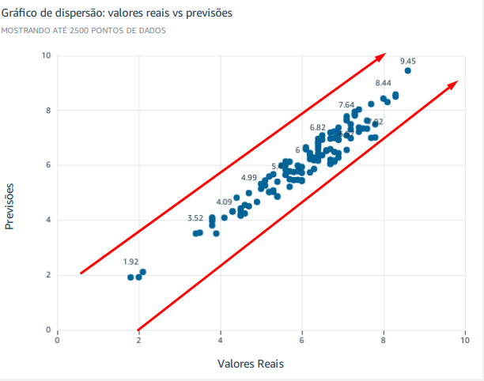

<h1>FIM da Sprint 10. vou comentar sobre a ultima parte do desafio.</h1>

# Meu tema é Comédia e animação.

<h3> Aqui vou explicar minhas ideias e os motivos por trás da análise, além de falar o que foi passando pela minha cabeça durante o processo de criação.</h3>

Vou focar nos anos 2000 até 2020 porque minha ideia é explorar filmes que, possivelmente, marcaram minha infância até os dias de hoje. Como nasci em 2001, achei interessante fazer essa análise como algo pessoal, pensando também em revisitar esses filmes em algum momento ou conehcer filmes novos.

Minha ideia desde o começo sempre foi fazer um rank de 10 melhores filmes e os 10 piores para eu assitir kkkkk.

entao desde o começo eu sabia que teria esse rank, claro eu fiz, outra coisa que eu queria fazer desde do começo era alguma coisando usando ML, como eu não tenho muita noção (basicamente zero) eu pensei em algo usando Regressão linear pois eu ja fiz isso na faculdade a muito tempo atras

eu sabia que iria precisar de um MAE = mean_absolute_error, MSE = mean_squared_error e talvez um MRSE = mean_squared_error, desde o começo eu queria fazer algo, porem notei que conversando tanto com Marli quanto os monitores eu nao teria muito auxílio pois quase ninguém usava.

Eu já sabia que, quando chegasse na Sprint 10, provavelmente mudaria minha análise, porque não fazia a menor ideia do que faria nos gráficos, além do ranking e do modelo de dispersão

logo minha analise seria algo muito raso e simples.

Sprint passada eu falei que queria algo como.

"Visualizações Finais Gráfico de Linha: Evolução da média de notas ao longo dos anos. Gráfico de Linha: Evolução da popularidade média.

Histograma/Scatter Plot: Distribuição das notas médias. Scatter Plot: Relação entre popularidade e nota média.

Gráfico de Barras: Top 10 filmes mais bem avaliados.

eu segui essa linha de raciocínio e fui mudando com base em novas ideias.

entao vamos começar a minha análise,

# Explicando a minha análise.

Vou focar nos anos 2000 até 2020 no gênero Comédia e animação. minha ideia é:

Eu analisei a Distribuição Temporal que mostra a contagem de registros por ano, fornece uma boa visão da produção ao longo do tempo. 

Ao comparar as Avaliações (Notas), vou observar as menores, médias e maiores notas por ano, identificar anos de destaque, como os melhores e os piores períodos para o gênero. Além disso, incluir o top 10 dos melhores e piores filmes.

Na análise de Popularidade, focar tanto na média quanto na máxima ao longo do tempo. 

Gráfico de Dispersão: O gráfico que relaciona valores reais e previsões.

Por fim, examinei os Top Gêneros Combinados. A tabela que destaca os gêneros mais relevantes foi especialmente útil para identificar combinações de temas que funcionam bem e têm maior aceitação entre o público.

Agora vou mostrar os graficos um por 1 e explciar eles:

Este gráfico de barras mostra a contagem de registros por ano entre 2000 e 2020, destacando a quantidade de filmes e de comédia e animação lançados a cada ano.

Vantagens do gráfico:

Facilidade de leitura: O gráfico de barras é simples e direto, o que torna fácil comparar os anos e perceber os picos e quedas na produção.

Identificação de tendências: Os anos mais produtivos e os menos produtivos, o que é útil para contextualizar a evolução do gênero ao longo do tempo.

Conexão com outras análises: Esse gráfico me ajuda a correlacionar o volume de lançamentos com outras informações, como popularidade ou avaliações, para gerar insights mais completos.

O gráfico de linha mostra três tendências:

Notas máximas (linha verde): Representam os filmes mais bem avaliados em cada ano, com o pico em 2013 (nota 8.6).

Notas médias (linha azul-escuro): Indicam a qualidade geral dos lançamentos por ano, com destaque para 2010, o melhor ano (média 6.8).

Notas mínimas (linha azul-claro): Mostram os filmes com as piores avaliações, sendo 2012 o ano com a pior nota (1.8).

Esses indicadores abaixo complementam o gráfico:

Maior nota: Foi 8.6 em 2013, com um aumento de 3.61% em relação a 2010.

Menor nota: Foi 1.8 em 2012, uma queda de 10% em relação a 2004.

Melhor ano: Foi 2010, com uma média de 6.8.

Pior ano: Foi 2004, com uma média de 5.08.

Vantagens:

Clareza nas comparações: Visualizar facilmente as diferenças de qualidade entre os anos.

Destaque para extremos: Os indicadores ajudam a identificar os anos mais significativos, tanto positivos quanto negativos.

Identificação de tendências: O gráfico de linha me permite observar a estabilidade ou os altos e baixos das avaliações ao longo do tempo.

Contexto para outras análises: Esses dados são importantes para conectar qualidade percebida à popularidade ou volume de lançamentos.

Com esse painel, eu consigo responder questões como qual foi o melhor e o pior ano, além de entender a evolução das avaliações dentro do meu tema.

Esse gráfico e indicadores apresentam a média e a máxima de popularidade por ano no período de 2000 a 2020, destacando os anos com maior e menor popularidade no tema comédia e animação.

No gráfico de linha:

Linha azul (Média de popularidade): Mostra a média de popularidade dos filmes e a cada ano. O maior valor foi em 2005 (28.78), indicando um ano de destaque.
Linha verde (Máxima de popularidade): Representa a popularidade máxima alcançada em cada ano. O pico ocorreu em 2002, com um valor de 81.13.
Nos indicadores:

Maior média de popularidade: 28.78 em 2005, com um aumento de 13.87%.
Menor popularidade: 0.91 em 2014, com uma queda de 25.16%.

Vantagens do painel:

Identificação de picos e quedas: Visualizar rapidamente os anos de maior e menor popularidade, o que ajuda a identificar momentos marcantes.

Comparação clara: A distinção entre média e máxima de popularidade permite entender tanto o desempenho geral quanto os destaques individuais de cada ano.

Contextualização temporal: É possível relacionar os dados de popularidade com outros fatores, como quantidade de lançamentos ou avaliações.

Insights adicionais: Esses dados são úteis para responder perguntas como quais anos foram mais significativos em termos de impacto popular no gênero.

Esse gráfico mostra os anos com as máximas de popularidade, destacando os filmes que tiveram maior impacto em cada período, independentemente da média geral do ano. Assim, mesmo em anos com médias baixas, podemos identificar obras excepcionais que alcançaram altos níveis de popularidade.

Vantagens do gráfico:

Foco em destaques individuais: Ele permite que eu analise quais anos tiveram filmes que realmente se sobressaíram, mesmo que a média não tenha sido alta.

Complemento às médias: Enquanto a análise de médias fornece uma visão geral, esse gráfico foca nos picos, oferecendo uma perspectiva mais completa.

Identificação de anos excepcionais: Por exemplo, 2002 e 2010 aparecem como anos marcantes devido a filmes altamente populares.

Clareza visual: A disposição em blocos torna fácil visualizar os valores e identificar os anos com maior impacto.

Esses gráficos mostram o Top 10 dos piores e melhores filmes com base nas menores e maiores notas, respectivamente. Eles ajudam a identificar os extremos de qualidade dentro do meu tema de comédia e animação.

Filmes como The Adventures of Panda Warrior (nota 1.8) e Meet the Space Guardians (nota 2.1) aparecem entre os piores. Isso destaca obras com avaliações muito negativas.

Mostra filmes que podem não ter atendido às expectativas do público, o que é útil para entender os pontos fracos no gênero.

Ja melhores filmes:

Filmes como Life is Beautiful (nota 8.6) e Toy Story 3 (nota 8.3) lideram as melhores avaliações, indicando títulos que se destacaram pela qualidade.
Ajuda a identificar obras que representam o auge do gênero.

Vantagens desses gráficos:

Destaques individuais: Foco nos extremos, permitindo identificar claramente o que funcionou e o que não funcionou no gênero.

Análise comparativa: Facilita a comparação entre os melhores e piores filmes, proporcionando um entendimento mais completo do cenário.

Clareza visual: As barras tornam fácil identificar as notas e os títulos, mesmo com vários dados.

Insights para tendências: Esses extremos ajudam a perceber o que contribui para o sucesso ou fracasso em comédia e animação.

Este gráfico de dispersão mostra a relação entre os valores reais e as previsões geradas pelo modelo, avaliando a precisão das previsões feitas para as notas dos filmes.

Cada ponto no gráfico representa um filme onde:

O eixo X (horizontal) indica as notas reais atribuídas.

O eixo Y (vertical) representa as notas previstas pelo modelo.

Uma boa correspondência entre os valores reais e as previsões é indicada por pontos próximos à linha imaginária de 45° (onde os valores reais são iguais às previsões).

O gráfico mostra que a maioria dos pontos está concentrada perto dessa linha, indicando que o modelo fez previsões consistentes na maior parte dos casos, com algumas exceções (outliers).

Porem esta correto, isso ocorreu porque tivemos 3 filmes com notas muito baixas fazendo com q ele se isolasse

Vantagens do gráfico:

Visualização da precisão: Permite identificar quão bem as previsões correspondem aos valores reais, evidenciando a qualidade do modelo.

Identificação de outliers: Pontos mais distantes da linha sugerem previsões menos precisas, o que ajuda a diagnosticar problemas ou ajustes necessários no modelo.

Análise da tendência geral: Mostra que o modelo tem uma tendência de seguir os valores reais, o que é positivo.

Clareza no desempenho global: Facilita a avaliação visual de como o modelo se comporta em diferentes faixas de valores (baixas, médias e altas notas).

Com este gráfico, consigo avaliar a performance do modelo e identificar possíveis ajustes para melhorar sua precisão em futuros cenários.

Agora para criar esse grafico 

Para criar o gráfico AE por Gênero, precisei configurar variáveis e uma fórmula personalizada para calcular a diferença absoluta entre a média das previsões e a média das notas reais. Isso me ajudou a analisar a precisão das previsões por gênero.

**A fórmula utilizada foi:**

`abs(avg({vote_predicted}) - avg(VoteAverageComoNumero))`

Essa fórmula calcula o erro absoluto médio (AE) entre as previsões e os valores reais, segmentado por gênero.

No gráfico:

Eixo X: Representa o valor de AE (Erro Absoluto Médio).
Eixo Y: Mostra os gêneros, permitindo identificar onde o modelo teve maior ou menor precisão.

Resultados:

Gêneros como comedy, drama, family apresentam o maior AE (0.64), indicando que as previsões foram menos precisas.
Por outro lado, gêneros como animation, drama e comedy, romance têm AE mais baixos (0.31), mostrando maior precisão nas previsões.

Vantagens do gráfico:

Análise detalhada por gênero: Permite identificar quais gêneros têm maior discrepância entre as previsões e os valores reais.

Identificação de padrões: Ajuda a entender em quais tipos de filmes  o modelo performa melhor ou pior.

Contexto para validação: O gráfico complementa as análises gerais, fornecendo insights específicos sobre a performance do modelo em diferentes categorias.

Esse AE nada mais é do que uma forma de ver como o meu modelo de previsão está funcionando na prática. Ele mede a diferença entre as notas previstas pelo meu modelo e as notas reais de cada gênero. Quando o AE é menor, significa que as previsões estão mais próximas dos valores reais, ou seja, o modelo está mais preciso naquele gênero.

Este gráfico mostra a média de notas por gênero, destacando os 10 principais gêneros analisados no meu projeto. Ele é essencial para entender quais gêneros têm o melhor desempenho geral em termos de avaliação.

Os gêneros action, animation, comedy e comedy, family, musical estão no topo, ambos com uma média de 7.4, indicando que esses gêneros têm uma recepção bastante positiva do público.

Vantagens do gráfico:

Facilidade de comparação: Consigo ver claramente quais gêneros têm as melhores e piores médias de notas.

Insights sobre desempenho: Ele ajuda a identificar quais gêneros são mais apreciados pelo público, o que pode ser útil para priorizar análises ou modelos futuros.

Complemento para outras análises: Esse gráfico, combinado com o AE, mostra não só a precisão do modelo, mas também quais gêneros são consistentemente melhores avaliados.

Com este gráfico, consigo ter uma visão geral de como cada gênero se sai em termos de avaliação média, ajudando a conectar essas informações com outros dados do meu projeto. É uma boa forma de complementar as análises de popularidade e previsões.

# Conclusão

Com as análises realizadas, foi possível ter uma visão ampla sobre o desempenho de filmes de comédia e animação no período de 2000 a 2020. Identifiquei quais anos foram os melhores e os piores, os filmes mais bem avaliados e os menos populares, e quais gêneros se destacaram tanto em termos de notas médias quanto de popularidade.

Além disso, usei meu modelo de previsão para avaliar a precisão das notas previstas e entendi como ele performa na prática, especialmente ao analisar o AE por gênero. Essa abordagem me mostrou onde o modelo está mais alinhado com os dados reais e onde ele pode ser otimizado.

No geral, os gêneros comedy, family, musical e action, animation, comedy tiveram um ótimo desempenho, enquanto categorias menos específicas, como Other, mostraram um desempenho mais fraco. A análise de popularidade também revelou que alguns anos, como 2002 e 2010, tiveram destaques significativos.

Essas conclusões me ajudam a entender as tendências do gênero comédia e animação e fornecem uma base sólida para explorar melhorias no modelo de previsão, além de aprofundar análises mais específicas no futuro.