Vou lá vou começar comentando sobre as dificuldades que enfrentei. Primeiramente, tive dificuldades para entender a funcionalidade das views. Acabei criando várias views que, na verdade, não faziam muito sentido, pois bastava utilizar um select com um where, que basicamente faz a mesma coisa.(ainda nao entendi muito bem, mas não achei complicado) Além disso, tive um pouco de dificuldade com os modelos de dados e a normalização. Outro ponto é que fui um pouco desorganizado durante o processo, mas vou detalhar isso melhor no read da sprint.

Vou ser mais direto nessa Sprint.

# Explicação simples

Diferenças entre os modelos:
Modelo Conceitual: Representa as entidades e seus relacionamentos sem muitos detalhes técnicos, focado mais em entender o problema do negócio. É mais abstrato.

Modelo Lógico: É uma etapa mais detalhada, onde você define as entidades, atributos, relacionamentos, mas sem ainda pensar em limitações específicas do SGBD. Já aparece a normalização, as relações entre tabelas, mas sem pensar ainda em tipos de dados do SGBD.

Modelo Físico: Representa a implementação prática no SGBD, com detalhes como tipos de dados, constraints (chaves primárias, estrangeiras), e sintaxe SQL para criar as tabelas e relações.

**Desenho da Modelagem Relacional:**

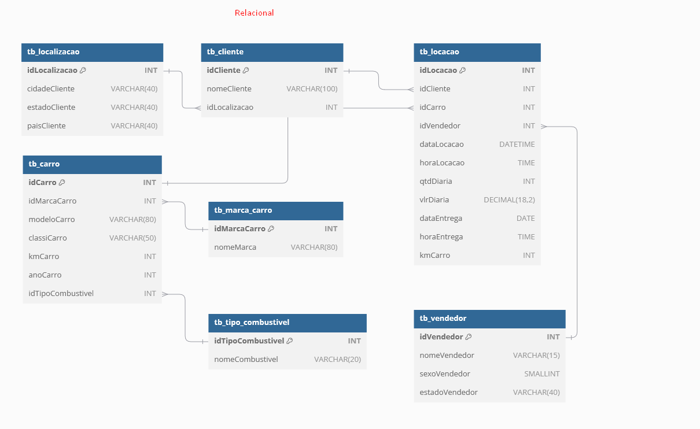

**Desenho do Modelo Dimensional:**

Formato SnowFlake e criando dim_tempo


conversei com a anne ela disse o seguinte.

- "Eu tiraria os tb do nome. É usual ja usar somente dim_ e fato_.
O seu modelo é o SnowFlake e não Estrela. Por exemplo, você criou a subdimensão tb_dim_marca_carro. 
Eu particularmente usaria modelo estrela, pois facilita a consulta, evitando fazer muitos joins. Mas o seu modelo como SnowFlake esta correto e é aceito como solução. Só é mais "complexo" de fazer a consulta."

Entao vamos la fazer isso ai:

**Desenho do Modelo Dimensional:**

Formato Estrela e criando dim_tempo


(**eu sei que não é a estrela mais bonita que vcs ja viram**)

**Desenho do Modelo Dimensional:**

sem o "tb"

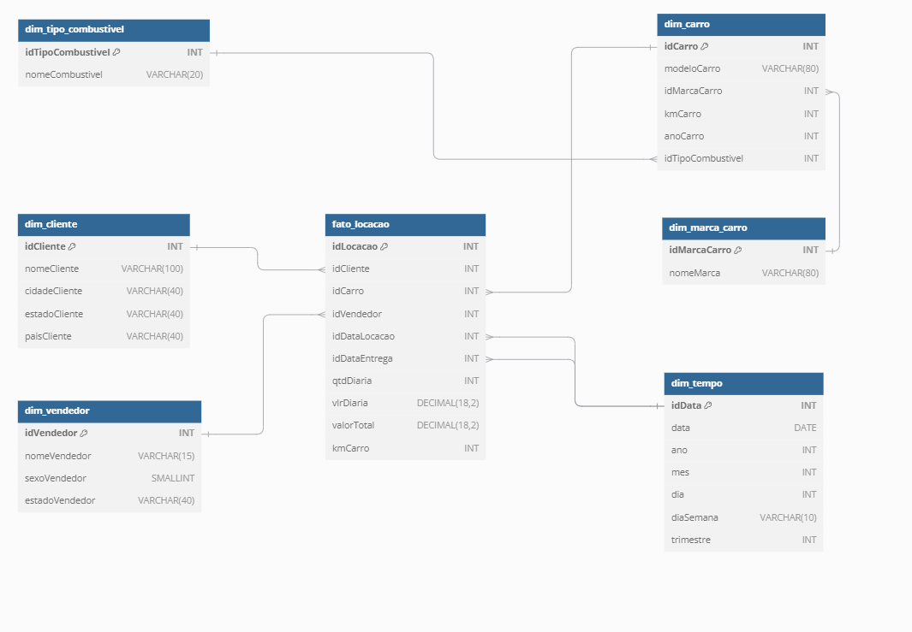


Bom agora vou mostrar como ficou no sql.

Mas antes vou dar um explicada de cada coisa que eu fiz vamo Avaliar as fromas

Avaliação das Formas Normais:

Analisar as tabelas e seus esquemas.
Verificar possíveis redundâncias ou anomalias de inserção/atualização.
Aplicar regras de normalização (1ª, 2ª e 3ª forma normal).

1FN: Todas as tabelas apresentam valores atômicos e possuem chaves primárias corretas.

2FN: Todas as dependências parciais foram eliminadas, com os atributos não-chave dependendo das chaves primárias.

3FN: As dependências transitivas foram removidas, assegurando que não haja atributos não-chave dependendo de outros não-chave.

Bom crei as tabelas.


CREATE TABLE tb_localizacao (
	idLocalizacao INT PRIMARY KEY,
	cidadeCliente VARCHAR(40),
	estadoCliente VARCHAR(40),
	paisCliente VARCHAR(40)
);

CREATE TABLE tb_cliente (
	idCliente INT PRIMARY KEY,
	nomeCliente VARCHAR(100),
	idLocalizacao INT,
	FOREIGN KEY (idLocalizacao) REFERENCES tb_localizacao(idLocalizacao)
);

CREATE TABLE tb_marca_carro (
	idMarcaCarro INT PRIMARY KEY,
	nomeMarca VARCHAR(80)
);

CREATE TABLE tb_tipo_combustivel (
	idTipoCombustivel INT PRIMARY KEY,
	nomeCombustivel VARCHAR(20)
);

CREATE TABLE tb_carro (
	idCarro INT PRIMARY KEY,
	idMarcaCarro INT,
	modeloCarro VARCHAR(80),
	classiCarro VARCHAR(50),
	kmCarro INT,
	anoCarro INT,
	idTipoCombustivel INT,
	FOREIGN KEY (idMarcaCarro) REFERENCES tb_marca_carro(idMarcaCarro),
	FOREIGN KEY (idTipoCombustivel) REFERENCES tb_tipo_combustivel(idTipoCombustivel)
);

CREATE TABLE tb_vendedor (
	idVendedor INT PRIMARY KEY,
	nomeVendedor VARCHAR(15),
	sexoVendedor SMALLINT,
	estadoVendedor VARCHAR(40)
);

CREATE TABLE tb_locacao (
	idLocacao INT PRIMARY KEY,
	idCliente INT,
	idCarro INT,
	idVendedor INT,
	dataLocacao DATETIME,
	horaLocacao TIME,
	qtdDiaria INT,
	vlrDiaria DECIMAL(18,2),
	dataEntrega DATE,
	horaEntrega TIME,
	kmCarro INT,
	FOREIGN KEY (idCliente) REFERENCES tb_cliente(idCliente),
	FOREIGN KEY (idCarro) REFERENCES tb_carro(idCarro),
	FOREIGN KEY (idVendedor) REFERENCES tb_vendedor(idVendedor)
);

1NF: Cada tabela já está em 1NF, pois todos os atributos contêm valores atômicos (um único valor por célula), e as tabelas têm chaves primárias.

2NF: A 2NF está satisfeita porque cada atributo em todas as tabelas depende completamente da chave primária. Como eu to usando chaves primárias simples (sem compostas), não há dependências parciais.

3NF: Já está em conformidade com a 3NF porque todas as dependências transitivas foram eliminadas. Por exemplo, na tabela `tb_carro`, o atributo `nomeMarca` foi movido para a tabela `tb_marca_carro`, e agora eu uso a chave estrangeira idMarcaCarro para referenciar a marca.

**(Nota:O banco de dados está normalizado de acordo com as 3 formas normais.)**

Agora vamos falar sobre as views

comecei fazer uma view simples 

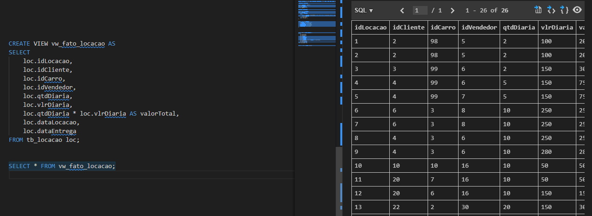

eu tomei um tapa na cara da anne kkkkkk.

Ela disse:

"não esta não
 
você precisa informar a pk da dimensao
 
e nao da tabela locacao
 
os valores como qtd de diarias e valor vem dela
 
mas ai você faz o join com a dimensao e coloca o id da dimensao 
 
algo como LEFT JOIN Cliente C ON LOCACAO.idCliente = C.idCliente
 
DIM_Cliente C na verdade, para ficar mais intuitivo
 
Cliente ficou parecendo a tabela
 
mas ja é a dimensao em si do Cliente
 
e lembre-se que, para cliente por exemplo, precisa de ser valores distintos
 
você pode ter feitos varias locações de carro
 
mas em cliente deve existir apenas UM registro seu 
 
e esse registro deve ser o mais atualizado"

Beleza acho que entendi oque ela queria entao vamo la. 

criei e ficou assim
# Documentação da View `vw_fato_locacao`

Esta view foi criada para consolidar informações de locação, cliente, carro e vendedor, facilitando a consulta de dados completos sobre as locações realizadas.

## Criação da View

A seguinte query foi usada para criar a view `vw_fato_locacao`:

```sql
CREATE VIEW IF NOT EXISTS vw_fato_locacao AS
SELECT
    loc.idLocacao,
    cli.idCliente,          
    cli.nomeCliente,        
    car.idCarro,            
    car.modeloCarro,        
    vend.idVendedor,        
    vend.nomeVendedor,      
    loc.qtdDiaria,
    loc.vlrDiaria,
    loc.qtdDiaria * loc.vlrDiaria AS valorTotal,
    loc.dataLocacao,
    loc.dataEntrega
FROM
    tb_locacao loc
LEFT JOIN tb_dim_cliente cli ON loc.idCliente = cli.idCliente  
LEFT JOIN tb_dim_carro car ON loc.idCarro = car.idCarro        
LEFT JOIN tb_dim_vendedor vend ON loc.idVendedor = vend.idVendedor;

```

(**Nota: tive muitos problemas fazendo essa view mas nada que precise ser destacado**)

fui todo feliz falar com a anne e entao recebi.

"Se você colocou os ids, nao tem necessidade de informar os atributos. A ideia é justamete diminuir o tamanho de colunas da sua fato
 
quando você for responder uma determinada pergunta
 
ai sim, você utiliza as informações
 
tipo
 
quero saber o valor total. Pego os ids e o valor total da fato. 
 
mas o valor total do vendedor x. 
 
pego a fato e faço o meu join com dimensao vendedor para pegar o nome dele"

Comecei de novo. 

# Fazendo a View 

Agora vou começar a mandar o codigo + os resultados

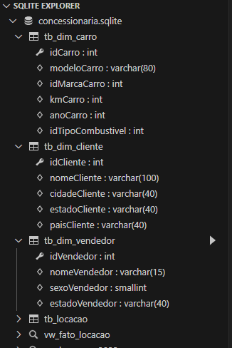

Minhas tabelas estavam assim (Não vou colocar o codigo pois ele ficou muito grande).

mas vale resaltar que o acabei inserindo dados na minha tabela(atutalmente eu tirei pois não sei se é permitido).

Mas ficou aassim. 

```sql
INSERT INTO tb_dim_cliente (idCliente, nomeCliente, cidadeCliente, estadoCliente, paisCliente)
VALUES
(1, 'João Silva', 'São Paulo', 'SP', 'Brasil'),
(2, 'Maria Oliveira', 'Rio de Janeiro', 'RJ', 'Brasil');

INSERT INTO tb_dim_carro (idCarro, modeloCarro, idMarcaCarro, kmCarro, anoCarro, idTipoCombustivel)
VALUES
(1, 'Civic', 1, 50000, 2018, 1),
(2, 'Corolla', 2, 30000, 2019, 2);


INSERT INTO tb_dim_vendedor (idVendedor, nomeVendedor, sexoVendedor, estadoVendedor)
VALUES
(1, 'Carlos Pereira', 1, 'SP'),
(2, 'Ana Santos', 0, 'RJ');

```
rodei o 

`SELECT * FROM tb_dim_cliente;`
`SELECT * FROM tb_dim_carro;`
`SELECT * FROM tb_dim_vendedor;`

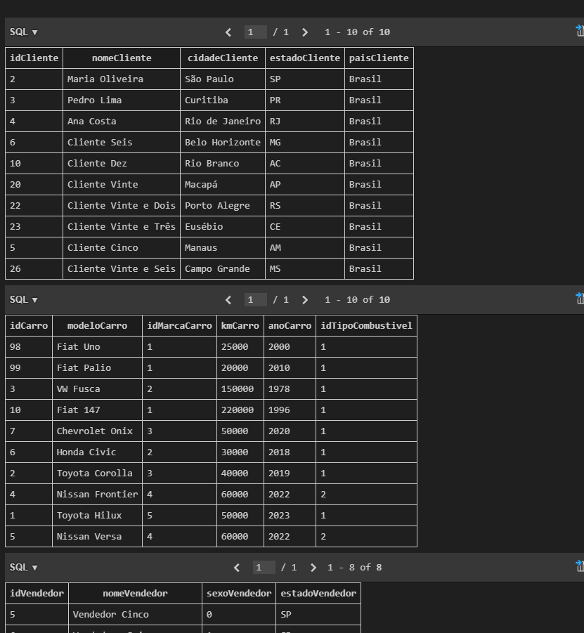

# Revisão

beleza agora seguindo as recomendaçoes 

Vamos revisar o que a Anne sugeriu para garantir que a view esteja correta e siga as boas práticas mencionadas.

Revisão dos Pontos:
Chaves das Dimensões (PKs): Ao invés de usar diretamente os IDs da tabela tb_locacao, eu teria que fazer JOIN com as tabelas de dimensão (por exemplo, tb_dim_cliente, tb_dim_carro, tb_dim_vendedor), garantindo que estamos usando as Primary Keys (PK) das dimensões.

Distinct (Clientes únicos): Para garantir que um cliente apareça apenas uma vez, devemos usar os dados da dimensão cliente, onde o cliente tem um único registro.

Atualização do Cliente: Caso precise, a dimensão cliente deve ter apenas o registro mais atualizado para cada cliente.

```sql
-- Ajustando a View de Fato para usar apenas os IDs das dimensões
-- Não é necessário incluir os atributos (nomeCliente, modeloCarro, etc.) diretamente aqui, eles podem ser acessados por meio de junções com as dimensões quando necessário.
CREATE VIEW IF NOT EXISTS vw_fato_locacao AS
SELECT 
    loc.idLocacao,
    loc.idCliente,   -- Apenas o idCliente, sem os atributos como nomeCliente
    loc.idCarro,     -- Apenas o idCarro, sem os atributos como modeloCarro
    loc.idVendedor,  -- Apenas o idVendedor, sem os atributos como nomeVendedor
    loc.qtdDiaria,
    loc.vlrDiaria,
    loc.qtdDiaria * loc.vlrDiaria AS valorTotal,
    loc.dataLocacao,
    loc.dataEntrega
FROM 
    tb_locacao loc;

    SELECT 
    f.idLocacao,
    f.qtdDiaria,
    f.vlrDiaria,
    f.valorTotal,
    c.nomeCliente,  -- Atributo da dimensão cliente
    car.modeloCarro -- Atributo da dimensão carro
FROM 
    vw_fato_locacao f
    -- Agora a tabela fato só contém os IDs das dimensões e os valores numéricos.
-- Se eu precisar de mais informações, como nome do cliente ou modelo do carro, basta fazer um JOIN com as tabelas de dimensões (como mostrado abaixo).
-- Exemplo de junção com a dimensão cliente e carro para obter mais informações
LEFT JOIN tb_dim_cliente c ON f.idCliente = c.idCliente
LEFT JOIN tb_dim_carro car ON f.idCarro = car.idCarro;
-- Verificando a View criada
SELECT * FROM vw_fato_locacao;
```
vendo se foi criado minha view


resultado do comando `SELECT * FROM vw_fato_locacao;` 

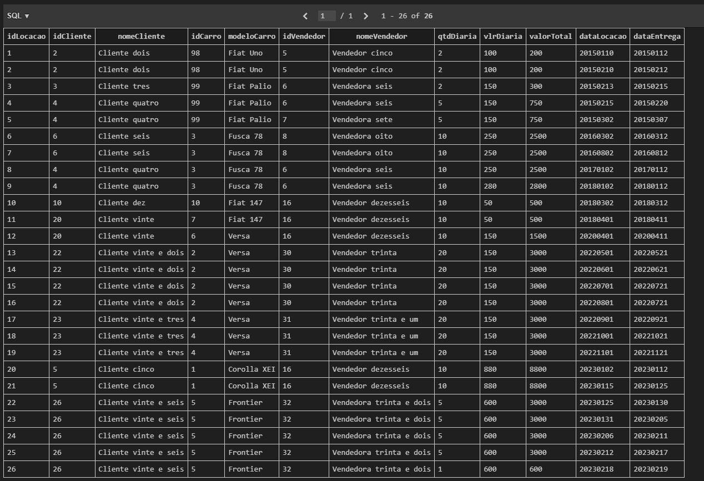

Aqui da pra ver eu ja tinha abandonado a ideia de inserir dados e usei somente os dados do arquivo 

```sql
SELECT idCliente, COUNT(*)
FROM tb_dim_cliente
GROUP BY idCliente
HAVING COUNT(*) > 1;
```
usei esse codigo para verificar a integridade dos dados:


Agora eu vou falar da Dimensão de Tempo, eu criei uma view 

```sql
INSERT INTO tb_dim_tempo (idData, data, ano, mes, dia, diaSemana, trimestre)
SELECT DISTINCT 
    dataLocacao AS idData,  -- Mantemos o idData no formato YYYYMMDD
    SUBSTR(dataLocacao, 1, 4) || '-' || SUBSTR(dataLocacao, 5, 2) || '-' || SUBSTR(dataLocacao, 7, 2) AS data,  -- Reformatação da data para YYYY-MM-DD
    CAST(SUBSTR(dataLocacao, 1, 4) AS INT) AS ano,  -- Extraindo o ano
    CAST(SUBSTR(dataLocacao, 5, 2) AS INT) AS mes,  -- Extraindo o mês
    CAST(SUBSTR(dataLocacao, 7, 2) AS INT) AS dia,  -- Extraindo o dia
    CASE 
        WHEN STRFTIME('%w', SUBSTR(dataLocacao, 1, 4) || '-' || SUBSTR(dataLocacao, 5, 2) || '-' || SUBSTR(dataLocacao, 7, 2)) = '0' THEN 'Domingo'
        WHEN STRFTIME('%w', SUBSTR(dataLocacao, 1, 4) || '-' || SUBSTR(dataLocacao, 5, 2) || '-' || SUBSTR(dataLocacao, 7, 2)) = '1' THEN 'Segunda'
        WHEN STRFTIME('%w', SUBSTR(dataLocacao, 1, 4) || '-' || SUBSTR(dataLocacao, 5, 2) || '-' || SUBSTR(dataLocacao, 7, 2)) = '2' THEN 'Terça'
        WHEN STRFTIME('%w', SUBSTR(dataLocacao, 1, 4) || '-' || SUBSTR(dataLocacao, 5, 2) || '-' || SUBSTR(dataLocacao, 7, 2)) = '3' THEN 'Quarta'
        WHEN STRFTIME('%w', SUBSTR(dataLocacao, 1, 4) || '-' || SUBSTR(dataLocacao, 5, 2) || '-' || SUBSTR(dataLocacao, 7, 2)) = '4' THEN 'Quinta'
        WHEN STRFTIME('%w', SUBSTR(dataLocacao, 1, 4) || '-' || SUBSTR(dataLocacao, 5, 2) || '-' || SUBSTR(dataLocacao, 7, 2)) = '5' THEN 'Sexta'
        WHEN STRFTIME('%w', SUBSTR(dataLocacao, 1, 4) || '-' || SUBSTR(dataLocacao, 5, 2) || '-' || SUBSTR(dataLocacao, 7, 2)) = '6' THEN 'Sábado'
    END AS diaSemana,  -- Dia da semana
    CASE 
        WHEN CAST(SUBSTR(dataLocacao, 5, 2) AS INT) IN (1, 2, 3) THEN 1
        WHEN CAST(SUBSTR(dataLocacao, 5, 2) AS INT) IN (4, 5, 6) THEN 2
        WHEN CAST(SUBSTR(dataLocacao, 5, 2) AS INT) IN (7, 8, 9) THEN 3
        ELSE 4
    END AS trimestre  -- Trimestre do ano
FROM tb_locacao
WHERE dataLocacao IS NOT NULL;
```

Isso vai gerar automaticamente as datas e seus componentes, como ano, mês, dia, dia da semana e trimestre, para todas as locações na tabela tb_locacao.

(**Nota: Ficaria muita coisa se eu tentasse colcoar todos os links que eu usei para fazer porem os destaques ficam para https://www.youtube.com/watch?v=5OieIJeNXZA e https://www.mssqltips.com/sqlservertip/4054/creating-a-date-dimension-or-calendar-table-in-sql-server/**)

`SELECT * FROM tb_dim_cliente;`
`SELECT * FROM tb_dim_carro;`
`SELECT * FROM tb_dim_vendedor;`
`SELECT * FROM tb_dim_tempo;`

Vou colcoar apenas o resultado do tb_dim_tempo.

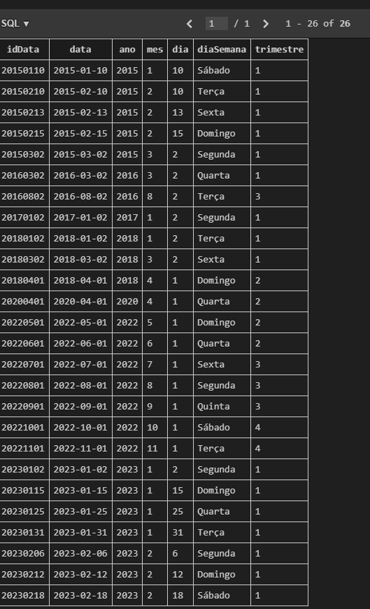

Bom aqui eu comecei dar uma brincada pois estava muito feliz de finalmente ter conseguido fazer a dim_tempo.

vale ressaltar que eu tive varios problemas como:

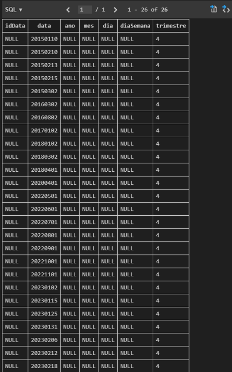

mas no fim deu tudo certo

Contar o número de locações por ano:


```sql
SELECT t.ano, COUNT(*) AS total_locacoes
FROM vw_fato_locacao f
LEFT JOIN tb_dim_tempo t ON f.dataLocacao = t.idData
GROUP BY t.ano;
```

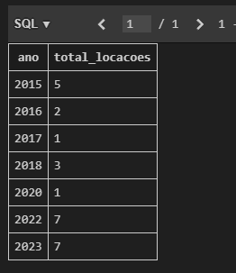

Filtrar locações feitas em um trimestre específico (por exemplo, 1º trimestre de 2023):

```sql

SELECT *
FROM vw_fato_locacao f
LEFT JOIN tb_dim_tempo t ON f.dataLocacao = t.idData
WHERE t.ano = 2023 AND t.trimestre = 1;
```

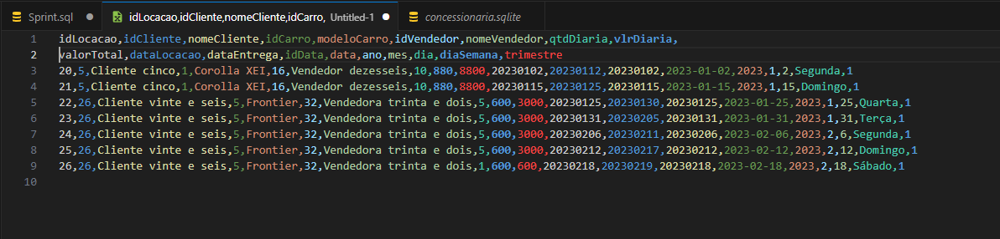
(**Nota: coloquei em csv apenas para mostrar o resultado, pois os resultados n ia caber em um so print**)

Obter locações feitas em dias específicos da semana, como segunda-feira:

```sql

SELECT *
FROM vw_fato_locacao f
LEFT JOIN tb_dim_tempo t ON f.dataLocacao = t.idData
WHERE t.diaSemana = 'Segunda';

```

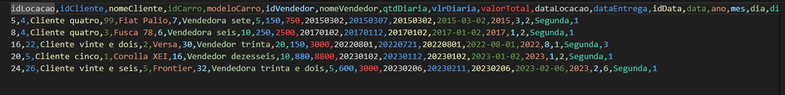

(**Nota: coloquei em csv apenas para mostrar o resultado, pois os resultados n ia caber em um so print**)


e bom a partir daqui ficou bem facil. 

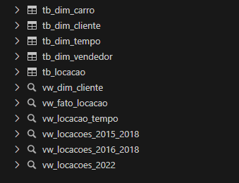

fiz varios testes 

ficando assim o meu codigo todo


```sql
-- Tabela de clientes (dimensão Cliente)
CREATE TABLE IF NOT EXISTS tb_dim_cliente (
    idCliente INT PRIMARY KEY,
    nomeCliente VARCHAR(100),
    cidadeCliente VARCHAR(40),
    estadoCliente VARCHAR(40),
    paisCliente VARCHAR(40)
);

-- Tabela de carros (dimensão Carro)
CREATE TABLE IF NOT EXISTS tb_dim_carro (
    idCarro INT PRIMARY KEY,
    modeloCarro VARCHAR(80),
    marcaCarro VARCHAR(80),  -- Armazenando a marca diretamente como texto
    kmCarro INT,
    anoCarro INT,
    idTipoCombustivel INT
);

-- Tabela de vendedores (dimensão vendedor)
CREATE TABLE IF NOT EXISTS tb_dim_vendedor (
    idVendedor INT PRIMARY KEY,
    nomeVendedor VARCHAR(15),
    sexoVendedor SMALLINT,
    estadoVendedor VARCHAR(40)
);

-- Tabela de tempo (dimensão Tempo)
CREATE TABLE IF NOT EXISTS tb_dim_tempo (
  idData INT PRIMARY KEY,
  data DATE,
  ano INT,
  mes INT,
  dia INT,
  diaSemana VARCHAR(10),
  trimestre INT
);


-- Inserção de dados distintos para a dimensão Cliente
INSERT INTO tb_dim_cliente (idCliente, nomeCliente, cidadeCliente, estadoCliente, paisCliente)
SELECT DISTINCT idCliente, nomeCliente, cidadeCliente, estadoCliente, paisCliente
FROM tb_locacao;

-- Inserção de dados distintos para a dimensão Carro com marca incluída
INSERT INTO tb_dim_carro (idCarro, modeloCarro, marcaCarro, kmCarro, anoCarro, idTipoCombustivel)
SELECT DISTINCT idCarro, modeloCarro, classiCarro AS marcaCarro, kmCarro, anoCarro, idcombustivel
FROM tb_locacao;

-- Inserção de dados distintos para a dimensão Vendedor
INSERT INTO tb_dim_vendedor (idVendedor, nomeVendedor, sexoVendedor, estadoVendedor)
SELECT DISTINCT idVendedor, nomeVendedor, sexoVendedor, estadoVendedor
FROM tb_locacao;

-- Verificando os dados inseridos
SELECT * FROM tb_dim_cliente;
SELECT * FROM tb_dim_carro;
SELECT * FROM tb_dim_vendedor;

-- Selecionar os dados de carros da tabela de locação
SELECT idCarro, modeloCarro, idcombustivel
FROM tb_locacao;

-- Inserindo dados na dimensão de Tempo (tb_dim_tempo) com a data separada
INSERT INTO tb_dim_tempo (idData, data, ano, mes, dia, diaSemana, trimestre)
SELECT DISTINCT 
    dataLocacao AS idData,  -- Mantemos o idData no formato YYYYMMDD
    SUBSTR(dataLocacao, 1, 4) || '-' || SUBSTR(dataLocacao, 5, 2) || '-' || SUBSTR(dataLocacao, 7, 2) AS data, 
    CAST(SUBSTR(dataLocacao, 1, 4) AS INT) AS ano,  -- Extraindo o ano
    CAST(SUBSTR(dataLocacao, 5, 2) AS INT) AS mes,  -- Extraindo o mês
    CAST(SUBSTR(dataLocacao, 7, 2) AS INT) AS dia,  -- Extraindo o dia
    CASE 
        WHEN STRFTIME('%w', SUBSTR(dataLocacao, 1, 4) || '-' || SUBSTR(dataLocacao, 5, 2) || '-' || SUBSTR(dataLocacao, 7, 2)) = '0' THEN 'Domingo'
        WHEN STRFTIME('%w', SUBSTR(dataLocacao, 1, 4) || '-' || SUBSTR(dataLocacao, 5, 2) || '-' || SUBSTR(dataLocacao, 7, 2)) = '1' THEN 'Segunda'
        WHEN STRFTIME('%w', SUBSTR(dataLocacao, 1, 4) || '-' || SUBSTR(dataLocacao, 5, 2) || '-' || SUBSTR(dataLocacao, 7, 2)) = '2' THEN 'Terça'
        WHEN STRFTIME('%w', SUBSTR(dataLocacao, 1, 4) || '-' || SUBSTR(dataLocacao, 5, 2) || '-' || SUBSTR(dataLocacao, 7, 2)) = '3' THEN 'Quarta'
        WHEN STRFTIME('%w', SUBSTR(dataLocacao, 1, 4) || '-' || SUBSTR(dataLocacao, 5, 2) || '-' || SUBSTR(dataLocacao, 7, 2)) = '4' THEN 'Quinta'
        WHEN STRFTIME('%w', SUBSTR(dataLocacao, 1, 4) || '-' || SUBSTR(dataLocacao, 5, 2) || '-' || SUBSTR(dataLocacao, 7, 2)) = '5' THEN 'Sexta'
        WHEN STRFTIME('%w', SUBSTR(dataLocacao, 1, 4) || '-' || SUBSTR(dataLocacao, 5, 2) || '-' || SUBSTR(dataLocacao, 7, 2)) = '6' THEN 'Sábado'
    END AS diaSemana,  -- Dia da semana
    CASE 
        WHEN CAST(SUBSTR(dataLocacao, 5, 2) AS INT) IN (1, 2, 3) THEN 1
        WHEN CAST(SUBSTR(dataLocacao, 5, 2) AS INT) IN (4, 5, 6) THEN 2
        WHEN CAST(SUBSTR(dataLocacao, 5, 2) AS INT) IN (7, 8, 9) THEN 3
        ELSE 4
    END AS trimestre  -- Trimestre do ano
FROM tb_locacao
WHERE dataLocacao IS NOT NULL;

--Contar o número de locações por ano:

SELECT t.ano, COUNT(*) AS total_locacoes
FROM vw_fato_locacao f
LEFT JOIN tb_dim_tempo t ON f.dataLocacao = t.idData
GROUP BY t.ano;

--Filtrar locações feitas em um trimestre específico (por exemplo, 1º trimestre de 2023):

SELECT *
FROM vw_fato_locacao f
LEFT JOIN tb_dim_tempo t ON f.dataLocacao = t.idData
WHERE t.ano = 2023 AND t.trimestre = 1;

--Obter locações feitas em dias específicos da semana, como segunda-feira:

SELECT *
FROM vw_fato_locacao f
LEFT JOIN tb_dim_tempo t ON f.dataLocacao = t.idData
WHERE t.diaSemana = 'Segunda';

--SELECT * FROM tb_dim_tempo;

-- Ajustando a View de Fato para usar apenas os IDs das dimensões
-- Não é necessário incluir os atributos (nomeCliente, modeloCarro, etc.) diretamente aqui, eles podem ser acessados por meio de junções com as dimensões quando necessário.
CREATE VIEW IF NOT EXISTS vw_fato_locacao AS
SELECT 
    loc.idLocacao,
    loc.idCliente,   -- Apenas o idCliente, sem os atributos como nomeCliente
    loc.idCarro,     -- Apenas o idCarro, sem os atributos como modeloCarro
    loc.idVendedor,  -- Apenas o idVendedor, sem os atributos como nomeVendedor
    loc.qtdDiaria,
    loc.vlrDiaria,
    loc.qtdDiaria * loc.vlrDiaria AS valorTotal,
    loc.dataLocacao,
    loc.dataEntrega
FROM 
    tb_locacao loc;

-- Agora a tabela fato só contém os IDs das dimensões e os valores numéricos.
-- Se eu precisar de mais informações, como nome do cliente ou modelo do carro, basta fazer um JOIN com as tabelas de dimensões (como mostrado abaixo).

-- Exemplo de junção com a dimensão cliente e carro para obter mais informações
SELECT 
    f.idLocacao,
    f.qtdDiaria,
    f.vlrDiaria,
    f.valorTotal,
    c.nomeCliente,  -- Atributo da dimensão cliente
    car.modeloCarro -- Atributo da dimensão carro
FROM 
    vw_fato_locacao f
LEFT JOIN tb_dim_cliente c ON f.idCliente = c.idCliente
LEFT JOIN tb_dim_carro car ON f.idCarro = car.idCarro;

-- Verificando a View criada
SELECT * FROM vw_fato_locacao;


-- Verificar clientes duplicados
SELECT idCliente, COUNT(*)
FROM tb_dim_cliente
GROUP BY idCliente
HAVING COUNT(*) > 1;

SELECT * FROM tb_dim_tempo;

-- Criação da View de Locações filtrando por datas entre 20150110 e 20180102
CREATE VIEW IF NOT EXISTS vw_locacoes_2015_2018 AS
SELECT 
    idLocacao,
    idCliente,
    idCarro,
    dataLocacao,
    qtdDiaria,
    vlrDiaria,
    (qtdDiaria * vlrDiaria) AS valorTotal
FROM 
    tb_locacao
WHERE 
    dataLocacao BETWEEN '20150110' AND '20180102';


-- Verificar os dados da View
SELECT * FROM vw_locacoes_2015_2018;

-- Caso eu não queira criar uma view e simplesmente rodar uma consulta com o filtro de datas:
--indignado de ter dado certo
SELECT 
    idLocacao,
    idCliente,
    idCarro,
    dataLocacao,
    qtdDiaria,
    vlrDiaria,
    (qtdDiaria * vlrDiaria) AS valorTotal
FROM 
    tb_locacao
WHERE 
    dataLocacao BETWEEN '20150110' AND '20180102';

-- View dimensões
    CREATE VIEW IF NOT EXISTS vw_dim_cliente AS
SELECT 
    idCliente,          -- ID único do cliente
    nomeCliente,        -- Nome do cliente
    cidadeCliente,      -- Cidade do cliente
    estadoCliente,      -- Estado do cliente
    paisCliente         -- País do cliente
FROM tb_dim_cliente;


SELECT * FROM vw_dim_cliente;  -- Consulta todos os clientes

-- View para mostrar informações de locações feitas por vendedores de um estado específico:

CREATE VIEW vw_locacao_vendedor_estado AS
SELECT 
    nomeVendedor,
    sexoVendedor,
    estadoVendedor,
    nomeCliente,
    marcaCarro,
    modeloCarro,
    dataLocacao
FROM tb_locacao
WHERE estadoVendedor = 'São Paulo';

SELECT * FROM vw_locacao_vendedor_estado;
```