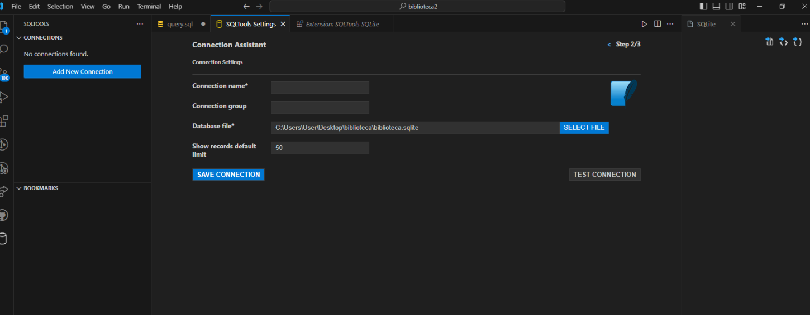
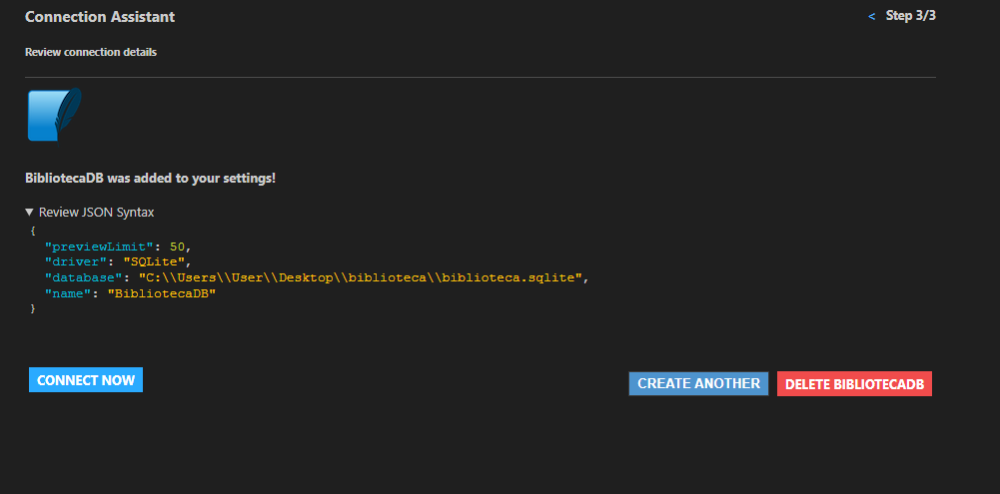
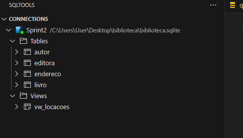
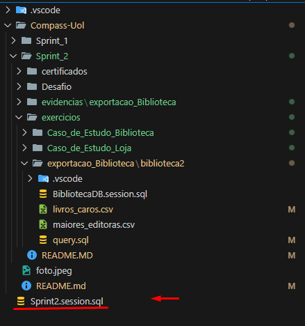
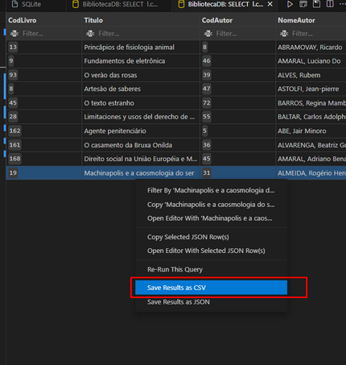
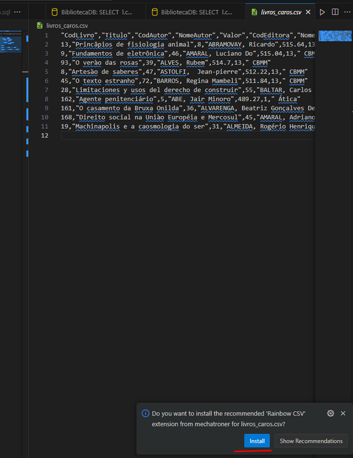
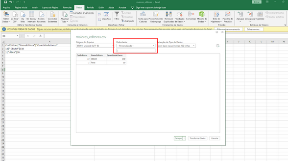
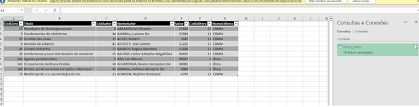
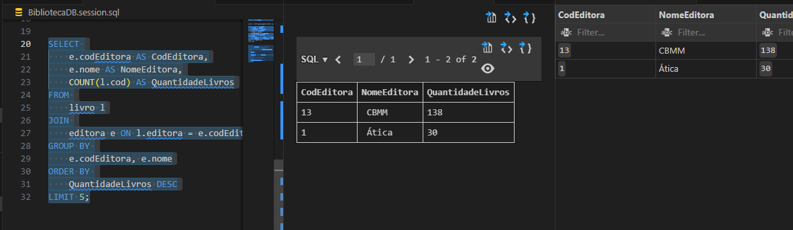
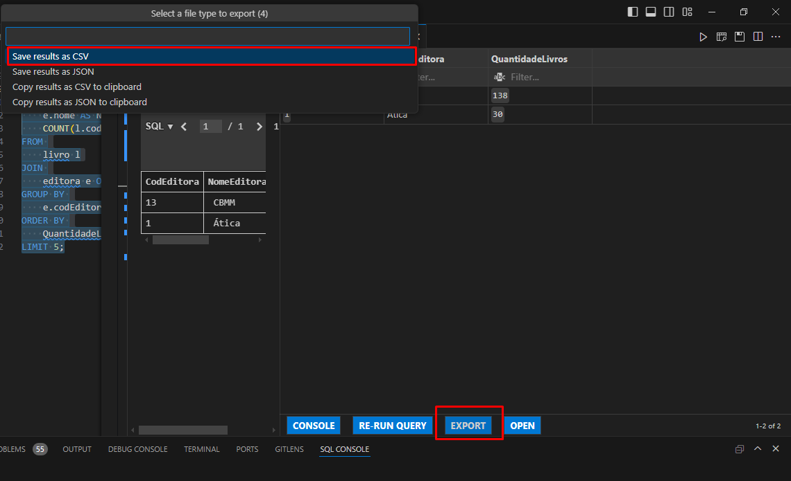

Durante a Sprint 2, aprendi muita coisa, 


Atualmente, já concluí os dois cursos (SQL e AWS) e estou gostando bastante da trilha. Estou ansioso pela próxima sprint e pelos novos aprendizados que ela trará 😊.

# Certificados

 [ Certificados](../Sprint_2/certificados/img/AWS%20Partner%20Sales%20Accreditation%20(Business)(Portuguese).png)

# Exercícios

1. [Resposta Caso de Estudo Biblioteca](../Sprint_2/exercicios/Caso_de_Estudo_Biblioteca/biblioteca/Exercicio_1_ao_7.sql)

2. [Resposta Caso de Estudo Loja](../Sprint_2/exercicios/Caso_de_Estudo_Loja/loja/Exercicio_8_ao_16.sql)

3. [exportacao_Biblioteca Ex3](../Sprint_2/exercicios/exportacao_Biblioteca/biblioteca2/query.sql)


# Desafios

[Desafio 2](../Sprint_2/Desafio/README.MD)


# Evidências

Minha lógica ja esta documentada nos aquivos, vou usar imagens colocando que funcionou dentro da plataforma. A ideia é mostrar de forma clara e direta os resultados

1. [Resposta Caso de Estudo Biblioteca](../Sprint_2/exercicios/Caso_de_Estudo_Biblioteca/biblioteca/Exercicio_1_ao_7.sql)

2. [Resposta Caso de Estudo Loja](../Sprint_2/exercicios/Caso_de_Estudo_Loja/loja/Exercicio_8_ao_16.sql)

Bom ja esse exercicios eu vou documentar aqui o meu passo a passo

3. [exportacao_Biblioteca Ex3](../Sprint_2/exercicios/exportacao_Biblioteca/biblioteca2/query.sql)

    # Seção 6: Linguagem SQL - Exercícios II


fiz as instalações na base de dados chamada "Biblioteca"

Baixei a extensão SQL Tools no VSCode



fazendo a conexão


Eu tive uns probleminhas, mas resolvi




confirmando se foi:




fazendo A Exportar os 10 livros mais caros (Etapa 1):
SELECT * FROM sqlite_master WHERE type='table';


Para a Etapa 1, use o caractere ; (ponto e vírgula) como separador.

**10 livros mais caros**

   ```sql
SELECT
	l.cod AS CodLivro, 
    l.titulo AS Titulo,
	a.codAutor AS CodAutor,
	a.nome AS NomeAutor,
	l.valor AS Valor,
	e.codEditora AS CodEditora,
	e.nome AS NomeEditora`
`FROM
	livro l
JOIN
	autor a ON l.autor = a.codAutor
JOIN
	editora e ON l.editora = e.codEditora
ORDER BY
	l.valor DESC
LIMIT 10;
```
Essa query realiza:

Um JOIN entre as tabelas LIVRO, AUTOR e EDITORA para obter os detalhes do livro, autor e editora.
Os resultados são ordenados pelo valor (l.valor) de forma decrescente e limitados aos 10 livros mais caros.
Resultado


Após rodar a query, opção Save Results As, depois selecionei CSV e usei o caractere ; como separador.



Resultado



**Nota: A extensão Rainbow CSV que apareceu na notificação é útil para visualização e edição de arquivos CSV, pois ela destaca automaticamente os campos. Eu optei por instalar essa extensão para facilitar o trabalho com arquivos CSV no VSCode, mas isso é opcional.**

Abri o arquivo no Excel:

No Excel, fui para Dados > Obter Dados Externos > Do Texto/CSV.
Selecione o arquivo CSV que eu exportei.

Abri o assistente de importação, olhei:
`O delimitador está definido como ponto e vírgula (;).`
E
`A codificação está definida como UTF-8.`




Resultado da minha tabela



[Resultado](exercicios/exportacao_Biblioteca/biblioteca2/livros_caros.csv)

Beleza deu tudo certo com a Modelagem de Dados.

Proximo:
**A query para listar as editoras com a maior quantidade de livros.**

Para a Etapa 2, use o caractere | (pipe) como separador.


Essa query realiza:

Um JOIN entre LIVRO e EDITORA para contar a quantidade de livros associados a cada editora.
O resultado é agrupado por codEditora e nome e ordenado pela contagem (QuantidadeLivros) de forma decrescente, mostrando apenas as 5 editoras com mais livros.

   ```sql  
   SELECT 
    e.codEditora AS CodEditora,
    e.nome AS NomeEditora,
    COUNT(l.cod) AS QuantidadeLivros
FROM 
    livro l
JOIN 
    editora e ON l.editora = e.codEditora
GROUP BY 
    e.codEditora, e.nome
ORDER BY 
    QuantidadeLivros DESC
LIMIT 5;`
```




Mesmo esquema para tranformar em arquivo.csv


[Resultado](exercicios/exportacao_Biblioteca/biblioteca2/maiores_editoras.csv)


# Desafios

Vou falar sobre o desafio agora

Foi criado um conjunto de tabelas, cada uma representando uma entidade. Entre as principais tabelas estão:

Clientes: Armazena informações sobre os clientes (nome, cidade, estado, país).
Carros: Contém os detalhes dos carros (modelo, marca, quilometragem, ano, tipo de combustível).
Vendedores: Armazena dados dos vendedores (nome, sexo, estado).
Locação: Registra as transações de locação, conectando clientes, carros e vendedores, e armazenando dados sobre a data de locação e o valor cobrado.

# Formas Normais
Para garantir a consistência e integridade dos dados, o modelo relacional foi estruturado de acordo com as três formas normais:

Primeira Forma Normal (1NF): Cada tabela contém apenas valores atômicos, ou seja, sem grupos repetidos ou múltiplos valores em uma única coluna. Além disso, cada tabela tem uma chave primária que garante a unicidade de cada registro.

Segunda Forma Normal (2NF): Todas as tabelas estão livres de dependências parciais. Como as chaves primárias são colunas simples, cada atributo depende totalmente da chave primária.

Terceira Forma Normal (3NF): Nenhum atributo não chave depende de outro atributo não chave. Todas as informações redundantes foram movidas para tabelas separadas, como, por exemplo, a separação da marca do carro em uma tabela distinta.

    Fiz a normalização 

**Resultado da normalização:** 

tb_cliente: contém informações do cliente.
tb_carro: contém informações do carro, evitando redundâncias.
tb_combustivel: armazena os tipos de combustível.
tb_vendedor: guarda os dados do vendedor.
tb_locacao: armazena as informações sobre as locações, com as referências às outras tabelas.

#  Relacionamentos

As tabelas foram relacionadas através de chaves estrangeiras, que permitem que uma tabela aponte para os dados em outra. Por exemplo, a tabela de locações faz referência aos clientes, carros e vendedores por meio de chaves estrangeiras, conectando todas essas informações para formar uma transação de locação completa.

vale resaltar que 

Modelo Relacional: Focado em eliminar redundâncias, os dados são organizados em tabelas normalizadas, divididos em várias entidades, com relações estabelecidas por chaves estrangeiras. É usado principalmente para transações (OLTP).


Já o Modelo Dimensional é otimizado para consultas analíticas (OLAP). Os dados são organizados em uma tabela fato (contendo medidas) e várias tabelas dimensão (descritores). Ele é menos normalizado, facilitando a análise de grandes volumes de dados.

#  Modelo Dimensional

O modelo dimensional foi criado para facilitar a análise dos dados e a geração de relatórios. Ele é especialmente útil para sistemas OLAP, onde o foco está na rapidez e eficiência das consultas. No modelo dimensional, os dados são organizados em uma tabela fato e várias tabelas de dimensões, formando o esquema estrela (star schema).

A estrutura do modelo dimensional consiste em:

Tabelas de Dimensão: Cada tabela de dimensão contém informações detalhadas sobre uma entidade específica. As dimensões criadas para este projeto foram:

Dimensão Cliente: Armazena informações sobre os clientes.
Dimensão Carro: Contém detalhes sobre os carros.
Dimensão Vendedor: Registra os dados dos vendedores.
Dimensão Tempo: Organiza as informações de tempo (ano, mês, dia, dia da semana, trimestre).(A mais complciada de se fazer)
Tabela Fato: A tabela fato contém as transações de locação. Cada registro na tabela fato faz referência às dimensões através de chaves estrangeiras e armazena métricas como quantidade de dias alugados e valor cobrado.

Esquema Estrela (Star Schema)
O modelo dimensional segue a estrutura de um esquema estrela, onde a tabela fato está no centro e é conectada a várias dimensões. Isso permite realizar consultas rápidas e agregações. Por exemplo, é possível consultar as locações de carros feitas por um cliente específico durante um período determinado, usando joins entre a tabela fato e as tabelas de dimensão. (modelo recomendado pela instrutora) 


# Benefícios do Modelo Dimensional
Facilidade nas Consultas: Com o modelo dimensional, é fácil consultar os dados para relatórios, pois as tabelas estão organizadas para permitir joins simples entre a tabela fato e as dimensões.

Análise de Tempo: A inclusão da dimensão tempo permite análises detalhadas por período, como dias da semana, meses, anos e trimestres.

Agilidade nas Análises: O modelo dimensional, com seu esquema estrela, facilita a realização de consultas complexas de forma eficiente, mesmo em grandes volumes de dados.

# Mostrando as tabelas

criei as tabelas no sql apenas para mostrar


Agora sobre as view eu tive difciduldade no data mas pesquisando bastante eu consegui fazer funcionar, fiquei bem feliz com o resultado.
**(Nota: todas tabelas foram e feitas no site https://dbdiagram.io/d)**

# Estudando sobre view

eu  estudei bastante sobre. 

"As views geralmente são usadas para simplificar consultas complexas, fornecer uma exibição personalizada dos dados ou limitar acesso a dados das tabelas reais."

"As views servem como tabelas virtuais que são baseadas no resultado de uma query. Elas permitem simplificar consultas complexas, encapsulando-as em uma única estrutura, e ajudam a fornecer uma camada de segurança, pois você pode restringir o acesso a determinadas colunas ou dados específicos. Além disso, views facilitam a manutenção de consultas frequentes, oferecendo uma forma conveniente de reutilizar consultas sem precisar reescrever o código toda vez. Elas não armazenam dados por si mesmas, mas sim referências aos dados em outras tabelas."

Tirando a parte de  de fazer o dim_data (foi complciado), o processo foi bem tranquilo. Criei várias views que considero importantes no desenvolvimento, com perguntas que provavelmente são comuns no dia a dia. Alguns exemplos incluem: uma view para mostrar informações de locações feitas por vendedores de um estado específico e outra para calcular o valor total pago em uma locação (multiplicando o número de dias pelo valor da diária).

Ainda me sinto um pouco inseguro em relação ao SQL, mas acredito que essa sprint está me ajudando bastante a aprender. Mesmo assim, ainda tenho muitas dúvidas, especialmente em relação aos modelos. Consegui fazer, mas não foi algo fácil. Espero que esteja tudo certo.

Bom vamos la?

Passo a Passo para Criar uma View:

# View 

**Identifique a Tabela de Fatos:**

A tabela de fatos é o ponto de partida da view, pois ela contém os dados principais, como o número de diárias, valor total da locação, etc.
Em seguida, identifique as dimensões que estão relacionadas à tabela de fatos.


**Criação da View Fato**

A View de Fato deve ser criada com base na tabela fato, contendo apenas os IDs das dimensões e as medidas numéricas. Por exemplo:
O ID de cada cliente, carro e vendedor.
As medidas, como a quantidade de diárias e o valor por diária.
O valor total calculado com base nas diárias e no valor por diária.
Essa view serve para consultas rápidas sobre os dados principais da locação, sem incluir detalhes desnecessários.

**(Nota: Importante A tabela fato não deve conter atributos descritivos como o nome do cliente ou o modelo do carro, apenas as referências a esses dados via IDs.)**

**Criação de Views Específicas por Período de Tempo**

O processo envolve:

Definir o intervalo de datas necessário, como por exemplo, de 2015 a 2018.
Criar uma View que filtra os dados da tabela fato ou da tabela de locações com base nesse intervalo.
As consultas resultantes mostrarão apenas os registros que ocorreram no período especificado.
Essa abordagem é útil para analisar rapidamente vendas ou locações em um ano, trimestre ou outro período específico.

**(Nota: Essa abordagem é útil para analisar rapidamente vendas ou locações em um ano, trimestre ou outro período específico.)**

Fiz outras diversar views mas nao vejo motivos para explicar elas pois todas seguem os mesmo padrão

ficando assim todas as minhas views

# Resultados


# Feedback

Gostaria de compartilhar meu feedback sobre a Sprint de forma geral e meu desempenho. Embora eu tenha desejado ser mais organizado, isso não aconteceu. Os exercícios foram tranquilos, mas no desafio eu me perdi nas tabelas, cometendo erros bobos. Entendi as formas de normalização, mas tive dificuldade em aplicá-las corretamente. O modelo dimensional foi complicado, mas consegui finalizar de certa forma com facildiade. Tive dificuldades com as views, criei várias para testar e entender suas funcionalidades, mas ainda preciso praticar mais. Comparada à primeira Sprint, esta foi relativamente mais simples, mas estou bem satisfeito e feliz com o que aprendi.

Um ponto positivo foi que ajudei muitas pessoas, o que me deu uma perspectiva diferente, pois as dúvidas delas ampliaram minha compreensão. Isso me fez evoluir bastante e ter uma logica diferente da minha.

Este resumo de Sprint foi menos detalhado e mais direto do que o anterior. Para a próxima, vou experimentar uma abordagem diferente resultando em 3 tipos. Após o feedback da terceira Sprint, decidirei qual modelo de resumo vou adotar daqui em diante com base o feedback de voces (talvez um pouco dos 3).
