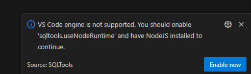
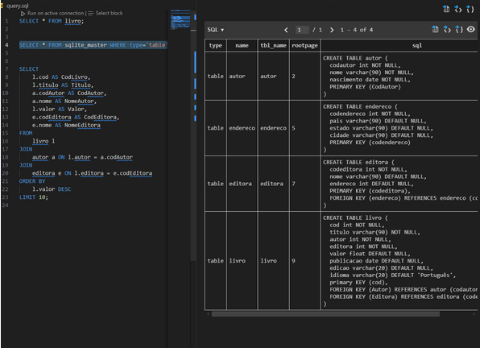
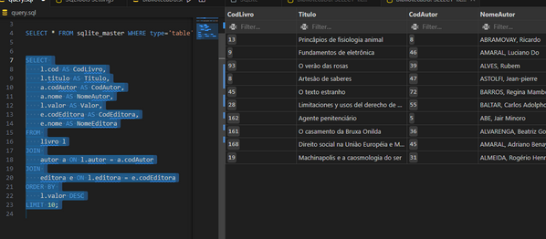
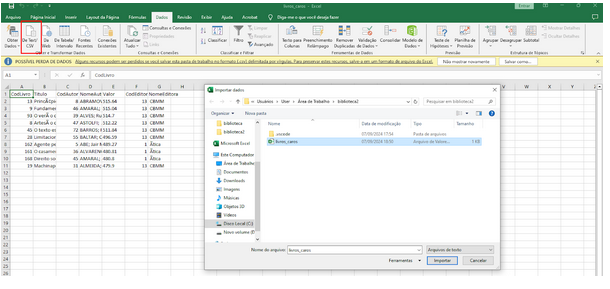

Durante a Sprint 2, aprendi muita coisa, 

Atualmente, já concluí os dois cursos (SQL e AWS) e estou gostando bastante da trilha. Estou ansioso pela próxima sprint e pelos novos aprendizados que ela trará 😊.

# Certificados

 [ Certificados](../Sprint_2/certificados/img/AWS%20Partner%20Sales%20Accreditation%20(Business)(Portuguese).png)

# Exercícios

1. [Resposta Caso de Estudo Biblioteca](../Sprint_2/exercicios/Caso_de_Estudo_Biblioteca/biblioteca/Exercicio_1_ao_7.sql)

2. [Resposta Caso de Estudo Loja](../Sprint_2/exercicios/Caso_de_Estudo_Loja/loja/Exercicio_8_ao_16.sql)

3. [exportacao_Biblioteca Ex3](../Sprint_2/exercicios/exportacao_Biblioteca/biblioteca2/query.sql)

# Desafios

[Desafio 2](../Sprint_2/Desafio/README.MD)

# Evidências

Minha lógica ja esta documentada nos aquivos, vou usar imagens colocando que funcionou dentro da plataforma. A ideia é mostrar de forma clara e direta os resultados

1. [Resposta Caso de Estudo Biblioteca](../Sprint_2/exercicios/Caso_de_Estudo_Biblioteca/biblioteca/Exercicio_1_ao_7.sql)

2. [Resposta Caso de Estudo Loja](../Sprint_2/exercicios/Caso_de_Estudo_Loja/loja/Exercicio_8_ao_16.sql)

Bom ja esse exercicios eu vou documentar aqui o meu passo a passo

3. [exportacao_Biblioteca Ex3](../Sprint_2/exercicios/exportacao_Biblioteca/biblioteca2/query.sql)

    # Seção 6: Linguagem SQL - Exercícios II

fiz as instalações na base de dados chamada "Biblioteca"

Baixei a extensão SQL Tools no VSCode

fazendo a conexão

Eu tive uns probleminhas, mas resolvi

confirmando se foi:

fazendo A Exportar os 10 livros mais caros (Etapa 1):
SELECT * FROM sqlite_master WHERE type='table';

Para a Etapa 1, use o caractere ; (ponto e vírgula) como separador.

**10 livros mais caros**
`SELECT`
	`l.cod AS CodLivro, 
    l.titulo AS Titulo,
	a.codAutor AS CodAutor,
	a.nome AS NomeAutor,
	l.valor AS Valor,
	e.codEditora AS CodEditora,
	e.nome AS NomeEditora`
`FROM
	livro l
JOIN
	autor a ON l.autor = a.codAutor
JOIN
	editora e ON l.editora = e.codEditora
ORDER BY
	l.valor DESC
LIMIT 10;`

Essa query realiza:

Um JOIN entre as tabelas LIVRO, AUTOR e EDITORA para obter os detalhes do livro, autor e editora.
Os resultados são ordenados pelo valor (l.valor) de forma decrescente e limitados aos 10 livros mais caros.
Resultado

Após rodar a query, opção Save Results As, depois selecionei CSV e usei o caractere ; como separador.

Resultado

**Nota: A extensão Rainbow CSV que apareceu na notificação é útil para visualização e edição de arquivos CSV, pois ela destaca automaticamente os campos. Eu optei por instalar essa extensão para facilitar o trabalho com arquivos CSV no VSCode, mas isso é opcional.**

Abri o arquivo no Excel:

No Excel, fui para Dados > Obter Dados Externos > Do Texto/CSV.
Selecione o arquivo CSV que eu exportei.

Abri o assistente de importação, olhei:
`O delimitador está definido como ponto e vírgula (;).`
E
`A codificação está definida como UTF-8.`

Resultado da minha tabela

[Resultado](exercicios/exportacao_Biblioteca/biblioteca2/livros_caros.csv)

Beleza deu tudo certo com a Modelagem de Dados.

Proximo:
**A query para listar as editoras com a maior quantidade de livros.**

Para a Etapa 2, use o caractere | (pipe) como separador.

Essa query realiza:

Um JOIN entre LIVRO e EDITORA para contar a quantidade de livros associados a cada editora.
O resultado é agrupado por codEditora e nome e ordenado pela contagem (QuantidadeLivros) de forma decrescente, mostrando apenas as 5 editoras com mais livros.

   ` SELECT 
    e.codEditora AS CodEditora,
    e.nome AS NomeEditora,
    COUNT(l.cod) AS QuantidadeLivros
FROM 
    livro l
JOIN 
    editora e ON l.editora = e.codEditora
GROUP BY 
    e.codEditora, e.nome
ORDER BY 
    QuantidadeLivros DESC
LIMIT 5;`

Mesmo esquema para tranformar em arquivo.csv

[Resultado](exercicios/exportacao_Biblioteca/biblioteca2/maiores_editoras.csv)

[Meu banco de dados](../../Sprint2.session.sql)

# Feedback
