# Desafio da Sprint 

Vamos começar 

Baixar o arquivo CSV (Google Play Store).
Criar um ambiente de trabalho usando Jupyter Notebook no VS Code ou Jupyter Lab. 
Documentar cada célula de código no Notebook usando Markdown.

**Nota: fiz pelo VS Code pois o anaconda travava muito**

bom quando eu comecei a primeira coisa q eu fiz foi dar um olhada em aquivo.

Aqui estão as primeiras linhas do arquivo googleplaystore.csv. O conjunto de dados contém as seguintes colunas:

App: Nome do aplicativo.
Category: Categoria do aplicativo.
Rating: Classificação do aplicativo.
Reviews: Número de avaliações.
Size: Tamanho do aplicativo.
Installs: Quantidade de instalações.
Type: Se o aplicativo é grátis ou pago.
Price: Preço do aplicativo (0 para gratuitos).
Content Rating: Classificação de conteúdo.
Genres: Gênero(s) do aplicativo.
Last Updated: Última atualização do aplicativo.
Current Ver: Versão atual do aplicativo.
Android Ver: Versão mínima do Android necessária.

**Nota: fiz o  desafio 2x pois acabou acontecendo algumas coisa que eu iria de enfase durante o readme.**

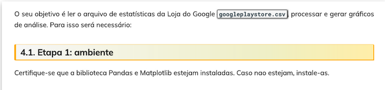

Importar bibliotecas necessárias

import pandas as pd
import numpy as np

a Primeira vez eu fiz 

df = pd.read_csv('googleplaystore.csv')

# Visualizar as primeiras linhas do dataframe
df.head()

que no fim da na mesma.

mas esta assim no git

# Ler o arquivo CSV
file_path = '../Desafio_Sprint_3/googleplaystore.csv'  
google_play_data = pd.read_csv(file_path)

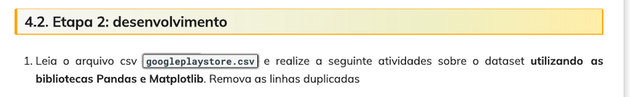

# Remover linhas duplicadas
google_play_data_cleaned = google_play_data.drop_duplicates()

# Verificar a quantidade de linhas antes e depois da limpeza
print(f"Linhas antes da remoção: {google_play_data.shape[0]}")
print(f"Linhas após a remoção: {google_play_data_cleaned.shape[0]}")

Isso remove as linhas duplicadas e exibe quantas linhas foram eliminadas no processo. Se estiver pronto, posso gerar gráficos usando o Matplotlib e continuar com as próximas etapas.

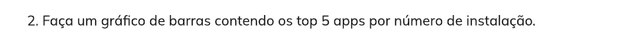

aqui eu tive dificuldade.

Parece que todos os valores da coluna "Installs" foram convertidos para 0.

depois de um tempo eu 

Eu consegui ver que a coluna Installs contém valores como 'Free' e '0+', que causam problemas durante a conversão. Além disso, alguns valores têm símbolos como '+' e ',', que precisam ser removidos.

ficando assim meu codigo.

# Recarregar os dados para garantir que a variável esteja definida
import pandas as pd

<h5> Carregar o arquivo CSV</h5>
file_path = '../Desafio_Sprint_3/googleplaystore.csv'
google_play_data = pd.read_csv(file_path)

<h5> Remover valores inválidos como 'Free' e '0+'</h5>
google_play_data_cleaned = google_play_data[~google_play_data['Installs'].isin(['Free', '0+'])]

<h5> Remover símbolos e converter a coluna 'Installs' para numérico</h5>
google_play_data_cleaned['Installs'] = google_play_data_cleaned['Installs'].str.replace('[+,]', '', regex=True).astype(int)

<h5> Selecionar os top 5 aplicativos por número de instalações</h5>
top_5_apps = google_play_data_cleaned.sort_values(by='Installs', ascending=False).head(5)

<h5> Exibir os top 5 aplicativos sem gerar gráfico</h5>
top_5_apps[['App', 'Installs']]

e meu grafico ficando.

<h5> Remover valores inválidos como 'Free' e '0+'</h5>
google_play_data_cleaned = google_play_data[~google_play_data['Installs'].isin(['Free', '0+'])]

 Remover símbolos e converter a coluna 'Installs' para numérico
 Remover símbolos e converter a coluna 'Installs' para numérico usando .loc[]
google_play_data_cleaned.loc[:, 'Installs'] = google_play_data_cleaned['Installs'].str.replace('[+,]', '', regex=True).astype(int)

# Selecionar os top 5 aplicativos por número de instalações
top_5_apps = google_play_data_cleaned.sort_values(by='Installs', ascending=False).head(5)

# Criar o gráfico de barras verticais
plt.figure(figsize=(10,6))
plt.bar(top_5_apps['App'], top_5_apps['Installs'], color='skyblue')
plt.title('Top 5 Aplicativos por Número de Instalações')
plt.xlabel('Aplicativo')
plt.ylabel('Número de Instalações')
plt.xticks(rotation=45, ha='right')  # Rotacionar os rótulos para facilitar a leitura
#plt.gca().invert_yaxis()  # Inverter o eixo y para mostrar o maior valor no topo
plt.tight_layout()
plt.show()

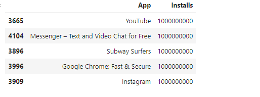

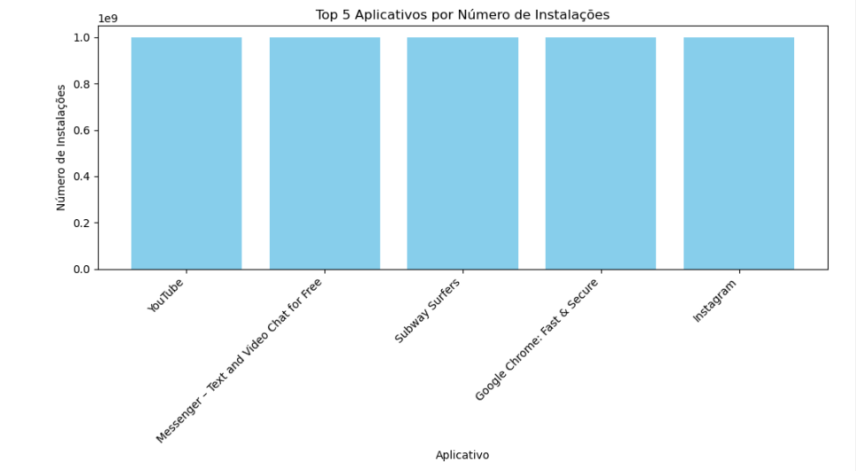

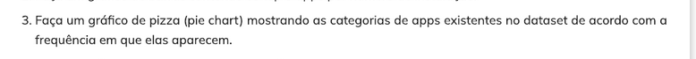
olhando
category_counts = google_play_data['Category'].value_counts().drop_duplicates
print(category_counts)

# Contar a frequência de cada categoria no dataset
category_counts = google_play_data['Category'].value_counts()

# Criar o gráfico de pizza
plt.figure(figsize=(10, 8))
plt.pie(category_counts, labels=category_counts.index, autopct='%1.1f%%', startangle=140)
plt.title('Frequência das Categorias de Apps', fontsize=14)
plt.axis('equal')  # Para garantir que o gráfico seja um círculo
plt.tight_layout()

# Exibir o gráfico
plt.show()

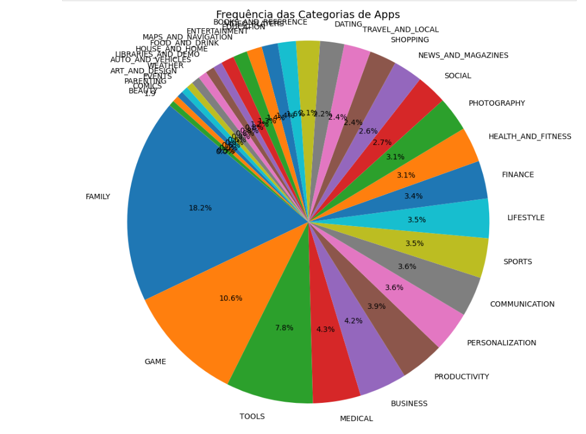

aqui eu dei uma Limpada

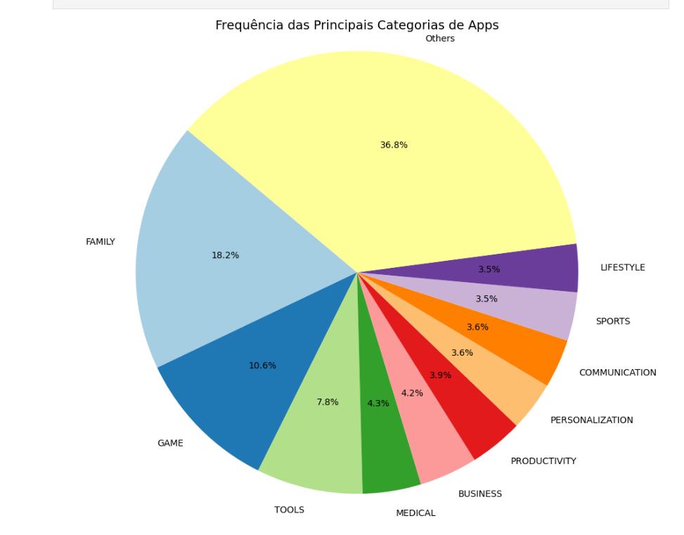

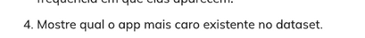

O aplicativo mais caro no dataset é:

I'm Rich - Trump Edition com um preço de 400.0 dólares.

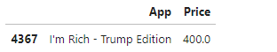

bom eu acabei dando uma olhada de modo geral nos preços pois Todos os apps estavam com o preço zero, entao fui a fundo para entender oque estava acontecendo, mas depois arrumei. 

bom agora vou falar sobre esse codigo.

 Converter a coluna 'Price' para string para evitar o erro
google_play_data['Price'] = google_play_data['Price'].astype(str)

 Filtrar apenas os valores que começam com '$'
google_play_data = google_play_data[google_play_data['Price'].str.startswith('$')]

 Remover o símbolo de dólar e converter a coluna para numérico
google_play_data['Price'] = google_play_data['Price'].str.replace('$', '').astype(float)

# Encontrar o app mais caro
app_mais_caro = google_play_data[['App', 'Price']].sort_values(by='Price', ascending=False).head(1)

# Exibir o app mais caro
print("O app mais caro é:")
print(app_mais_caro)

esta me resultado um **Empty** e eu n faço ideia do porque, essa foi aperte mais complicada do desafio, eu não consegui fazer esse codigo rodar e ate agora eu não, quando eu crio outro arquivo e coloco o codigo ele vai mas nesse codigo nao.

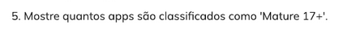

<h5> Contar o número de apps classificados como 'Mature 17+' na coluna 'Content Rating'
mature_17_apps_count = google_play_data_cleaned[google_play_data_cleaned['Content Rating'] == 'Mature 17+'].shape[0]

<h5> Exibir o resultado </h5>
mature_17_apps_count

Existem 499 aplicativos classificados como Mature 17+ no dataset. 

vou tratar agora 

<h5> Remover duplicatas com base no nome do aplicativo</h5>
mature_17_unique_apps = google_play_data_cleaned[google_play_data_cleaned['Content Rating'] == 'Mature 17+'].drop_duplicates(subset='App')

<h5> Contar o número de apps únicos classificados como 'Mature 17+'</h5>
mature_17_apps_unique_count = mature_17_unique_apps.shape[0]

# Exibir o resultado
print(f"Quantidade de apps classificados como 'Mature 17+': {mature_17_apps_unique_count}")

ficando:
Quantidade de apps classificados como 'Mature 17+': 393

# Aqui eu achei legal confirir se realmente tinha dados duplciados.

 Encontrar os apps duplicados (com base no nome do app)
duplicated_apps = google_play_data_cleaned[google_play_data_cleaned.duplicated(subset='App', keep=False)]

# Exibir as primeiras 10 duplicatas para mostrar o que foi removido (so pra confirmar)
duplicated_apps.head(10)

confirmando

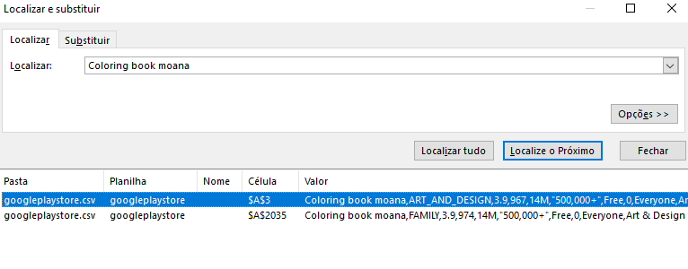

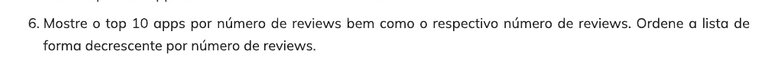

# Converter a coluna 'Reviews' para numérico (caso necessário)
google_play_data_cleaned['Reviews'] = pd.to_numeric(google_play_data_cleaned['Reviews'], errors='coerce')

# Selecionar os top 10 aplicativos por número de reviews
top_10_reviews = google_play_data_cleaned[['App', 'Reviews']].sort_values(by='Reviews', ascending=False).head(10)

# Exibir o resultado
top_10_reviews

bom so apareceu 
Facebook, WhatsApp Messenger e Instagram

entao vamos entender oque aconteceu.

# Remover duplicatas com base no nome do aplicativo

<h5> selecionar os top 10 únicos </h5>
top_10_reviews_unique = google_play_data_cleaned[['App', 'Reviews']].drop_duplicates(subset='App', keep='first').sort_values(by='Reviews', ascending=False).head(10)

# Exibir o resultado sem duplicatas
top_10_reviews_unique

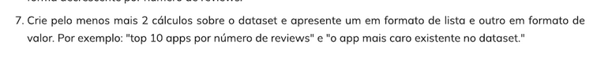

<h5>Excplicação do que fazer</h5>

1. Lista de apps por categoria com mais instalações (formato de lista):
Essa lista apresentará as categorias que têm o maior número de instalações somadas.

2. Média de classificações  de todos os apps:
Calcular a média das classificações  de todos os apps no dataset.

Vou implementar esses dois cálculos agora.

Aqui estão os dois Resultados:

1. 
Top 10 categorias por número de instalações (em formato de lista):
GAME: 35,086,024,415 instalações
COMMUNICATION: 32,647,276,251 instalações
PRODUCTIVITY: 14,176,091,369 instalações
SOCIAL: 14,069,867,902 instalações
TOOLS: 11,452,771,915 instalações
FAMILY: 10,258,263,505 instalações
PHOTOGRAPHY: 10,088,247,655 instalações
NEWS_AND_MAGAZINES: 7,496,317,760 instalações
TRAVEL_AND_LOCAL: 6,868,887,146 instalações
VIDEO_PLAYERS: 6,222,002,720 instalações

2. Média de classificações (ratings) de todos os apps (em formato de valor):
A média das classificações dos apps no dataset é 4.19.

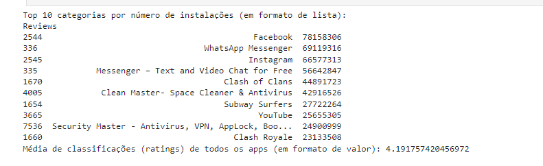

Aqui estão as duas formas gráficas:

Gráfico de linha mostrando o total de instalações por categoria (Top 10).

Gráfico de dispersão mostrando a média de classificações dos aplicativos.

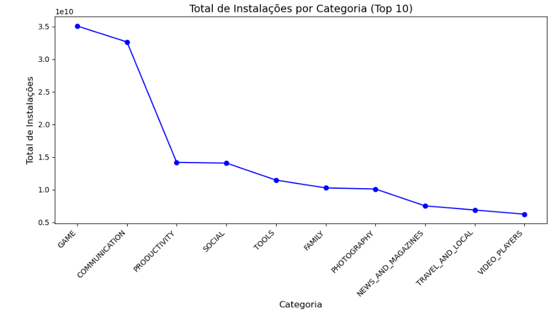

**Nota: eu sei que n foi o grafico mais criativo que eu poderia ter feito**

Ao pesquisar mais sobre gráficos, identifiquei os seguintes tipos:

Histogramas
Gráficos de linhas
Gráficos de dispersão
Gráficos de barras
Gráficos de pizza
Diagramas de caixa

o unico que me deu medo foi **"Diagramas de caixa"**

mas depois pesquisei um pouco direito e saiu:

Gráficos de área: 
Gráficos de erro: 
Gráficos de bolhas: 
Gráficos de radar (ou gráficos de aranha): 
Heatmaps (mapas de calor):
Gráficos de treemap:
Gráficos de densidade: 
Gráficos de violino: 
Gráficos de vetor (quiver):

e sai traumatizado, não me senti muito seguro sobre Matplotlib ainda...

falo melhor sobre isso no meu feedback da Sprint 
