Durante a Sprint 3, tive a oportunidade de aprofundar meus conhecimentos em Python. Embora tenha enfrentado algumas dificuldades com o pandas, e com o Anaconda, que travava meu computador com frequência, a experiência me foi um aprendizado valioso(aprendi o suficiente usando Anaconda e depois voltei pro vscode).

Após essa Sprint, me identifiquei mais com o papel de analista de dados. A facilidade em explorar os dados e visualizar os resultados me motivou.

O que mais gostei na sprint foi a facilidade em realizar pesquisas e resolver problemas. Os processos se mostraram extremamente práticos e intuitivos, especialmente ao utilizar bibliotecas como Pandas e Matplotlib.

No futuro, pretendo explorar outras ferramentas e técnicas de análise de dados, como o aprendizado de máquina.

Atualmente, já concluí os dois cursos (python e AWS) e estou gostando bastante da trilha. 
Estou ansioso pela próxima sprint e pelos novos aprendizados que ela trará 😊.

# Certificados

 [ Certificados](../Sprint_3/certificados/Aspectos%20econômicos%20da%20nuvem.png)

# Exercícios

1. [Respostas Seção_3](../Sprint_3/exercicios/Seção_3/)

2. [Resposta Seção_4](../Sprint_3/exercicios/Seção_4/)

3. [Resposta Seção_5](../Sprint_3/exercicios/Seção_5/)

# Desafios

[Desafio 3](../Sprint_3/Desafio/README.MD)

# Evidências

Minha lógica ja esta documentada nos aquivos, vou usar imagens colocando que funcionou dentro da plataforma. A ideia é mostrar de forma clara e direta os resultados

1. [Respostas Seção_3](../Sprint_3/exercicios/Seção_3/)

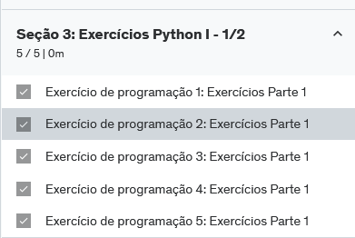

foi bem simples de se fazer, nao tive problemas.

2. [Resposta Seção_4](../Sprint_3/exercicios/Seção_4/)

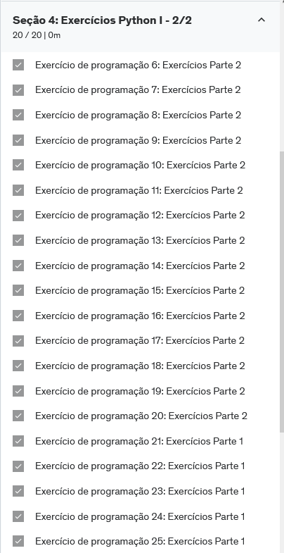

Já esses exercícios eu tive problemas Principalmente com a saida dos resultado, os exercícios em sí não são difíceis.
Eu particularmente gostei dos exercícios mas por ter que usar a udemy como forma de validação acaba se tornando um situação meio frustante, eu adotei o método  simples de se eu não fizer o exercício de primeira eu simplesmente pulava para o próximo e depois eu voltava e via oq estava acontecendo, tirando um ou outro que eu realemtne fiz com a lógica errada kkkk a maioria que deu errado foi o formato da saida esperado.
Achei que foram muitos exercícios. 

Bom ja esse exercicio (Seção_5) eu vou documentar aqui o meu passo a passo

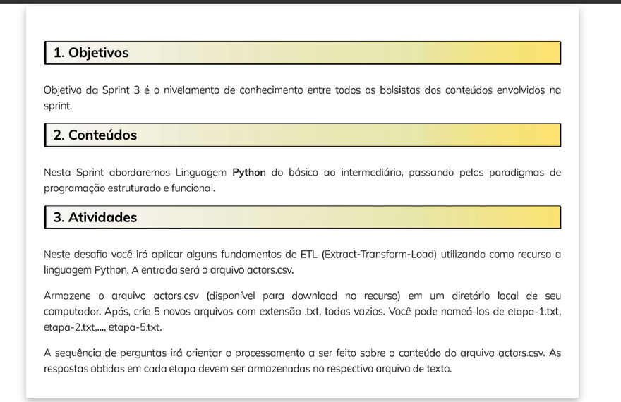

Antes de começar, aqui esta uma explicação de como eu fiz para abrir o aquivo CSV.

Abrir o arquivo CSV usando o modo de leitura ("r").

Ler as linhas do arquivo.

Separar os valores em cada linha, já que o CSV usa vírgulas para separar os campos.

Guardar as informações para processá-las e descobrir qual ator tem o maior número de filmes.

[Respostas Seção_5](../Sprint_3/exercicios/Seção_5/0_Exercício_ETL_Python.py)

Beleza agora vamos fezer o exercício

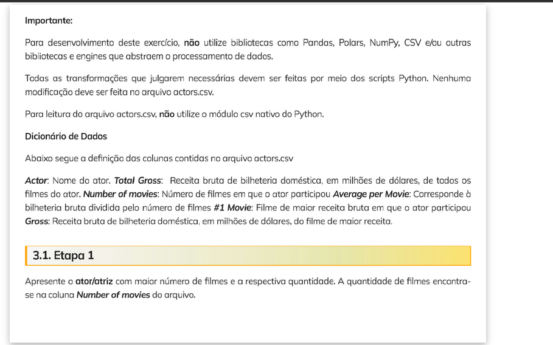

Vamos começar pela Etapa 1, que pede para encontrar o ator ou atriz com o maior número de filmes, baseado na coluna "Number of movies". Lembrando de que não posso usar bibliotecas como Pandas ou NumPy, então vou usar a manipulação de arquivos CSV diretamente no Python.

1. Identificar a coluna correta de "Number of Movies":
Depois de verificar as primeiras linhas do CSV, confirmar em qual posição da linha está a coluna "Number of Movies".

2. Extrair o número de filmes e o nome do ator:

3. Comparar e encontrar o ator com mais filmes:

comparando com o maior valor atual e mantenha o nome do ator correspondente.

Bom vale resaltar que usei o strip() me ajudou bastante.

´strip() aplicado ao nome do ator para garantir que nenhum espaço extra seja considerado no resultado.´

 <h1>Resultado</h1>

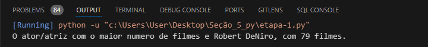

Etapa 2:
A Etapa 2 pede para apresentar a média de receita bruta de bilheteria doméstica dos principais filmes, considerando todos os atores. Eu precisa calcular a média da coluna "Gross", que representa a receita bruta.

Gross: Receita bruta de bilheteria doméstica está na segunda coluna.

Ideia:
Ler o arquivo CSV e extrair a coluna "Gross".
Somar os valores dessa coluna.
Calcular a média dividindo a soma total pelo número de atores (linhas).
Imprimir o resultado.

**Nota: estava fazendo o Total Gross inves de apenas Gross**

 <h1>Resultado</h1>

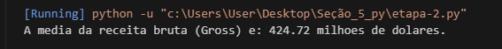

Etapa 3:

encontrar o ator ou atriz que tem a maior média de receita bruta por filme, utilizando a coluna "Average per Movie".

Ideia do que 
fazer:
Ler a coluna "Average per Movie" 
Verificar a coluna "Average per Movie" para cada linha e comparar os valores.
Encontrar o valor mais alto nessa coluna.
Armazenar o nome do ator/atriz com o maior valor dessa coluna.
Exibir o nome do ator/atriz com a maior média.

Passo a passo do cálculo:

Como é calculada a média "Average per Movie":
Somar o total de receita bruta do ator: Isso está na coluna "Total Gross", que representa a receita total de todos os filmes em que o ator participou.
Dividir pelo número de filmes: O número de filmes em que o ator participou está na coluna "Number of Movies".
A fórmula da média seria:

Average per Movie = Total Gross
               /
                Number of Movies

Exemplo com números:
Vamos pegar o exemplo de Anthony Daniels, que teve a maior média:

Total Gross (Receita total bruta): 4957.8 milhões de dólares
Number of Movies (Número de filmes): 11
Agora aplicamos a fórmula: 4957.8/11 = 451.8M

Isso significa que, em média, cada filme em que Anthony Daniels participou gerou 451.8 milhões de dólares em receita bruta.

 <h1>Resultado</h1>

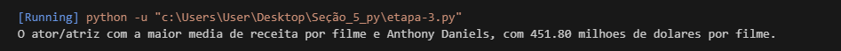

Etapa 4:

Bom aqui eu ja vou avisando q eu fiz de 3 formas diferentes.(mais irei comentar somente 2)
Vamos la.

Explicação:

Contagem de filmes: usando a coluna "#1 Movie" para extrair o nome do filme de cada linha e armazená-lo na lista filmes.
Contagem de ocorrências: usando o objeto Counter da biblioteca collections para contar quantas vezes cada filme aparece ou apenas utilziando py.
Ordenação: Ordenamos primeiro pela quantidade (em ordem decrescente) e depois alfabeticamente em caso de empate.
Formato da saída: A saída segue o formato solicitado, com a sequência de aparição, o nome do filme e o número de vezes que ele aparece.

<h2>Vou explicar cada uma da minhas Abordagens.</h2>

Abordagem sem Counter:

criar um dicionário vazio para armazenar os filmes e suas quantidades.
Iterar sobre as linhas do CSV e verificar se o filme já está no dicionário:
Se o filme já estiver no dicionário, incrementamos a contagem.
Se não estiver, adicionamos o filme ao dicionário com uma contagem inicial de 1.
Ordenar os filmes de acordo com a quantidade de aparições.
Imprimir ou salvar o resultado no formato solicitado.

Abordagem com Counter:

Explicação:
Contagem de filmes: usei a coluna "#1 Movie" (índice 4) para extrair o nome do filme de cada linha e armazená-lo na lista filmes.
Contagem de ocorrências: Usei o objeto Counter da biblioteca collections para contar quantas vezes cada filme aparece.
Ordenação: ordenei primeiro pela quantidade (em ordem decrescente) e depois alfabeticamente em caso de empate.
Formato da saída: A saída segue o formato solicitado, com a sequência de aparição, o nome do filme e o número de vezes que ele aparece.

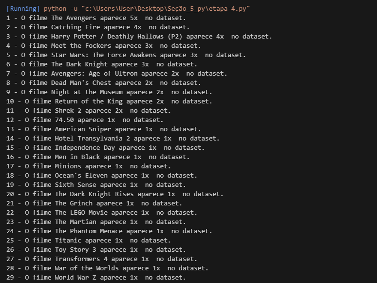

**Nota: no meu codigo esta explciado melhor**

1. [Respostas Seção_5](../Sprint_3/exercicios/Seção_5/etapa-4.py) 
aqui eu explico com mais detalahes sobre minhas abordagens e sobre minhas ideas por tras

vale ressaltar que eu fiz um codigo para me dar uma ideia da minha situação 

creie um codigo que faz:

"destacando os filmes que tem a mesma quantidade de aparicoes:"

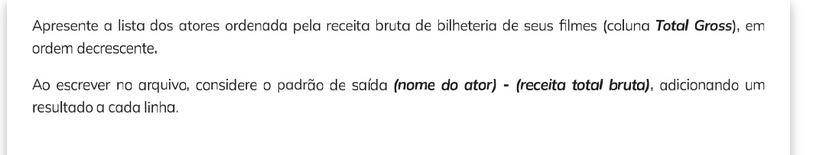

Na última etapa, o desafio pede para para apresentar a lista dos atores ordenada pela receita bruta de bilheteria dos seus filmes (coluna "Total Gross") em ordem decrescente, e depois salvar essa lista em um arquivo seguindo o padrão:

Extração de dados: O nome do ator (coluna 0) e a receita bruta total "Total Gross" (coluna 1) são extraídos e armazenados em uma lista chamada atores_total_gross.
Ordenação: A lista é ordenada pela receita bruta em ordem decrescente usando a função sort() com reverse=True.
Escrita no arquivo: Os resultados são salvos no arquivo atores_total_gross.txt 

no formato: (nome do ator) - (receita total bruta)

O script irá gerar um arquivo atores_total_gross.txt com a lista de atores e suas receitas totais, ordenados em ordem decrescente de receita.

acabei cometendo o seguinte erro, que vale apena ser comentado.

Tive um erro ao tentar converter a coluna "Total Gross" para um valor numérico, o Python encontrou um valor inválido. Esse erro occoreu pq o arquivo CSV tem vírgulas em campos de texto (como o nome do ator) e isso acaba quebrando o formato esperado. 
Eu acabo quebrando a cabeça

bom continuando 

Solução:
Em vez de simplesmente usar split(','), que pode causar problemas se houver vírgulas nos campos de texto, precisamo garantir que esta pegando as colunas corretamente.
Verificar a integridade de cada linha: verifiquei se a linha tem a quantidade correta de colunas antes de tentar processá-la.

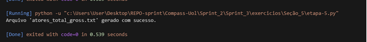

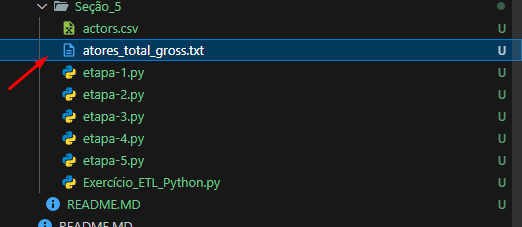

deu certo!! 

beleza Finalizando a ultimo ex.

agora vamos falar sobre o desafio.

# Desafio

Resumo do Desafio da Sprint
Objetivo:
O desafio consiste em aplicar conhecimentos de Python para manipulação e análise de dados utilizando bibliotecas como Pandas e Matplotlib. O objetivo é processar um arquivo CSV com informações da Google Play Store e gerar gráficos para análise.

Entregáveis:

Arquivo .IPYNB contendo o código, criado no Jupyter Notebook ou VS Code com a extensão Jupyter.
Documentação detalhada de cada célula de código usando Markdown para explicações e insights.
Preparação:

fiz o download do arquivo googleplaystore.csv.
Configure o ambiente de trabalho no Jupyter.
Etapas do Desafio:

Etapa 1: Ambiente

bibliotecas Pandas e Matplotlib estejam instaladas.

Etapa 2: Desenvolvimento

atividades no dataset utilizando as bibliotecas Pandas e Matplotlib:

# Importar as bibliotecas
import pandas as pd
import matplotlib.pyplot as plt

Ler o arquivo googleplaystore.csv e remova as linhas duplicadas.

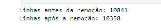

Crie um gráfico de barras com os top 5 aplicativos por número de instalações.

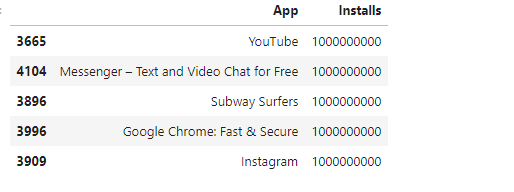

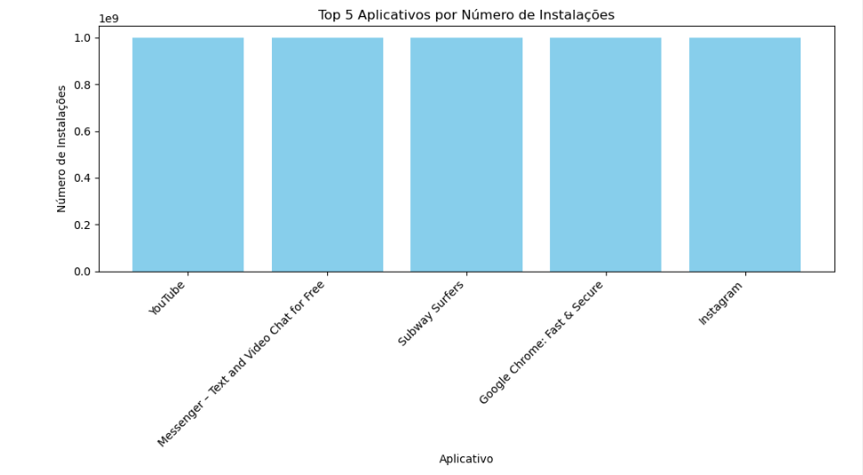

Crie um gráfico de pizza para mostrar a distribuição de categorias de aplicativos.

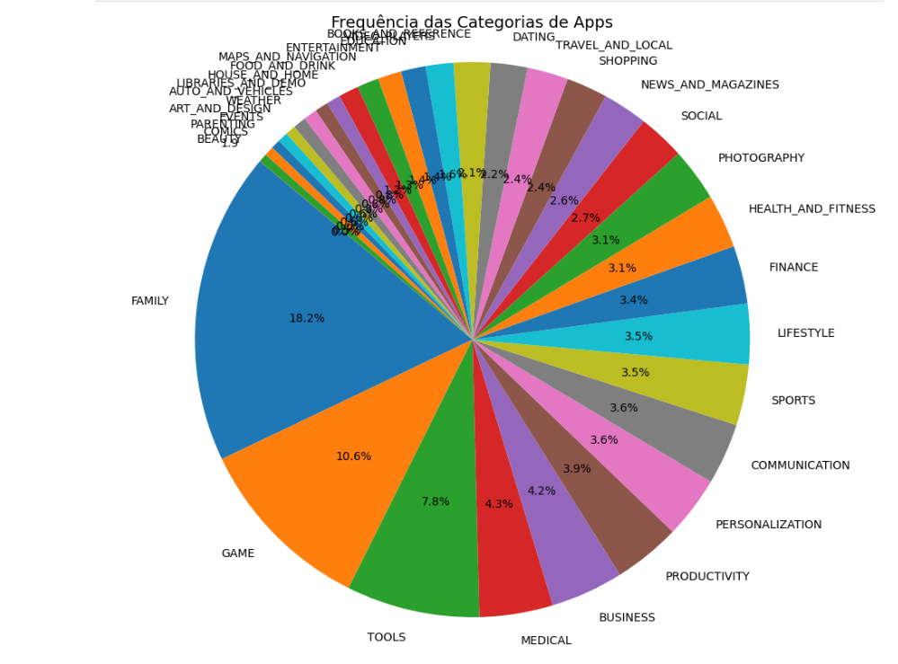

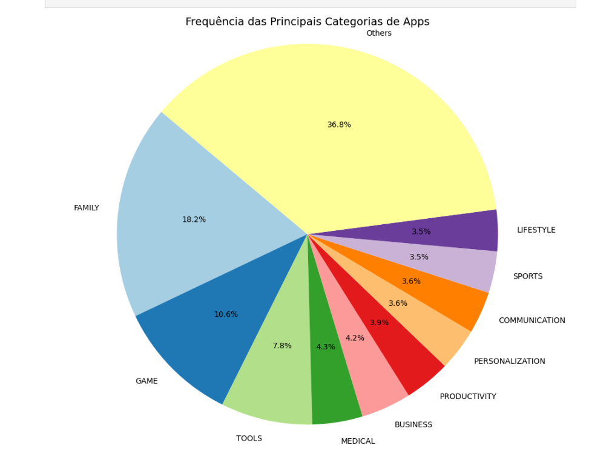

Identifique e exiba o aplicativo mais caro no dataset.

Mostre quantos aplicativos estão classificados como 'Mature 17+'.

 top 10 aplicativos por número de avaliações (reviews).

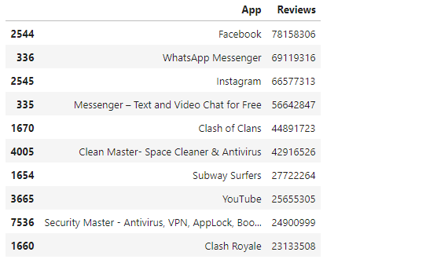

Realize mais dois cálculos sobre o dataset e apresente-os em formato gráfico ou de lista.

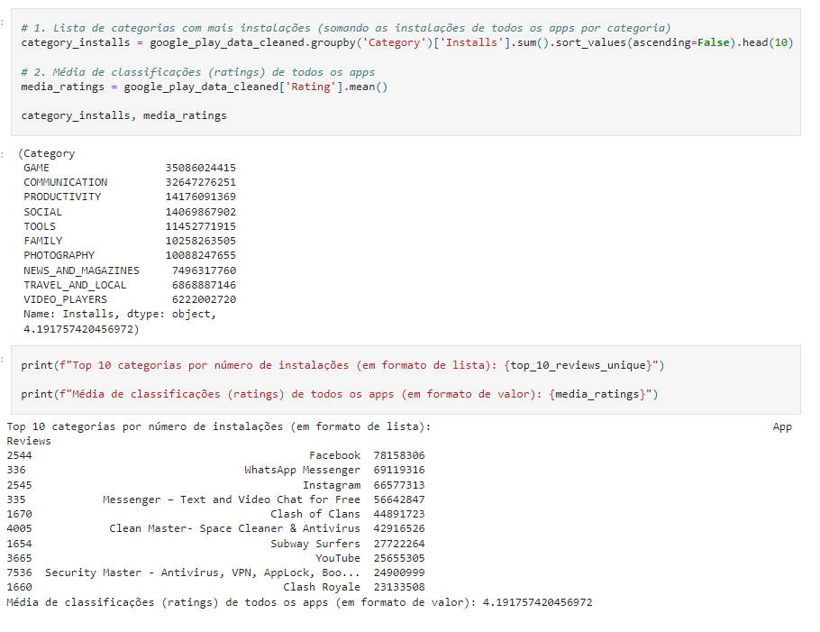

Crie pelo menos mais duas formas gráficas de exibição dos indicadores utilizando Matplotlib, como gráficos de linha ou dispersão.
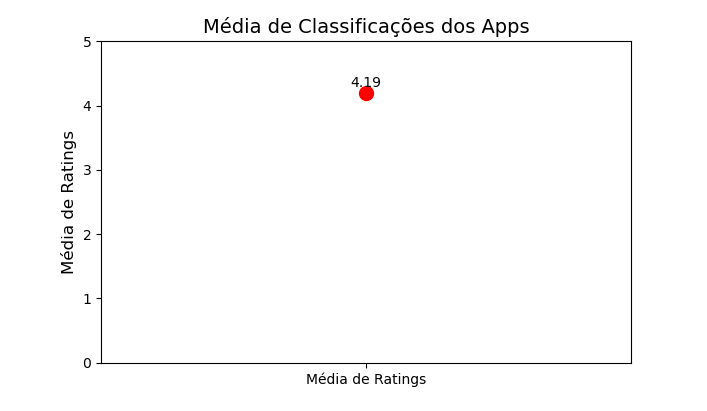

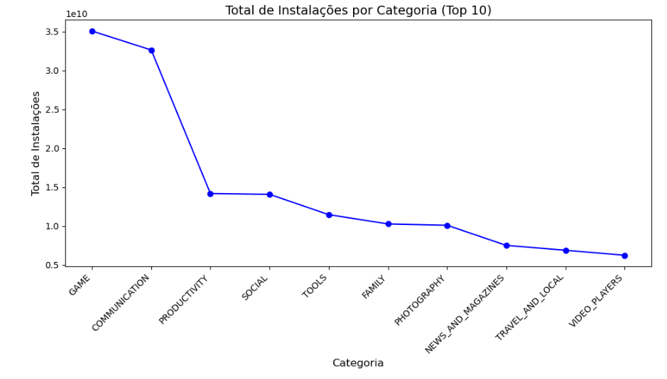

Desafios Enfrentados:

Durante a realização do desafio, tive dificuldades na limpeza de dados e transformação das colunas Installs e Price, que apresentavam valores inconsistentes. Além disso, foi necessário resolver problemas com duplicação de registros e manipulação de tipos de dados para que os gráficos fossem gerados corretamente.

O desafio foi uma oportunidade para explorar ferramentas de visualização e aprofundar conhecimentos em manipulação de dados com Python.

notei alguns erros no meu git 

entao vamos arrumar

# Feedback

Feedback da Sprint
Eu achei o desafio em si relativamente simples e não tive muitas dificuldades. Consegui completar a atividade em dois dias: e o ETL em um  demorei mais para fazer os exercícios.

O que achei mais desafiador(CHATO) foram os exercícios que acompanharam a sprint. A quantidade de exercícios foi exaustiva e um pouco cansativa de resolver. Acredito que seria mais interessante se houvesse uma redução na quantidade de exercícios, mas que eles tivessem um nível de dificuldade maior. Isso exigiria mais raciocínio e aplicação de conhecimento, o que acho que faz as pessoas aprenderem mais rapido.

Observando a Sprint 4, percebi que há uma menor quantidade de exercícios, mas com um nível de dificuldade maior. Esse modelo me parece mais eficaz, pois força os participantes a se dedicarem mais a cada problema. Pessoalmente, aprendo melhor com exercícios mais complexos pois acabo levando pro lado pessoal de nao conseguir fazer, enquanto as atividades mais simples acabam não proporcionando o mesma velocidade de aprendizado.

No geral, gostei bastante do desafio e do aprendizado que ele proporcionou, apesar de ainda não me sentir totalmente confortável com algumas partes. Acredito que com mais prática e desafios mais avançados, a confiança no processo aumentará.
