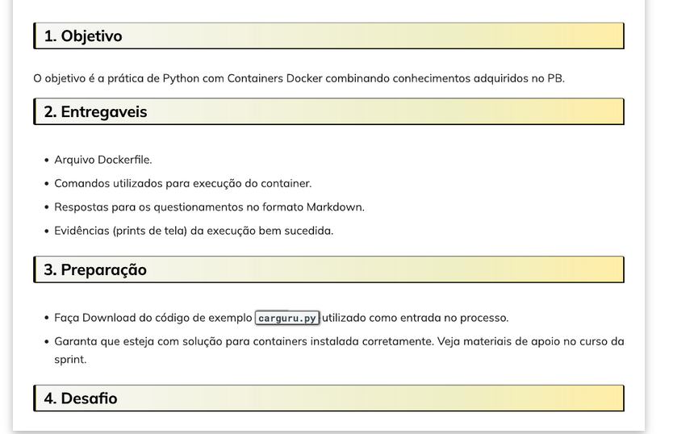
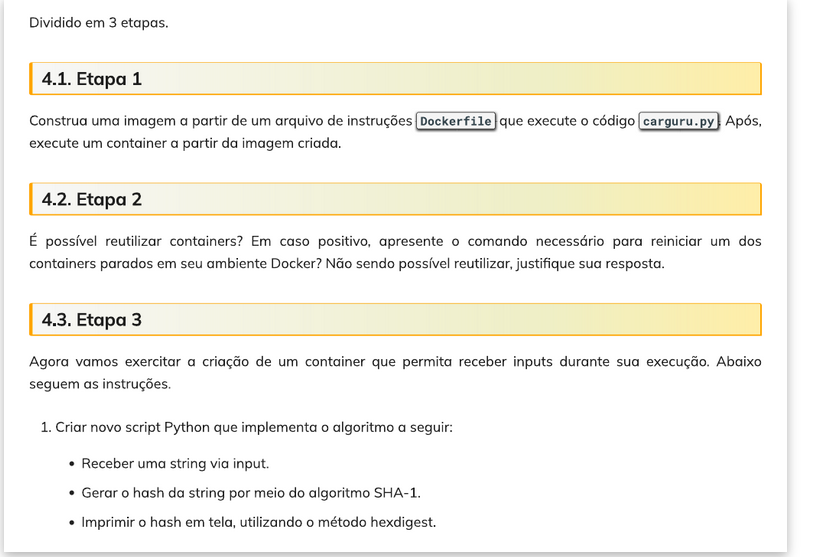
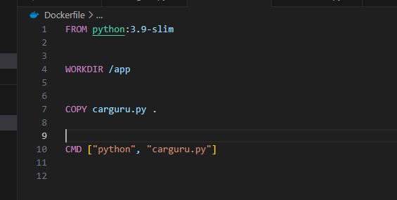
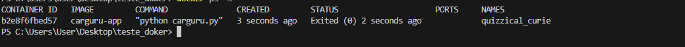
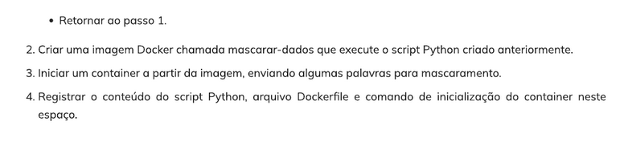
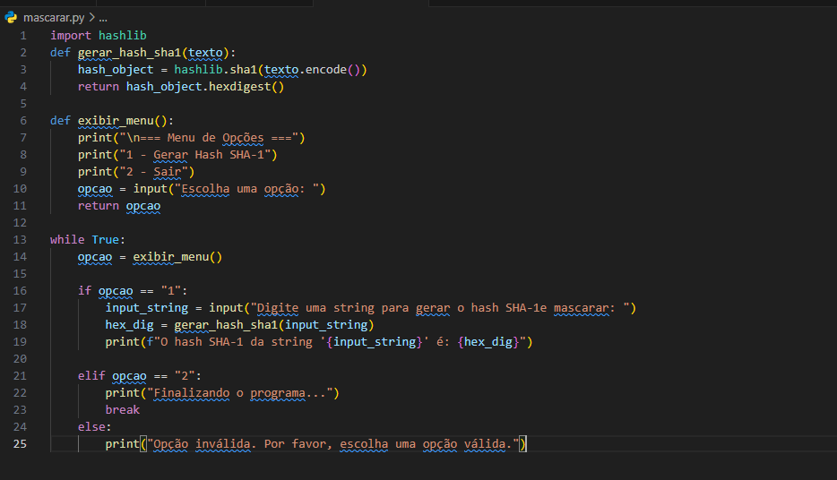
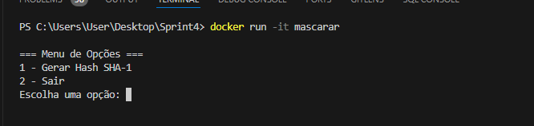
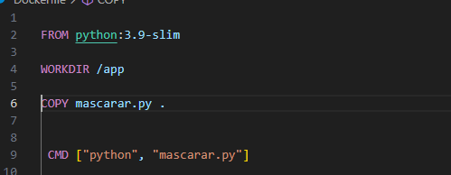
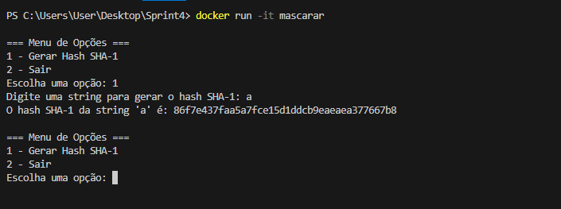

# Desafio da Sprint 

Vamos começar 

mas antes disso vamos fazer um lista de comandos importantes.

comandos usados para criar  
`docker build -t carguru-container .`
`docker build -t carguru-app .`
` docker build -t mascarar-dados .`
rodar 
`docker run carguru-app`
`docker run -it mascarar-dados`

comandos uteis
`clear`
`docker images`
`docker ps -a`
`docker stop `
`docker logs `
`docker rm $(docker ps -a -q)`
`docker rm `

Oque preciso fazer?

Baixar o arquivo CSV:  download do arquivo necessário para o projeto (carguru.py).

Criar um ambiente de trabalho utilizando Docker: Configurei um ambiente Docker para gerenciar a execução dos scripts.

Configurar o Dockerfile: Escrever um Dockerfile que defina as instruções para executar os scripts Python corretamente.

Entao vamos lá começar o desafio

Criação do Dockerfile:

O primeiro passo foi criar um Dockerfile para configurar e construir a imagem Docker que executaria os scripts Python.
Conteúdo inicial do Dockerfile:

eu Usei a versão python:3.9-slim mas fiz tambem usando 3.11-slim.

Da na mesma optei sempre de usar o -slim pois fica muito pesa no meu pc acaba travando tudo.

mostrando meu Dockerfile

Construção da Imagem com carguru.py:

No terminal, dentro do diretório onde estão os arquivos Dockerfile e carguru.py, o comando abaixo foi utilizado para construir a imagem:

`docker build -t carguru-container .`

Esse comando criará uma imagem chamada carguru-image com base no Dockerfile.

Execute o container criado a partir da imagem:

`docker run -it carguru-container`
ou apenas
`docker run  carguru-container`

beleza tudo certo meu codigo esta rodando e me retornando qual carro eu dirijo 

mas antes disso vale resaltar que eu usei o comando `docker rm $(docker ps -a -q)` para limpar tudo e deixar mais claro pra vc

Agora vamos responder a etapa 2

Sim, é possível reutilizar containers no Docker. Quando um container está parado (ou seja, foi interrompido, mas ainda existe), ele pode ser reiniciado com o comando certo.

Para reiniciar um container parado, eu vou utilizar o seguinte comando:

`docker start b2e8f6fbed57`

beleza confirmando que esta sendo reutilizado.

para parar é so usar

`docker stop b2e8f6fbed57`

optei por mudar o nome. so por curiosidade.

usei o comando `docker run -d --name meu_container carguru-app`

Script Python para a etapa 3:

Beleza vamos para etapa 3 que é criar um hash.

Primeiro eu fui pesquisar oq era um hash.

peguei a primeira biblioteca que apreceu do google e por sorte deu certo de primeira(depois confirmei com o monitor)
Para permitir a entrada de dados pelo usuário durante a execução do container, eu criei um novo script que receba um valor de entrada e execute o algoritmo SHA-1.

**Nota: eu não sabia oque era um hash mas pesquisando um pouco parece que esta certo(depois confimei com o monitor)**

`docker images`

para mostrar como que esta.

beleza falta mascarar os dados agora que é a ultima parte do desafio

criei um menu usando while true onde eu posso escolher sair ou continuar gerando hash. 

meu codigo

explicação do codigo:

Importação da Biblioteca Necessária:

A primeira etapa  foi importar a biblioteca hashlib, que é essencial para a geração de hashes. O hashlib permite a criação de funções hash, como SHA-1, que são usadas para converter textos em um formato único e criptografado.

Criação da Função de Geração de Hash:

Eu criei uma função que recebe uma string como entrada e a converte em um hash SHA-1. Para isso, a string é transformada em um formato de bytes e, em seguida, o hash é gerado. O resultado é retornado em uma string hexadecimal para facilitar a leitura e visualização.

Implementação do Menu Interativo:
O próximo passo foi implementar um menu interativo que oferece duas opções ao usuário:
Opção 1: Permite ao usuário fornecer uma string para gerar o hash SHA-1 correspondente.
Opção 2: Finaliza o programa.
Para isso, desenvolvi uma função exibir_menu que exibe as opções na tela e retorna a escolha do usuário.

Estrutura do Loop para Execução Contínua:
Após definir as funções principais, implementei um loop while para garantir que o menu fosse exibido repetidamente até que o usuário optasse por sair. Isso mantém o programa em execução, aguardando novas interações.

Decidi utilizar um único arquivo Dockerfile para ambos os scripts (carguru.py e mascarar.py) no meu projeto no VS Code. Apesar de saber que poderia ter criado arquivos Dockerfile separados para cada um dos scripts, optei por consolidar tudo em um único arquivo. Acredito que essa abordagem seja mais prática e simplifica o gerenciamento dos containers, mantendo o processo de build mais enxuto.

Ficou assim meu vscode

E ficando assim meu aquivo  Dockerfile 

Já aqui eu vou mostrar como ficou minha tela de menu

**Nota: no video eu pretendo mostras como ficou utilizando o menu q eu crie pois eu achei bem legal kkk, eu fiz um explicação bem breve no video**
