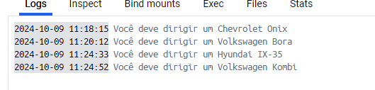

# Desafio da Sprint 

Vamos começar 

mas antes disso vamos fazer um lista de comandos importantes.

comandos usados para criar  
`docker build -t carguru-container .`
`docker build -t carguru-app .`
` docker build -t mascarar-dados .`
rodar 
`docker run carguru-app`
`docker run -it mascarar-dados`

romando uteis
`clear`
`docker images`
`docker ps -a`
`docker stop `
`docker logs `
`docker rm $(docker ps -a -q)`
`docker rm `

Baixar o arquivo CSV (carguru.py)

Criei um ambiente de trabalho usando Docker. 

Configuração do Dockerfile para Executar Scripts Python

Criação do Dockerfile:

O primeiro passo foi criar um Dockerfile para configurar e construir a imagem Docker que executaria os scripts Python.
Conteúdo inicial do Dockerfile:

eu Usei a versão python:3.9-slim mas fiz tambem usando 3.11-slim.

Construção da Imagem com carguru.py:

No terminal, dentro do diretório onde estão os arquivos Dockerfile e carguru.py, o comando abaixo foi utilizado para construir a imagem:

`docker build -t carguru-container .`

Esse comando criará uma imagem chamada carguru-image com base no Dockerfile.

Execute o container criado a partir da imagem:

`docker run -it carguru-container`
ou apenas
`docker run  carguru-container`

beleza tudo certo meu codigo esta rodando e me retornando qual carro eu dirijo 

mas antes disso vale resaltar que eu usei o comando `docker rm $(docker ps -a -q)` para limpar tudo e deixar mais claro pra vc

agora vamos responder a etapa 2

Sim, é possível reutilizar containers no Docker. Quando um container está parado (ou seja, foi interrompido, mas ainda existe), ele pode ser reiniciado com o comando certo.

Para reiniciar um container parado, eu vou utilizar o seguinte comando:

`docker start b2e8f6fbed57`

beleza confirmando que esta sendo reutilizado.

para parar é so usar

`docker stop b2e8f6fbed57`

optei por mudar o nome.

usei o comando `docker run -d --name meu_container carguru-app`

Script Python para a etapa 3:

Beleza vamos para etapa 3 que é crar um hash.

Primeiro eu fui pesquisar oq era um hash.

peguei a primeira biblioteca que apreceu do google e por sorte deu certo de primeira(depois confirmei com o monitor)
Para permitir a entrada de dados pelo usuário durante a execução do container, eu criei um novo script que receba um valor de entrada e execute o algoritmo SHA-1.

**Nota: eu não sabia oque era um hash mas pesquisando um pouco parece que esta certo(depois confimei com o monitor)**

`docker images`

para mostrar como que esta.

beleza falta mascarar os dados agora que é a ultima parte do desafio

criei um menu usando while true onde eu posso escolher sair ou continuar gerando hash. 

ficando assim o meu VScode, eu sei que eu pdoeria ter usado outro arquivo Dockerfile um para o carguru e outro para o mascarar, mas optei por usar apenas 1 acredito que esteja certo assim mesmo

ficando assim eu aquivo  Dockerfile 

beleza deu tudo certo.
mostrando a tela de menu

**Nota: no video eu pretendo mostras como ficou utilizando o menu q eu crie pois eu achei bem legal kkk, eu fiz um explicação bem breve no video**
