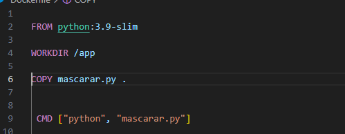

Durante a Sprint 4, aprendi como criar e configurar Dockerfiles, construir e gerenciar imagens e containers, e explorar o ambiente Docker. A possibilidade de controlar a execução dos scripts Python diretamente dentro dos containers, definir CMD, além de automatizar a construção e execução de diferentes ambientes, foram pontos que ampliaram minha visão sobre o uso de containers para desenvolvimento e deploy de aplicações.

Foi interessante entender a diferença entre imagens e containers, aprender a visualizar logs de containers sem necessidade de interagir diretamente com eles e como otimizar o uso do Docker com loops e controle de execução dos scripts.

Além disso, foi divertido aprender como construir diferentes ambientes para scripts distintos, como mascarar-dados e hash_string, o que me ajudou a perceber como Docker pode ser usado para gerenciar múltiplas aplicações com facilidade e consistência.

# Certificados

 [ Certificados](../Sprint_4/certificados/img/AWS%20Partner%20Credenciamento.pdf)

# Exercícios

1. [Respostas Exercícios](../Sprint_4/exercicios/ex1.py)

2. [Respostas Exercícios](../Sprint_4/exercicios/ex2.py)

3. [Respostas Exercícios](../Sprint_4/exercicios/ex3.py)

4. [Respostas Exercícios](../Sprint_4/exercicios/ex4.py)

5. [Respostas Exercícios](../Sprint_4/exercicios/ex5.py)

6. [Respostas Exercícios](../Sprint_4/exercicios/ex6.py)

7. [Respostas Exercícios](../Sprint_4/exercicios/ex7.py)

# Desafios

[Desafio 4](../Sprint_4/Desafio/README.MD)

# Evidências 

Aqui vou colocar a prova q Exercícios foram feitos na plataforma 

 [Ex](../Sprint_4/evidencias/ex/image%20dos%20ex.png)

acho legal comentar q eu gostei do exercícios em si, mas por ser na plataforma acaba ficando bem descantante, particularmente o 5 e 1 foram bem chatos de se fazer mas deu tudo certo no final.

<h1>Desafio com Docker e Python - Passo a Passo</h1>
Neste desafio, vou explicar como foi o processo de desenvolvimento para criar um container Docker que executa um script Python e interage com o usuário para mascarar palavras e criar um hash. 
1. Objetivo
O desafio consiste em combinar conhecimentos de Docker com a linguagem Python para construir containers que executam scripts e permitem a interação com o usuário. 
A ideia principal é criar containers reutilizáveis e demonstrar o uso de imagens Docker e suas funcionalidades.

2. Entregáveis
O primeiro passo foi entender os requisitos do desafio e os entregáveis esperados:

Criar um Dockerfile para construir a imagem que executa o script carguru.py.
Registrar todos os comandos utilizados no processo de execução e reinicialização dos containers.
Responder às perguntas relacionadas à reutilização de containers no Docker.
Capturar prints de tela para evidenciar a execução do container e o funcionamento correto do script.
3. Preparação
Antes de começar, precisei garantir que o ambiente estava configurado corretamente:

Fiz o download do script carguru.py e verifiquei se a solução Docker estava instalada corretamente no meu ambiente de desenvolvimento.

4. Etapas
O desafio foi dividido em três etapas principais:

4.1. Etapa 1: Construção da Imagem Docker
Primeiro, criei um arquivo chamado Dockerfile no mesmo diretório onde estava o script carguru.py.
No Dockerfile, defini a imagem base e configurei a cópia do script para dentro do container.
Após configurar o Dockerfile, construi a imagem com o comando docker build, atribuindo um nome específico para facilitar o gerenciamento.

Em seguida, executei um container a partir da imagem criada para garantir que tudo estava funcionando como esperado.
4.2. Etapa 2: Reutilização de Containers
Nesta etapa, verifiquei se era possível reutilizar um container parado. respondia no desafio mas de forma simples a resposta é SIM

Executei o comando docker ps -a para listar todos os containers existentes, inclusive os que estavam parados.
Comprovei que um container pode ser reiniciado com o comando docker start <nome_do_container>.
Justifiquei que um container removido com docker rm não pode ser reutilizado, sendo necessário recriar a partir da imagem original.

4.3. Etapa 3: Criação de um Container Interativo
Nesta etapa, desenvolvi um novo script Python para hash, similar ao script carguru.py, mas com funcionalidades adicionais:
 gera o hash da string com o algoritmo SHA-1 e imprime o resultado no console.
No Dockerfile, atualizei o comando CMD para permitir que o container execute o script e aceite inputs do usuário.
Testei o container com o comando docker run -it, garantindo que ele estivesse preparado para receber entradas durante sua execução.

Agora criação do mascarar_dados script que recebe uma string via input,
Criei uma nova imagem chamada mascarar-dados e executei o container para mascarar algumas palavras e registrar as evidências do funcionamento correto.
Testei o container com o comando docker run -it, garantindo que ele estivesse preparado para receber entradas durante sua execução.

5. Conclusão
Por fim, compilei todos os prints de tela, o conteúdo do Dockerfile, o script Python e os comandos de inicialização do container para compor o material de entrega.

# Feedback

Feedback da Sprint:
Acredito que essa tenha sido a sprint mais fácil até agora. Consegui completar as atividades em menos de 2 horas, mesmo sem ter visto os cursos Docker antes. Foi uma ótima experiência aprender como criar Dockerfiles, construir e gerenciar imagens e containers, além de utilizar comandos como docker build, docker run e docker logs. Gostei bastante de como a documentação do Docker é clara e objetiva, facilitando a busca por soluções.
Adorei trabalhar com Docker. Tenho interesse em explorar mais a área de Machine Learning e Deep Learning com frameworks como TensorFlow e PyTorch. A ideia de poder treinar e fazer a inferência de modelos dentro de containers, mantendo todo o ambiente controlado e replicável, é algo que quero explorar mais a fundo. Tenho muita curiosidade nessa área e espero ter mais oportunidades para aplicar e adquirir experiência prática."