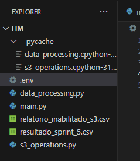

Durante a Sprint 5, aprendi bastante, especialmente sobre AWS, uma área que me interessou muito. O ponto mais positivo foi a introdução prática aos serviços da AWS, que me permitiu aprender de forma simples e envolvente. Outro destaque foi a oportunidade de aprender a fazer a conexão com o S3 por meio do desafio proposto, o que foi uma experiência valiosa.

De forma geral, considerei a sprint fácil e, como terminei as atividades com bastante tempo livre, acabei explorando mais do que o necessário. Aproveitei para pesquisar possíveis bônus e aprimorar ainda mais meus conhecimentos.
e fiz um curso sobre AWS chamado "Master AWS with Python and Bot03" achei bem legal ele
Atualmente, já concluí os  cursos e estou gostando bastante da trilha. Estou ansioso pela próxima sprint e pelos novos aprendizados que ela trará 😊.

# Certificados

 [ Certificados](../Sprint_5/certificados/img/AWS%20Skill%20Builder%20Course%20Completion%20Certificate.pdf)

  [ Link publico](https://www.credly.com/badges/8f42540e-33ce-4e93-b419-5f825c0b4111/public_url)

  
 [ Certificados](../Sprint_5/certificados/img/aws-cloud-quest-cloud-practitioner.png)

# Exercícios

1. [Resposta Ex1](../Sprint_5/exercicios/Ex.py)

Bom exercicio eu gostei de fazer de certo modo aqui eu vou documentar um pouco melhor sobre

# Desafios

[Desafio 1](../Sprint_5/Desafio/README.md)

# Evidências

Vou documentar aqui a lógica por trás das minhas ideas, usando imagens. A ideia é mostrar de forma clara e direta o que eu fiz e por que tomei certas decisões, facilitando o entendimento do processo.

Procurei um arquivo CSV ou JSON no portal de dados públicos do Governo Brasileiro e verifiquei se ele está dentro do limite permitido no S3.
link do arquivo:

https://dados.gov.br/dados/conjuntos-dados/inabilitados-para-funcao-publica-segundo-tcu

Vou explicar um pouco sobre o meu diretório:

__pycache__:

No meu projeto, o diretório __pycache__ é onde o Python armazena os arquivos compilados (.pyc) dos módulos que utilizo. No meu caso, ele contém os arquivos compilados dos scripts data_processing e s3_operations.

Arquivos .py:
data_processing.py: Este é o script onde defini as funções para processar o DataFrame, incluindo tarefas como limpar, manipular e analisar dados.
main.py: Esse é o arquivo principal do meu projeto, onde coordeno as operações entre os diferentes módulos e scripts que criei.
s3_operations.py: Esse script contém funções específicas para operações no S3, como download e upload de arquivos usando a biblioteca boto3.
Arquivos .csv:
relatorio_inabilitado_s3.csv: Este é o arquivo que baixei do S3 e que utilizo para manipulações e análises no meu projeto.
resultado_sprint_5.csv: Este é o arquivo gerado após o processamento realizado pelo meu script, onde aplico transformações e agregações com o Pandas.
.env:
O arquivo .env é onde armazeno minhas variáveis de ambiente, como credenciais e configurações sensíveis que não quero expor diretamente no código. Utilizo a biblioteca dotenv para carregar essas variáveis de maneira segura.

Eu decidi usar o arquivo .env porque não gostava de ver as senhas aparecendo diretamente no código. Por isso, pesquisei uma maneira de escondê-las e proteger essas informações, e encontrei essa solução.

Além disso, importei o módulo logging após fazer uma pesquisa sobre ele e achei interessante adicioná-lo ao meu código como um bônus. Ele é uma forma eficiente de registrar eventos e informações úteis, o que ajuda a monitorar o comportamento do programa e a identificar problemas de maneira mais profissional.
Vamos fala do desafio. 

# Documentação do Desafio AWS S3

1. Objetivo
Meu objetivo com esse desafio foi praticar os conhecimentos adquiridos sobre AWS, especificamente com o serviço S3. A ideia era manipular arquivos diretamente no S3 usando scripts em Python com a biblioteca boto3 e pandas.

2. Entregáveis
Para concluir o desafio, preparei os seguintes entregáveis:

Um arquivo Markdown com evidências (prints) e documentação explicando cada etapa executada.
Arquivos .py contendo os códigos para download, processamento, e upload dos arquivos no S3.
Um arquivo CSV com os resultados processados e salvos.
3. Preparação
Primeiramente, certifiquei-me de que minha conta da Compass AWS estava configurada e que eu tinha as permissões necessárias para criar e manipular buckets e arquivos no S3.

4. Desafio
O desafio consistiu em trabalhar com dados de um CSV baixado do portal de dados públicos do Governo Brasileiro. Escolhi o arquivo relatorio_inabilitado.csv e segui os passos abaixo:

4.1 AWS S3
1. Escolha do arquivo
Escolhi o arquivo relatorio_inabilitado.csv porque ele se encaixava nos critérios exigidos pelo desafio. Garanti que ele era único na turma.

2. Análise dos dados
Analisei o conteúdo do arquivo localmente usando um editor de texto para conhecer os dados e planejar as manipulações necessárias.

3. Carregamento no S3
Utilizei um script Python para carregar o arquivo relatorio_inabilitado_s3.csv para um bucket no S3, utilizando a biblioteca boto3. Fiz a configuração das credenciais no arquivo .env para manter as informações sensíveis fora do código.

4. Manipulação do DataFrame
Em outro script, carreguei o arquivo diretamente do S3 e criei um DataFrame usando pandas para aplicar as seguintes manipulações:

Usei uma cláusula que filtra dados com dois operadores lógicos: selecionei registros onde a "Data Final" era posterior a 2025 e o "Trânsito em Julgado" era anterior a 2023.
Apliquei funções de agregação, como calcular a diferença de anos entre duas colunas de data.
Utilizei uma função condicional para determinar se um registro estava "Válido" ou "Expirado" com base na data atual.
Fiz conversões de colunas para strings formatadas, incluindo a limpeza de CPFs e transformação de nomes para maiúsculas.
5. Salvando e enviando o arquivo
Depois de processar o DataFrame, salvei o resultado em um arquivo CSV chamado resultado_sprint_5.csv e o enviei de volta para o bucket no S3.

6. Documentação no Git
Documentei todo o processo em um arquivo Markdown, incluindo prints das execuções e os códigos utilizados. Armazenei os arquivos .csv e .py, juntamente com as evidências, no meu repositório Git.

# Feedback

De modo geral, durante essa sprint, percebi que acabei procrastinando bastante, assim como na sprint anterior. Achei as duas muito fáceis, o que me fez finalizar todas as atividades com antecedência, levando-me a enrolar um pouco. No entanto, gostei muito de aprender sobre AWS; até o momento, é a área pela qual desenvolvi mais interesse em todas as sprints.

Minha avaliação para essa sprint é 6/10. A experiência com o jogo de AWS foi ótima, achei-o fácil e muito intuitivo, e espero que haja mais jogos como esse no futuro. Particularmente, gostei bastante de criar a conexão com a AWS e espero continuar explorando essa área.