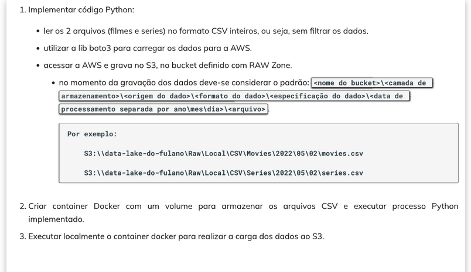

# Desafio da Sprint 

Vamos começar 

# Desafio da Sprint 

1. Objetivo
O propósito deste desafio é praticar e consolidar o que foi aprendido até agora sobre diversas tecnologias e ferramentas, integrando-as em um projeto robusto. A tarefa consiste na construção de um Data Lake que organize, armazene e possibilite o consumo de dados de filmes e séries, com foco em comédia e animação. Esse Data Lake possui uma estrutura de armazenamento em camadas, incluindo a ingestão de dados em um formato bruto, processamento dos dados com Apache Spark, e consumo final através de dashboards analíticos.

Este é um projeto de ponta a ponta, no qual aplico conhecimentos de Python, Docker, AWS, manipulação de dados e visualização, além de explorar uma API para enriquecer as análises. Em resumo, o desafio oferece uma excelente oportunidade de experimentar como as diferentes tecnologias se complementam na construção de um pipeline completo de dados.

2. Implementação da Ingestão Batch (Entrega 1)

A etapa de desenvolvimento começou com a criação de um script Python dedicado para carregar os dados dos arquivos CSV para o bucket S3. Para isso, utilizei a biblioteca boto3, que é a SDK oficial da AWS para Python. Este foi o passo a passo:

Configuração de Credenciais: Configurei as credenciais da AWS utilizando um arquivo .env, que armazena as variáveis de ambiente com segurança. Essa abordagem é importante para evitar expor dados sensíveis no código.

s3 = boto3.client(
    's3',
    aws_access_key_id=os.getenv('AWS_ACCESS_KEY_ID'),
    aws_secret_access_key=os.getenv('AWS_SECRET_ACCESS_KEY'),
    aws_session_token=os.getenv('AWS_SESSION_TOKEN')
)

Leitura e Preparação dos Dados: O script lê dois arquivos CSV (movies.csv e series.csv), cada um contendo informações sobre filmes e séries, respectivamente. Como o objetivo nesta fase é armazenar os dados brutos, não realizo nenhum tipo de filtro ou transformação. As funções que escrevi garantem que os dados são carregados e preparados no formato esperado para o upload.

Função de Upload para o S3: A função upload_file_s3 é responsável por enviar os arquivos para o bucket S3. Ela verifica a existência dos arquivos locais e, em caso de sucesso, realiza o upload, registrando logs de sucesso ou falha para cada arquivo. O logging detalhado ajuda no monitoramento e no diagnóstico de possíveis problemas.

Definição de Estrutura de Pastas no S3: Seguindo o padrão estabelecido, o script cria um caminho de diretório com ano/mês/dia no S3, organizando os arquivos de forma cronológica. Essa estrutura é particularmente útil para cenários de processamento batch, permitindo fácil recuperação de dados históricos.

3. Configuração do Docker
Para facilitar a execução do código, criei um container Docker que armazena os arquivos CSV e executa o processo de upload para o S3. Este container contém todos os requisitos necessários, incluindo a instalação do boto3, e permite que o código seja executado de forma isolada e controlada. Ao configurar o Docker, garanti que o ambiente fosse configurado corretamente para a interação com o AWS S3, tornando o processo de ingestão mais prático e seguro.

criei um requirements.txt 

4. Execução do Processo de Carga para o S3

Para garantir a portabilidade e facilidade de execução, configurei um container Docker que armazena os arquivos CSV e executa o script Python para envio dos dados ao S3. A escolha pelo Docker se deu para assegurar que o código funcionaria de maneira consistente em qualquer ambiente, sem depender das configurações da máquina local.

Execução do Container: Com o ambiente configurado, o processo de ingestão é simples: basta iniciar o container e o script Python será executado automaticamente, realizando o upload dos dados para o S3. Esse setup torna a ingestão dos dados eficiente e reduz a complexidade de configuração, além de fornecer isolamento entre o ambiente de desenvolvimento e a execução em produção.

Para tornar o processo de ingestão mais transparente, configurei logs detalhados que registram cada etapa do upload, incluindo:

Confirmação de leitura dos arquivos CSV.
Confirmação de envio dos arquivos ao S3, com logs de sucesso ou falha.
Registro de exceções caso ocorra algum erro durante o upload.
Os logs são essenciais para monitorar o processo e identificar rapidamente qualquer problema. Além disso, incluí verificações de integridade no código para garantir que os arquivos estão no formato correto e prontos para ingestão.

crei a imagem.

docker build -t ingestao-filmes-series .

docker build --no-cache -t ingestao-filmes-series .

docker run --env-file .env ingestao-filmes-series

para fazer meu s3 ir eu uso o comando

docker run -it ingestao-filmes-series /bin/bash

ou mudo no meu docker

Até agora, concluí a primeira entrega, que consiste na ingestão de dados brutos no bucket S3. O Data Lake já possui uma estrutura inicial, com os arquivos CSV armazenados na camada RAW, prontos para a próxima fase de transformação e catalogação. A estrutura organizada do S3 permite fácil rastreamento e versionamento dos dados, essencial para as etapas futuras.

Beleza fiz algumas coisa para entender melhor o csv.

teste.py

Este arquivo é um script de testes para verificar os dados de filmes e séries antes de aplicar análises mais complexas. Ele oferece uma visão geral dos gêneros únicos presentes nos arquivos e exibe os primeiros registros.

Funcionalidades principais:
Carregamento de dados: Lê movies.csv e series.csv, assumindo que cada arquivo usa um delimitador “|”.
Exibição inicial dos dados: Imprime as colunas e as primeiras linhas dos arquivos para verificação rápida do conteúdo.
Extração de gêneros únicos: Extrai todos os gêneros listados nos arquivos de filmes e séries, permitindo uma visão abrangente das categorias de produção presentes nos dados.
Listagem de gêneros individuais: Mostra todos os gêneros distintos identificados nos dados, útil para entender a diversidade de categorias​(teste).

As tabelas

generos 

utils.py

Este é um arquivo utilitário que oferece funções de apoio para carregamento de dados e geração de gráficos. Ele centraliza operações comuns, reduzindo a repetição de código em outros scripts.

Funcionalidades principais:
load_data: Carrega arquivos CSV e substitui valores específicos (\N) por NaN, facilitando a manipulação de dados ausentes.
plot_top_ratings: Gera um gráfico de barras horizontal para as 10 produções com nota máxima. Esse gráfico mostra o ano de lançamento e destaca as produções com nota 10, permitindo uma análise visual rápida das produções mais bem avaliadas.
Essas funções de visualização são úteis para transformar dados em gráficos significativos que ajudam na análise de padrões e tendências nos dados de filmes e séries​(utils).

notas.py
O arquivo notas.py fornece uma análise das notas para filmes e séries, com foco em produções de comédia e animação. Ele calcula quantos filmes e séries possuem a nota máxima e também a média de notas para esses gêneros.

Funcionalidades principais:
Contagem de produções com nota máxima: Conta o total de filmes e séries que receberam nota 10.
Contagem por gênero: Especifica quantos desses filmes e séries pertencem aos gêneros "Comedy" e "Animation".
Cálculo de média: Calcula a média de notas para filmes e séries de comédia e animação, facilitando a compreensão do desempenho geral dessas produções nos respectivos gêneros.
Exibição de resultados: Imprime os totais e médias calculados para uma análise quantitativa rápida​(notas).

comediaEanimacaoNota.py
Este arquivo é responsável por analisar e filtrar filmes e séries do gênero "Animation" e "Comedy" com nota máxima (10). Ele utiliza funções de carregamento de dados e geração de gráficos do arquivo utils.py para exibir informações sobre as produções mais bem avaliadas desses gêneros.

Funcionalidades principais:
Carregamento de dados: Usa load_data para carregar dois arquivos CSV (movies.csv e series.csv), que contêm informações sobre filmes e séries.
Filtros por gênero e nota máxima: Filtra produções dos gêneros "Animation" e "Comedy" que têm nota 10.
Exibição dos Top 10: Imprime os 10 melhores filmes e séries de animação e comédia com nota máxima.
Geração de gráficos: Usa plot_top_genre_ratings para criar gráficos focados na nota média dessas produções, mostrando os anos de lançamento e a popularidade dentro dos gêneros selecionados​(comediaEanimacaoNota).

# Tipo de analise 

Para minha análise, pensei em começar com analytics descritiva Análise de Filmes e Séries de Comédia/Animação

Objetivo: Analisar a evolução e as tendências de filmes e séries de Comédia/Animação ao longo dos anos. O projeto busca entender as avaliações desse gênero, destacando fatores que possam influenciar a popularidade e qualidade percebida, com insights que auxiliem em uma visão preditiva e diagnóstica.

Principais Análises:

Média de Notas por Ano:

Análise: Calcular a média de notas para filmes e séries de Comédia/Animação ao longo dos anos, identificando tendências de aumento ou queda na popularidade.
Visualização: Gráfico de linha mostrando a média de notas por ano, facilitando a visualização das mudanças de avaliação ao longo do tempo.
Objetivo: Responder "como as avaliações de Comédia/Animação evoluíram ao longo dos anos?".

Análise Preditiva (Simples):

Análise: Aplicar uma previsão simples de notas futuras para o gênero Comédia/Animação, utilizando técnicas básicas de Machine Learning.

Métricas: Mean Squared Error (MSE) e Mean Absolute Error (MAE) serão usados para medir a precisão do modelo.

Visualização: Exibir as métricas em cards no dashboard e usar um scatter plot para visualizar a relação entre previsões e valores reais.

Objetivo: Identificar possíveis tendências futuras e avaliar a precisão do modelo preditivo.

Análise Diagnóstica:
Análise: Utilizar MSE e MAE para verificar a presença de erros significativos ou outliers que possam estar impactando a precisão das previsões.

Visualização: Gráfico de distribuição dos erros residuais, mostrando onde o modelo pode estar errando mais.

Objetivo: Diagnosticar problemas e entender o comportamento do modelo para prever notas de Comédia/Animação.

Evolução Temporal de Popularidade e Qualidade:

Análise: Examinar como a produção e popularidade de Comédia/Animação mudaram ao longo dos anos, com uma análise da quantidade de lançamentos e avaliações.

Visualização: Gráfico de linha para a quantidade de lançamentos por ano e a evolução das notas médias.
Objetivo: Oferecer uma visão ampla da presença e aceitação do gênero ao longo do tempo.

**Nota: Ainda não tenho certeza sobre isso preciso ter api para ter uma ideia melhor sobre, mas gostaria muito de poder usar ML no meu desafio, tenho bastante interesse na área**

Bônus: eu ja fiz um modelo de I.A

modelo com MSE e MAE

