Vamos lá, vou começar comentando sobre as dificuldades que enfrentei.
 Primeiramente, o maior desafio foi entender como integrar a API do TMDB com o AWS Lambda, especialmente configurando as variáveis de ambiente e garantindo que as dependências estivessem corretamente instaladas em uma camada (layer). Além disso, lidar com o limite de requisições da API exigiu planejar chamadas em pequenos lotes para evitar bloqueios (Oque foi mudado depois de conversar com a monitoria).
 Outra dificuldade foi Entender o Lambda. Apesar disso, acredito não ter tido dificuldades a respeito gostei bastante de usar lambda porem ainda não me sinto confortavel. 

Vamos começar.

Vou explicar minha ideia por tras do arquivos que eu estava procurando no tmdb.

Minha ideia por trás dos arquivos JSON que busque no TMDB está diretamente relacionada ao meu objetivo de analisar filmes e séries do gênero Comédia/Animação entre os anos de 2000 e 2020. Nesses arquivos, procurei informações essenciais como:

Título do filme ou série para identificar as produções relevantes.

Data de lançamento para organizar a evolução temporal e observar como o gênero mudou ao longo dos anos.
Nota média (vote_average), que é a métrica principal para avaliar a qualidade percebida.
Número de votos (vote_count), usado para analisar a representatividade das avaliações.
Popularidade, para compreender o impacto cultural e comercial das produções.
Esses dados são fundamentais para as análises que planejo realizar, como a média de notas por ano, a evolução da popularidade do gênero e insights preditivos sobre futuras tendências. Ao limitar os anos de 2000 a 2020, foquei em evitar puxar um volume excessivo de informações, concentrando-me no período que considero mais representativo para minha análise.

Esses arquivos JSON foram gerados para que eu pudesse fazer visualizações e conclusões relevantes sobre o impacto do gênero ao longo dos anos.

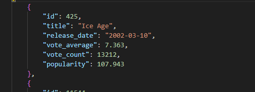

1. Configuração do Ambiente

Antes de iniciar o desenvolvimento, certifiquei-me de configurar corretamente o ambiente. Para isso:

Instalei as bibliotecas necessárias listadas no arquivo requirements.txt com o comando:

`pip install -r requirements.txt`

Criei um arquivo .env para armazenar as variáveis sensíveis, como AWS_ACCESS_KEY_ID, AWS_SECRET_ACCESS_KEY, API_KEY, e o nome do bucket no S3. Este arquivo foi essencial para garantir a segurança das credenciais.

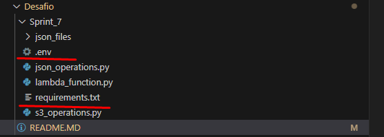

2. Desenvolvimento Local Inicial
Eu optei por trabalhar localmente antes de testar o código diretamente no AWS Lambda, para facilitar o debug e ajustar as funções. Aqui está o que fiz:

O objetivo desse código foi coletar informações de filmes de Comédia e Animação para análise. Para isso, utilizei a API do TMDB e implementei um processo automatizado para buscar e salvar os dados em arquivos JSON organizados. Aqui está como tudo funciona:

Configuração Inicial
Primeiro, configurei as variáveis de ambiente utilizando o dotenv para carregar a chave da API TMDB. Depois, implementei logs para acompanhar o progresso e possíveis erros. Defini também parâmetros importantes, como:

IDs de Gênero: Usei os IDs de Comédia (35) e Animação (16).
Anos de Análise: Decidi trabalhar com o intervalo de 2000 a 2020.
Diretório Local: Configurei uma pasta chamada json_files para armazenar os arquivos JSON gerados.

Funções Principais
Implementei duas funções principais para estruturar o código:

fetch_movies_by_year_and_genre:
Essa função busca filmes por ano e gênero, utilizando a API TMDB. Ela retorna uma lista paginada de filmes ordenada pela popularidade.

fetch_movie_details:
Para cada filme, optei por buscar informações adicionais como título, data de lançamento, média de votos, número de votos e popularidade. Esses dados são estruturados para facilitar a análise posterior.

achei legal colocar 

Nomes de Arquivos: Cada arquivo segue o padrão ano_comedy_animation_movies_part_X.json, facilitando a identificação e organização.

Tamanho Total: Para monitorar a quantidade de dados coletados, calculei e registrei o tamanho total dos arquivos gerados.

Para ter uma ideia melhor de organização e de espaço.

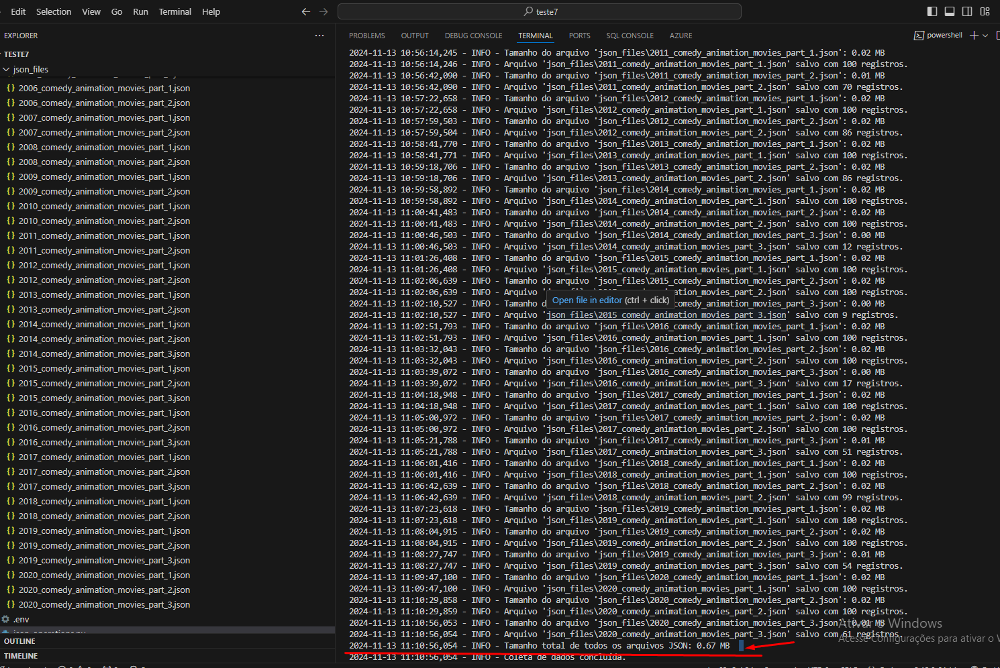

(**Nota: eu abandonei a ideia de dividir os json, apos conversa com a monitoria, porem  aqui no vscode eles continuam, mas no lambda e no s3 NÃO**)

Upload dos Arquivos para o S3:

No script s3_operations.py, implementei uma função para fazer upload de arquivos JSON para o bucket S3.
Testei o upload localmente, garantindo que os arquivos estavam sendo salvos no formato correto, com a estrutura de pastas no S3, como:

s3://data-lake-do-thalles-lima/Raw/TMDB/JSON/2024/11/22/

Implementei três funções principais:

upload_file_s3:
Essa função realiza o upload de um arquivo específico para o bucket. Verifico se o arquivo existe localmente antes de tentar enviá-lo, para evitar erros. Registrei mensagens de sucesso ou erro para cada tentativa, o que me ajuda a monitorar o processo.

generate_file_keys:
Criei essa função para gerar automaticamente a chave (caminho) de cada arquivo no S3. O formato que escolhi segue uma estrutura organizada por data e ano, como:

Raw/TMDB/JSON/YYYY/MM/DD/year_file_name

upload_all_files_in_directory:
Essa função percorre todos os arquivos .json dentro de um diretório local e usa as outras funções para gerar as chaves S3 e fazer o upload. Aqui, extraí o ano do nome do arquivo, o que foi útil para organizar os dados.

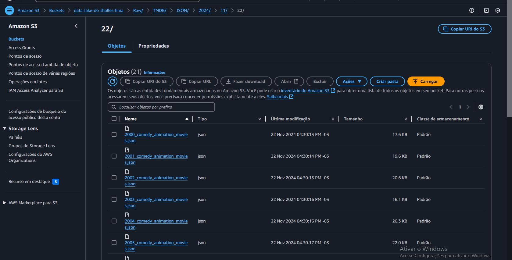

3. Configuração do AWS Lambda

em vez de usar Docker eu optei por outro meios para fazer de uma forma diferente 

utilizei um método mais direto para empacotar meu código e dependências:

Criei um ambiente virtual local com as bibliotecas necessárias:

Depois, copiei os arquivos lambda_function.py;

Compactei tudo em um único arquivo ZIP utilizando o PowerShell:

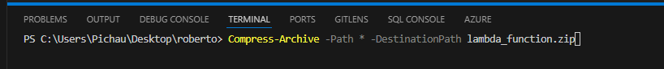

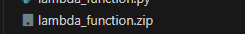

no Lambda criei uma camada nova chamada teste

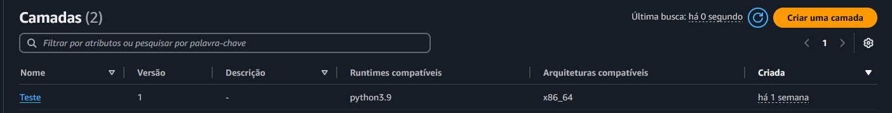

e com ela eu criei uma Função e add a Layers "Teste"

Fiz o upload do arquivo ZIP diretamente no console do AWS Lambda.

Em vez de fazer por s3.

optei por essa escolha pois eu não queria que meu s3 ficasse bagunçado, e futuramente acabe me atrapalhando. 

Colocando meu zip no meu Lambda ficou assim:

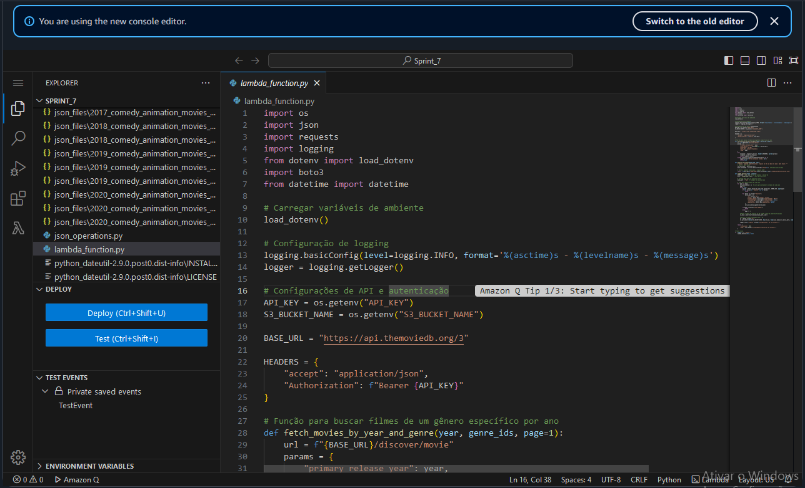

Optei pelo uso do PowerShell para empacotar o código facilitou o processo. consegui criar um pacote funcional e cumprir todos os requisitos do desafio.

Apesar de eu saber usar Docker eu quis tentar novas alternativas

4. Configuração do AWS Lambda

Desenvolvi esse código para ser executado no AWS Lambda e automatizar a coleta de dados de filmes do gênero Comédia e Animação. O objetivo era buscar informações diretamente da API do TMDB e enviá-las para um bucket no S3, organizadas por ano e data. Aqui está como tudo funciona:

Configuração Inicial
Primeiramente, configurei as variáveis de ambiente usando a biblioteca dotenv para carregar informações sensíveis, como:

API_KEY para acessar a API do TMDB.
S3_BUCKET_NAME, o nome do bucket no S3 onde os dados seriam armazenados.
Implementei logs para acompanhar o progresso e diagnosticar possíveis erros durante a execução.

Funções Principais
fetch_movies_by_year_and_genre: Essa função é responsável por buscar filmes da API TMDB, filtrados por ano e gênero. Ela retorna uma lista paginada de resultados, ordenados por popularidade.

generate_file_keys: Aqui, gerei as chaves para salvar os arquivos no S3. Cada chave segue o formato:

lambda_handler: É a função principal, executada pelo AWS Lambda. Ela:

Itera pelos anos de 2000 a 2020, buscando filmes do gênero Comédia/Animação.

Coleta informações como título, data de lançamento, média de votos, número de votos e popularidade.

Gera um arquivo JSON para cada ano e o salva diretamente no bucket S3 usando boto3.

No console da AWS, configurei a função Lambda:

Criei uma nova função e fiz o upload do arquivo ZIP.

Configurei uma role de IAM com permissões para acessar o bucket S3.

Ajustei as variáveis de ambiente no Lambda para evitar incluir o .env no pacote. (mas o .env continua la de demostração)

5. Testes no AWS Lambda
Realizei os testes diretamente no console do Lambda:

Validei os uploads no S3 e confirmei que os arquivos JSON estavam no formato correto.

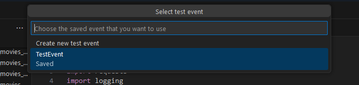

Confirmação do JSON 

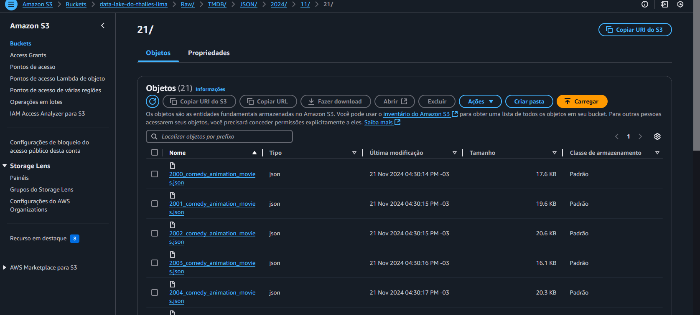

Após validar a execução, configurei o Amazon EventBridge para agendar execuções regulares da função Lambda.

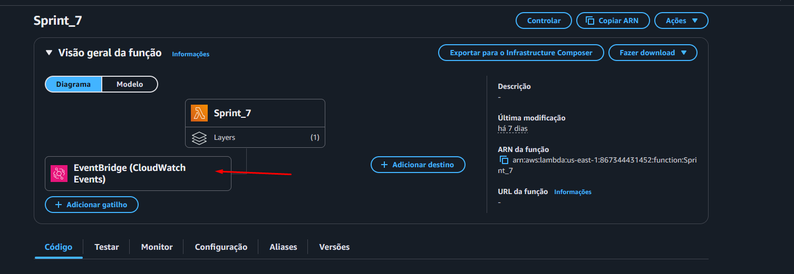

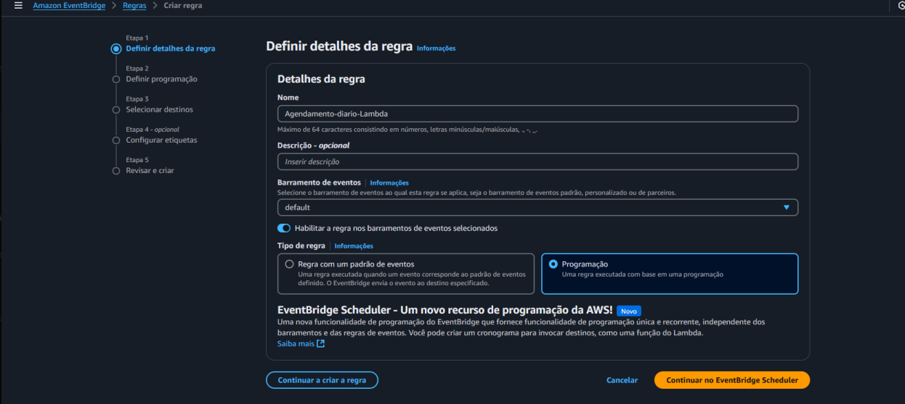

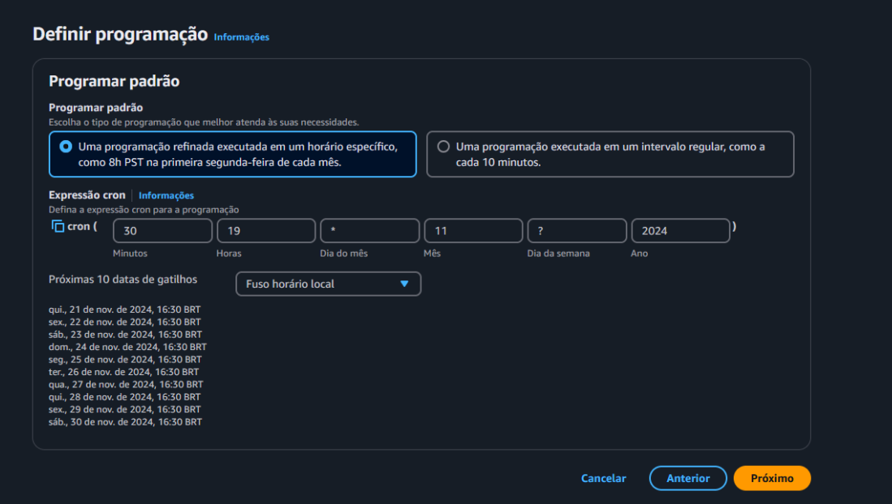

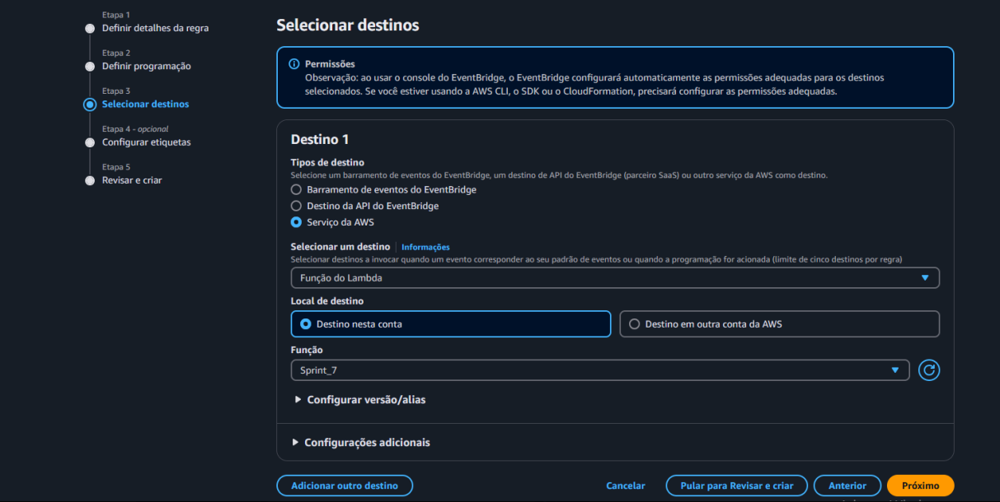

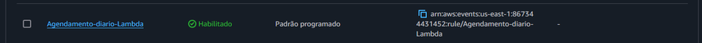

Ou seja todos os dias as 16:30 ate o final do mes eu vou gerar json meu s3

# Tipo de analise 

Mudei o meu tipo de analise, inicialmente, planejei uma análise ampla de filmes e séries de Comédia/Animação, utilizando analytics descritiva, preditiva e diagnóstica para explorar tendências e previsões de notas. No entanto, ajustei o escopo para focar no período de 2000 a 2020, otimizando a coleta de dados e aproveitando informações já disponíveis no meu arquivo CSV e complementar1 informações usando os meus Json. Mantive como foco a evolução das notas médias, a popularidade e qualidade ao longo dos anos, utilizando gráficos e métricas como MSE e MAE para complementar a análise. 