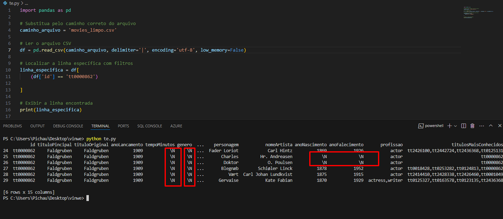
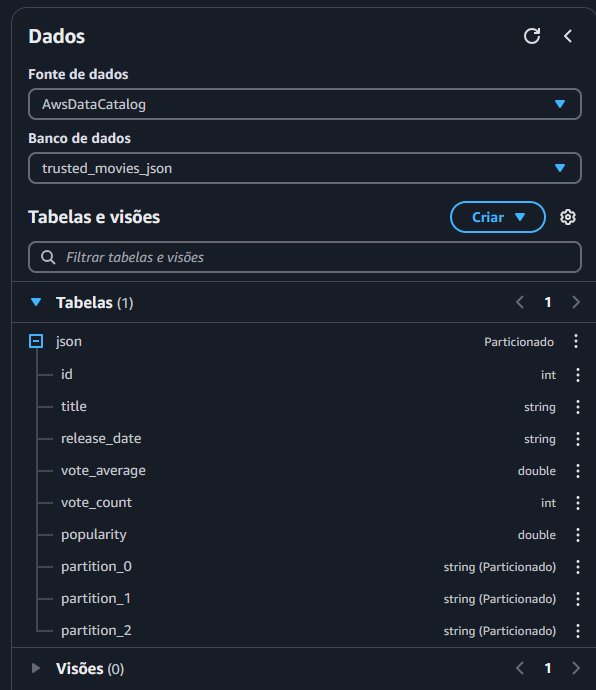

Vou começar comentando sobre as dificuldades que enfrentei ao longo do desafio.

Primeiramente, tentei desenvolver o código no Google Colab, mas isso não deu muito certo. Achei que seria fácil copiar o código do Colab e utilizá-lo diretamente no Glue, mas percebi que as coisas funcionam de forma diferente por lá.

A segunda dificuldade foi relacionada ao meu arquivo CSV. Conversando com o pessoal do meu grupo e de outros grupos, notei que cada um estava obtendo resultados diferentes, o que me incomodou um pouco e tornou o processo mais desafiador.

Apesar disso, sinto que estou pegando o jeito de trabalhar no Glue. Ainda acho que meu código do Job precisa de melhorias, mas pesquisei bastante e descobri que muitas pessoas preferem usar o visual ETL em vez de escrever o código manualmente.

Enfim, gostei bastante do desafio como um todo e acredito que foi uma experiência enriquecedora.

Desafio de Glue ETL - Documentação

1. Entregáveis
Para este desafio, o que será entregue é:

Um script que processa arquivos no formato CSV.
Um script que processa arquivos no formato JSON.

3. Preparação

Fiz todos os teste localmente usando pandas para confirma se meu parquet estava correto 

Primeiro eu fiz um codigo q removesse apenas as duplicadas 

 fiz um codigo q removece apenas as nulos

  

Acredito q o //N seja sim um valor nulo no meu csv, como eu cheguei nessa conclusão? 

então esse \N é um valor nulo no meu csv, logo eu preciso tratar ele tbm.

eu sei o comando   na_values='\\N' para tratar '\N' como nulo.

Beleza agora eu preciso juntar tudo isso em um codigo e ver oque fica.

 

Fechou essa foi meu resultado, agora eu preciso fazer a mesma cosia usando o glue

(**Nota: Eu realizei esses testes exclusivamente com meu arquivo CSV, já que me adiantei nas sprints anteriores e preparei meu JSON de forma completamente limpa, contendo apenas os dados que realmente vou precisar.**)

Vamos voltar pro desafio:

4. Descrição do Desafio

4.1. Entrega 3 - Processamento da Camada Trusted
Nesta etapa, meu objetivo é processar dados na Camada Trusted. Essa camada é onde os dados são armazenados de forma padronizada, limpa e confiável. Ela é derivada da integração de dados brutos, oriundos da Camada Raw.

Para isso, utilizarei o serviço AWS Glue e o framework Apache Spark. O objetivo é gerar uma visão consolidada e padronizada dos dados, armazenando-os no S3 no formato Parquet, particionado pela data de criação do arquivo. Essa padronização facilita consultas futuras via AWS Athena(A quais eu fiz teste e irei mostrar em breve).

5. Etapas do Processamento será dividido em dois jobs:

Job 1: Processamento de dados em CSV.
Job 2: Processamento de dados em JSON.

Vou explicar cada etapa.

5.1. Job 1 - Processamento de Dados em CSV
Entrada
Os dados brutos no formato CSV estão armazenados na Camada Raw no S3. Estes arquivos possuem cabeçalhos e utilizam o caractere | como delimitador.

Processamento
Leitura dos dados: Utilizei o AWS Glue para ler os arquivos CSV diretamente da camada Raw no S3.
Transformações aplicadas:

Substituí valores inválidos (\N) por null.

Padronizei textos: converti para minúsculas e removi espaços em branco.

Eliminei duplicatas no conjunto de dados.

Removi todas as linhas com valores nulos em qualquer coluna.

Formato de saída: Após o processamento, os dados foram salvos no formato Parquet, particionados pela data de criação.
Saída
Os dados processados são armazenados na Camada Trusted no S3, prontos para consulta via AWS Athena.

Meus Job parameters

Coloquei esse barra /Local para ficar mais facil pra mim, posso tirar ele a qualquer momento para:

s3://data-lake-do-thalles-lima/Trusted/CSV.

5.2. Job 2 - Processamento de Dados em JSON
Entrada
Os dados brutos no formato JSON foram extraídos da API do TMDB e armazenados na Camada Raw do S3.

Processamento

Leitura dos dados: Utilize o AWS Glue para acessar os arquivos JSON.

Transformações aplicadas:

Nesta etapa, faço a leitura do arquivo JSON localizado na Raw Zone:

connection_type: Indica que a fonte dos dados é o S3.

connection_options: Especifica o caminho do arquivo no S3.

format: Define o formato do arquivo como JSON.

O resultado é um DynamicFrame chamado dyf_raw.

Converto o DynamicFrame para um DataFrame do Spark. Isso me permite usar funcionalidades avançadas de manipulação de dados disponíveis no Spark SQL.

Removo duplicatas com base nas colunas id e title, garantindo que cada registro seja único.

Removo todas as linhas que contenham valores nulos em qualquer coluna, garantindo que os dados sejam consistentes.

Após a limpeza, converto o DataFrame de volta para um DynamicFrame. Isso é necessário porque o Glue trabalha nativamente com DynamicFrames para escrita em S3.

Salvo os dados limpos no S3:

frame: Especifica o DynamicFrame que será salvo.

connection_type: O destino é o S3.

format: O formato de saída é Parquet.

6. Benefícios da Padronização
Ao armazenar os dados na camada Trusted em formato Parquet, obtive:

Eficiência de armazenamento: O formato Parquet comprime os dados e ocupa menos espaço no S3.

Facilidade de consulta: A estrutura tabular do Parquet é otimizada para ferramentas analíticas como AWS Athena.

Consistência: Todos os dados seguem o mesmo padrão, independentemente do formato original.

Beleza agora eu vou criar um Databases  apra o csv e para o json

trusted_movies_csv

trusted_movies_json

feito, agora eu vou criar um Crawler para cada um

CSV:

JSON:

Rodei e deu tudo  certo. agora eu tenho minhas tabelas, vamos ver elas.

tabelas criadas com sucesso no formato Parquet.

vamo confirma alguamas coisa no athena para verificar se esta tudo certo.

JSON:

`SELECT * FROM "AwsDataCatalog"."trusted_movies_json"."json" limit 10`

Verificando duplicadas:

Verificando nulo:

vendo quantidade de linhas:

Agora o csv.

Vendo duplicadas

`SELECT 
    *, 
    COUNT(*) AS qtd_duplicados
FROM 
    "AwsDataCatalog"."trusted_movies_csv"."local"
GROUP BY 
    id, 
    titulopincipal, 
    titulooriginal, 
    anolancamento, 
    tempominutos, 
    genero, 
    notamedia, 
    numerovotos, 
    generoartista, 
    personagem, 
    nomeartista, 
    anonascimento, 
    anofalecimento, 
    profissao, 
    titulosmaisconhecidos, 
    partition_0
HAVING 
    COUNT(*) > 1
ORDER BY 
    qtd_duplicados DESC
LIMIT 10;`

Verificando nulos

`SELECT 
    SUM(CASE WHEN id IS NULL THEN 1 ELSE 0 END) AS nulos_id,
    SUM(CASE WHEN titulopincipal IS NULL THEN 1 ELSE 0 END) AS nulos_titulopincipal,
    SUM(CASE WHEN titulooriginal IS NULL THEN 1 ELSE 0 END) AS nulos_titulooriginal,
    SUM(CASE WHEN anolancamento IS NULL THEN 1 ELSE 0 END) AS nulos_anolancamento,
    SUM(CASE WHEN tempominutos IS NULL THEN 1 ELSE 0 END) AS nulos_tempominutos,
    SUM(CASE WHEN genero IS NULL THEN 1 ELSE 0 END) AS nulos_genero,
    SUM(CASE WHEN notamedia IS NULL THEN 1 ELSE 0 END) AS nulos_notamedia,
    SUM(CASE WHEN numerovotos IS NULL THEN 1 ELSE 0 END) AS nulos_numerovotos,
    SUM(CASE WHEN generoartista IS NULL THEN 1 ELSE 0 END) AS nulos_generoartista,
    SUM(CASE WHEN personagem IS NULL THEN 1 ELSE 0 END) AS nulos_personagem,
    SUM(CASE WHEN nomeartista IS NULL THEN 1 ELSE 0 END) AS nulos_nomeartista,
    SUM(CASE WHEN anonascimento IS NULL THEN 1 ELSE 0 END) AS nulos_anonascimento,
    SUM(CASE WHEN anofalecimento IS NULL THEN 1 ELSE 0 END) AS nulos_anofalecimento,
    SUM(CASE WHEN profissao IS NULL THEN 1 ELSE 0 END) AS nulos_profissao,
    SUM(CASE WHEN titulosmaisconhecidos IS NULL THEN 1 ELSE 0 END) AS nulos_titulosmaisconhecidos,
    SUM(CASE WHEN partition_0 IS NULL THEN 1 ELSE 0 END) AS nulos_partition_0
FROM 
    "AwsDataCatalog"."trusted_movies_csv"."local";`

Numero totais de linhas

Aqui eu vou me aprofundar um pouco mais

Calcular a Média de Notas por Ano

Vendo media do meu tema, comedia e animação

Contando os registros

Contar Lançamentos por Ano

Top 10 filmes ou séries de Comédia e Animação

