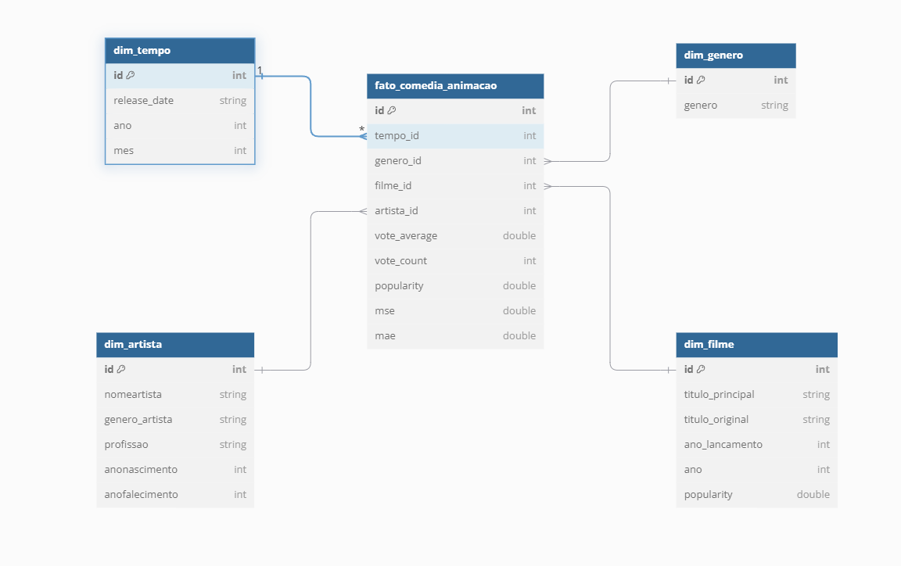

Vou lá vou começar comentando sobre as dificuldades que enfrentei.

Tive que revisar e testar várias vezes a lógica de join entre os arquivos CSV e JSON.

Os regex utilizados para filtrar gêneros "comedy" e "animation" também foi complciado, pois precisei testar várias abordagens até encontrar case-insensitive.

Não  tive problemas com o meu modelo.

# DESAFIO

Comecei fazendo minha modelagem com base no que eu vou precisar para minha analise.

<h1>Analisar a Fonte dos Dados</h1>

CSV:

Tenho um arquivo CSV que possui as seguintes colunas:

id, titulopincipal, titulooriginal, anolancamento, tempominutos, genero, notamedia, numerovotos, generoartista, personagem, nomeartista, anonascimento, anofalecimento, profissao, titulosmaisconhecidos, partition_0.

JSON:

Meu JSON possui as seguintes colunas:
id, title, release_date, vote_average, vote_count, popularity, partition_0, partition_1, partition_2.

# Fiz usando DiagramaDB:

<h3>Passo a Passo para Modelagem do Star Schema no DiagramaDB</h3>

Identificação das Tabelas Fato e Dimensão

Com base nos arquivos CSV e JSON, identifiquei as principais entidades e métricas:

Tabela Fato: fato_comedia_animacao

Contém métricas como vote_average, vote_count e popularity, além de chaves estrangeiras para as dimensões.

Tabelas Dimensão:
dim_tempo: Data, ano e mês de lançamento.
dim_genero: Informações sobre o gênero.
dim_filme: Detalhes dos filmes, como títulos e ano de lançamento.
dim_artista: Informações dos artistas, como nome, gênero, profissão e anos de vida.

<h1>Estruturação da Tabela Fato</h1>

A tabela fato_comedia_animacao foi criada como a tabela central. Ela conecta todas as dimensões e contém as métricas necessárias.

id: Chave primária para cada registro.
tempo_id: Chave estrangeira para dim_tempo.
genero_id: Chave estrangeira para dim_genero.
filme_id: Chave estrangeira para dim_filme.
artista_id: Chave estrangeira para dim_artista.
vote_average, vote_count e popularity: Métricas numéricas.

# Criação das Tabelas Dimensão

<h1>dim_tempo</h1>

Armazena os dados relacionados ao tempo, extraídos do JSON (release_date).

id: Chave primária.
release_date: Data completa de lançamento.
ano: Ano de lançamento.
mes: Mês de lançamento.

<h1>dim_genero</h1>
Contém informações únicas sobre os gêneros dos filmes.

id: Chave primária.
genero: Nome do gênero (ex: Comédia, Animação).

<h1>dim_filme</h1>
Armazena detalhes específicos sobre os filmes, combinando dados do CSV e JSON.

id: Chave primária.
titulo_principal: Título principal.
titulo_original: Título original.
ano_lancamento: Ano de lançamento.
ano: Duração (em minutos) se necessário.
popularity: Indicador de popularidade.

<h1>dim_artista </h1>
Guarda informações detalhadas dos artistas presentes nos filmes.

id: Chave primária.
nomeartista: Nome do artista.
genero_artista: Gênero do artista.
profissao: Função do artista (ator, diretor, etc.).
anonascimento: Ano de nascimento.
anofalecimento: Ano de falecimento (se aplicável).

# Estrutura Final

<body>
    <table>
        <caption>3. Estrutura Final</caption>
        <thead>
            <tr>
                <th>Tabela</th>
                <th>Colunas Principais</th>
                <th>Descrição</th>
            </tr>
        </thead>
        <tbody>
            <tr>
                <td>Dim_Filme</td>
                <td>id, titulopincipal, titulooriginal, anolancamento, tempominutos, genero</td>
                <td>Informações principais dos filmes.</td>
            </tr>
            <tr>
                <td>Dim_Artista</td>
                <td>nomeartista, generoartista, anonascimento, anofalecimento, profissao</td>
                <td>Informações principais sobre os artistas.</td>
            </tr>
            <tr>
                <td>Dim_Tempo</td>
                <td>anolancamento, mês, dia, partition_0</td>
                <td>Informações de tempo relacionadas ao lançamento.</td>
            </tr>
            <tr>
                <td>Fato_Avaliacoes</td>
                <td>id, notamedia, numerovotos, popularity</td>
                <td>Dados analíticos sobre avaliações e popularidade.</td>
            </tr>
            <tr>
                <td>Fato_Elenco</td>
                <td>id, nomeartista, personagem</td>
                <td>Dados relacionando artistas aos filmes e personagens.</td>
            </tr>
        </tbody>
    </table>
</body>

# Relacionamentos Entre Tabelas

As chaves estrangeiras conectam as tabelas dimensão à tabela fato:

tempo_id → dim_tempo.id

genero_id → dim_genero.id

filme_id → dim_filme.id

artista_id → dim_artista.id

Resultado:

Beleza, agora eu vou criar o passo a passo para minha camada refined

# Passo a Passo - Construção da Camada Refined

Importar Bibliotecas Necessárias
GlueContext, DynamicFrame, pyspark, functions, sys, getResolvedOptions.

Capturar Parâmetros de Entrada

Defino os parâmetros do Glue Job:

JOB_NAME: Nome do job.
INPUT_PATH_CSV e INPUT_PATH_JSON: Caminhos no S3 para os arquivos Trusted (CSV e JSON).
OUTPUT_BASE_PATH: Caminho no S3 para salvar as saídas Refined.

Leitura dos Dados Trusted
Carrego os dados do S3:
Formato Parquet para os dois arquivos (CSV e JSON).
Converto para DataFrame do Spark.

Renomear Colunas para Evitar Ambiguidade
Para evitar conflitos entre colunas do CSV e JSON, renomeio os campos que possuem o mesmo nome.

Filtrar Filmes Comuns Entre os Arquivos
Realizo o JOIN entre os dois DataFrames usando os títulos (titulopincipal e title) como chave. Renomeio o título para "titulo_principal" para consistência.

Resolver Valores Duplicados com Coalesce
Uso a função coalesce para priorizar os valores do CSV, caso existam duplicidades.

<h2>Dim_Tempo</h2>

Extraio a data, ano e mês do campo release_date.

<h2>Dim_Genero</h2>

Filtra gêneros que contenham "comedy" ou "animation".

<h2>Dim_Filme</h2>

Seleciono os atributos dos filmes e crio a dimensão.

<h2>Dim_Artista</h2>

Seleciono informações dos artistas.

<h2>Tabela Fato</h2>

Filtra apenas filmes de Comédia/Animação entre 2000 e 2020 e particiona por ano.

<h2>Resultado Final </h2>
Dim_Tempo, Dim_Genero, Dim_Filme, e Dim_Artista foram criadas e armazenadas em formato Parquet.
A Tabela Fato foi particionada por ano e salva no formato Parquet.
Os dados Trusted foram processados e estruturados na camada Refined, prontos para análise.

Análise: Filmes de Comédia/Animação (2000-2020)

Objetivo:
Explorar a evolução e tendências de filmes do gênero Comédia/Animação entre os anos 2000 e 2020. A análise busca entender as avaliações médias, popularidade e qualidade das produções ao longo do tempo, destacando fatores que influenciam a aceitação do público e oferecendo insights preditivos e diagnósticos.

Etapas Principais da Análise:

Média de Notas por Ano

Análise: Calcular e observar a média das avaliações de filmes ao longo dos anos para identificar tendências.
Visualização: Gráfico de linha destacando mudanças na qualidade percebida.
Pergunta: Como as avaliações de Comédia/Animação evoluíram entre 2000 e 2020?

Análise Preditiva

Análise: Previsão de notas futuras para o gênero com técnicas simples de Machine Learning.
Métricas: Avaliar precisão com MSE (Mean Squared Error) e MAE (Mean Absolute Error).
Visualização: Scatter plot mostrando relação entre previsões e valores reais, com cards para exibir métricas.
Objetivo: Identificar tendências futuras e validar o modelo preditivo.

Análise Diagnóstica

Análise: Identificar erros e outliers que impactam a precisão do modelo preditivo.
Visualização: Gráfico de distribuição dos erros residuais, diagnosticando pontos de falha.
Objetivo: Diagnosticar problemas e otimizar previsões.

Evolução Temporal de Popularidade e Qualidade

Análise: Estudar a quantidade de lançamentos e as avaliações médias ao longo dos anos.
Visualização: Gráficos de linha mostrando tanto o número de lançamentos quanto a evolução das notas.
Pergunta: Como a produção e popularidade de Comédia/Animação mudaram de 2000 a 2020?

Dados e Metodologia:

Fonte: Combinação de informações coletadas via API TMDB e dados CSV já disponíveis.
Enriquecimento: Os dados CSV serão complementados com JSONs da API TMDB para obter maior profundidade nas análises.
Ferramentas: Python, Pandas, gráficos para visualização e métricas quantitativas (MSE e MAE).

Objetivo Final:
Entender a evolução e tendências no gênero Comédia/Animação, gerando insights que auxiliem na identificação de fatores que influenciam popularidade e qualidade, com suporte em análises quantitativas, preditivas e diagnósticas.

